# ADS131M08 8-Channel, Simultaneously-Sampling, 24-Bit, Delta-Sigma ADC

## 1 Features

- 8 simultaneously sampling differential inputs
- Programmable data rate up to 32 kSPS
- Programmable gain up to 128
- Noise performance:
    * 102-dB dynamic range at gain = 1, 4 kSPS
    * 80-dB dynamic range at gain = 64, 4 kSPS
- Total harmonic distortion: -100 dB
- High-impedance inputs for direct sensor connection:
    * Input impedance 330-kΩ for gains of 1, 2, and 4
    * Input impedance ≥ 1-MΩ for gains of 8, 16, 32, 64, and 128
- Programmable channel-to-channel phase delay calibration:
    * 244-ns resolution, 8.192-MHz fCLKIN
- Current-detect mode allows for extremely low power tamper detection
- Fast startup: first data within 0.5 ms of supply ramp
- Integrated negative charge pump allows input signals below ground
- Crosstalk between channels: -120 dB
- Low-drift internal voltage reference
- Cyclic redundancy check (CRC) on communications and register map
- 2.7-V to 3.6-V analog and digital supplies
- Low power consumption: 6.0 mW at 3-V AVDD and DVDD
- Packages: 32-pin TQFP or 32-pin WQFN
- Operating temperature range: -40°C to +125°C

## 2 Applications

- Electricity meters: commercial and residential
- Circuit breakers
- Protection relays
- Power quality meters
- Battery test equipment
- Battery management systems

## 3 Description

The ADS131M08 is a eight-channel, simultaneouslysampling,  24-bit,  delta-sigma  (ΔΣ),  analog-to-digital converter (ADC) that offers wide dynamic range, low power, and energy-measurement-specific features, making the device an excellent fit for energy metering, power metrology, and circuit breaker applications. The ADC  inputs  can  be  directly  interfaced  to  a  resistordivider  network  or  a  power  transformer  to  measure voltage or to a current transformer or a Rogowski coil to measure current.

The  individual  ADC  channels  can  be  independently configured  depending  on  the  sensor  input.  A  lownoise,  programmable  gain  amplifier  (PGA)  provides gains  ranging  from  1  to  128  to  amplify  low-level signals. Additionally, this device integrates channel-tochannel phase calibration and offset and gain calibration registers to help remove signal-chain errors.

A  low-drift,  1.2-V  reference  is  integrated  into  the device  reducing  printed  circuit  board  (PCB)  area. Optional  cyclic  redundancy  checks  (CRCs)  on  the data  input,  data  output,  and  register  map  maintain communication integrity.

The complete analog front-end (AFE) is offered  in  a 32-pin  TQFP  package  or  a  leadless  32-pin  WQFN package and is specified over the industrial temperature range of -40°C to +125°C.

**Table Device Information  (1)**

| PART NUMBER   | PACKAGE   | BODY SIZE (NOM)   |
|---------------|-----------|-------------------|
| ADS131M08     | TQFP (32) | 5.00 mm × 5.00 mm |
| ADS131M08     | WQFN (32) | 4.00 mm × 4.00 mm |

- (1) For all available packages, see the orderable addendum at the end of the data sheet.

**Figure Simplified Block Diagram**


## 5 Pin Configuration and Functions

**Figure 5-1. PBS Package, 32-Pin TQFP, Top View**

[PBS Package - 32-Pin TQFP PCB](schematics/ads131m08.kicad_pcb)
[PBS Package - 32-Pin TQFP SCH](schematics/ads131m08.kicad_sch)


**Table 5-1. Pin Functions**

| PIN  NAME |N° PIN WQFN | N° PIN TQFP   | I/O   | DESCRIPTION (1)  |
| ----- | ----- | ----- | ----- | ----- |
| AGND        | 13, 28 | 13, 28 | Supply         | Analog ground  |
| AIN0N       | 30     | 30     | Analog input   | Negative analog input 0   |
| AIN0P       | 29     | 29     | Analog input   | Positive analog input 0   |
| AIN1N       | 31     | 31     | Analog input   | Negative analog input 1   |
| AIN1P       | 32     | 32     | Analog input   | Positive analog input 1  |
| AIN2N       | 2      | 2      | Analog input   | Negative analog input 2  |
| AIN2P       | 1      | 1      | Analog input   | Positive analog input 2  |
| AIN3N       | 3      | 3      | Analog input   | Negative analog input 3   |
| AIN3P       | 4      | 4      | Analog input   | Positive analog input 3   |
| AIN4N       | 6      | 6      | Analog input   | Negative analog input 4   |
| AIN4P       | 5      | 5      | Analog input   | Positive analog input 4   |
| AIN5N       | 7      | 7      | Analog input   | Negative analog input 5  |
| AIN5P       | 8      | 8      | Analog input   | Positive analog input 5    |
| AIN6N       | 10     | 10     | Analog input   | Negative analog input 6    |
| AIN6P       | 9      | 9      | Analog input   | Positive analog input 6   |
| AIN7N       | 11     | 11     | Analog input   | Negative analog input 7    |
| AIN7P       | 12     | 12     | Analog input   | Positive analog input 7      |
| AVDD        | 15     | 15     | Supply         | Analog supply. Connect a 1-µF capacitor to AGND. |
| CAP         | 24     | 24     | Analog output  | Digital low-dropout (LDO) regulator output. Connect a 220-nF capacitor to DGND. |
| CS          | 17     | 17     | Digital input  | Chip select; active low |
| DGND        | 25     | 25     | Supply         | Digital ground    |
| DIN         | 21     | 21     | Digital input  | Serial data input   |
| DOUT        | 20     | 20     | Digital output | Serial data output   |
| DRDY        | 18     | 18     | Digital output | Data ready; active low  |
| DVDD        | 26     | 26     | Supply         | Digital I/O supply. Connect a 1-µF capacitor to DGND.  |
| NC          | 27     | 27     | -              | Leave unconnected or connect to AGND  |
| REFIN       | 14     | 14     | Analog input   | External reference voltage input. (2)  |
| SCLK        | 19     | 19     | Digital input  | Serial data clock  |
| SYNC/RESET  | 16     | 16     | Digital input  | Conversion synchronization or system reset; active low  |
| XTAL1/CLKIN | 23     | 23     | Digital input  | Master clock input, or crystal oscillator input  |
| XTAL2       | 22     | 22     | Digital output | Crystal oscillator excitation (3)   |
| Thermal pad |   Thermal pad     | -      | -              | Thermal pad; connect to AGND  |

(1) See the Unused Inputs and Outputs section for details on how to connect unused pins.

(2) Do not place any capacitance on REFIN if the current-detect mode is used.

(3) See the Clocking and Power Modes section for more information regarding synchronization and how to implement the clocking scheme for optimized device performance.

## 6 Specifications

### 6.1 Absolute Maximum Ratings

See  (1)

|                         |                                               | MIN        | MAX        | UNIT   |
|-------------------------|-----------------------------------------------|------------|------------|--------|
| Power-supply voltage    | AVDD to AGND                                  | -0.3       | 3.9        | V      |
| Power-supply voltage    | AGND to DGND                                  | -0.3       | 0.3        | V      |
| Power-supply voltage    | DVDD to DGND                                  | -0.3       | 3.9        | V      |
| Power-supply voltage    | DVDD to DGND, CAP tied to DVDD   | -0.3       | 2.2        | V      |
| Power-supply voltage    | CAP to DGND                                   | -0.3       | 2.2        | V      |
| Analog input voltage    | AINxP, AINxN                                  | AGND - 1.6 | AVDD + 0.3 | V      |
| Reference input voltage | REFIN                                         | AGND - 0.3 | AVDD + 0.3 | V      |
| Digital input voltage   | CS, XTAL1/CLKIN, DIN, SCLK, SYNC/RESET, XTAL2 | DGND - 0.3 | DVDD + 0.3 | V      |
| Input current           | Continuous, all pins except power-supply pins | -10        | 10         | mA     |
| Temperature             | Junction, T J                                 |            | 150        | °C     |
| Temperature             | Storage, T stg                                | -60        | 150        | °C     |

(1) Operation outside the Absolute Maximum Ratings may cause permanent device damage. Absolute Maximum Ratings do not imply functional operation of the device at these or any other conditions beyond those listed under Recommended Operating Conditions. If used outside the Recommended Operating Conditions but within the Absolute Maximum Ratings, the device may not be fully functional, and this may affect device reliability, functionality, performance, and shorten the device lifetime.

### 6.2 ESD Ratings

|         |                                                                     | VALUE   | UNIT   |
|---------|---------------------------------------------------------------------|---------|--------|
| V (ESD) | Human body model (HBM), per ANSI/ESDA/JEDEC JS-001 (1)              | ±2000   | V      |
| V (ESD) | Charged device model (CDM), per JEDEC specification JESD22-C101 (2) | ±500    | V      |

### 6.3 Recommended Operating Conditions

over operating ambient temperature range (unless otherwise noted)

| Symbol | Parameter | Condition  | MIN  | NOM   | MAX   | UNIT   |
| ------ | ----- | ----- | ------ | ----- | ----- | ----- |
|  | **POWER SUPPLY** |  |  |  |  |  |
|  | Analog power supply  | AVDD to AGND, normal operating modes  | 2.7 | 3.0  | 3.6    | V |
|  |  Analog power supply | AVDD to AGND, standby and current-detect modes | 2.4  | 3.0  | 3.6  | V |
|  |  Analog power supply  | AGND to DGND | -0.3  | 0  | 0.3  | V |
|  | Digital power supply | DVDD to DGND  | 2.7   | 3.0 | 3.6  | V |
|  |  Digital power supply | DVDD to DGND, DVDD shorted to CAP (digital LDO bypassed) | 1.65 | 1.8 | 2 | V |
| | **ANALOG INPUTS (1)** |   |  |  |  |  |
| VAINxP , VAINxN   | Absolute input voltage | Gain = 1, 2, or 4  | AGND - 1.3 |  | AVDD | V  |
| VAINxP , VAINxN   | Absolute input voltage | Gains = 8, 16, 32, 64 or 128  | AGND - 1.3 |  | AVDD - 1.8 | V |
| VIN | Differential input voltage    | Using internal reference, VIN = VAINxP - VAINxN | -VREF / Gain  |  | VREF / Gain  | V |
| VIN | Differential input voltage    | Using external reference, VIN = VAINxP - VAINxN | - 0.96 × VREF / Gain |  | 0.96 × VREF / Gain | V  |
|  | **VOLTAGE REFERENCE INPUT**       |  |  | |  |  |
| VREFIN  | Reference input voltage |   | 1.1  | 1.25  | 1.3  | V  |
|  | **EXTERNAL CLOCK SOURCE**  |  |   |    |   |    |
| fCLKIN | External clock frequency  | High-resolution mode, Gain = 1 or 2 | 0.3 | 8.192 | 8.4 | MHz  |
| fCLKIN | External clock frequency | High-resolution mode, Gain > 2 | 0.3 | 8.192 | 8.2 | MHz |
| fCLKIN | External clock frequency | Low-power mode | 0.3 | 4.096 | 4.15 | MHz  |
| fCLKIN | External clock frequency | Very-low-power mode | 40  | 50  | 60 | %  |
|  | **DIGITAL INPUTS** |  |  |  |  |  |
|  | Input voltage   |  | DGND  |   | DVDD  | V |
|  | **TEMPERATURE RANGE** |  |  |   |  |  |
| T A | Operating ambient temperature | Operating ambient temperature | -40 |  | 125  | °C  |

(1) The subscript "x" signifies the channel. For example, the positive analog input to channel 0 is named AIN0P. See the Pin Configurations and Functions section for the pin names.

### 6.4 Thermal Information

| THERMAL METRIC (1) | THERMAL METRIC (1) |ADS131M08  RSN (WQFN) 32 PINS   |ADS131M08  PBS (TQFP) 32 PINS  | UNIT |
|--------------------|----------------------------------------------|-------------|-------------|------|
| R θJA              | Junction-to-ambient thermal resistance       | 33.7        | 81.9        | °C/W |
| R θJC(top)         | Junction-to-case (top) thermal resistance    | 26.5        | 26.0        | °C/W |
| R θJB              | Junction-to-board thermal resistance         | 13.4        | 32.7        | °C/W |
| Ψ JT               | Junction-to-top characterization parameter   | 0.3         | 1.1         | °C/W |
| Ψ JB               | Junction-to-board characterization parameter | 13.4        | 32.5        | °C/W |
| R θJC(bot)         | Junction-to-case (bottom) thermal resistance | 4.1         | N/A         | °C/W |

(1) For more information about traditional and new thermal metrics, see the Semiconductor and IC Package Thermal Metrics application report.

### 6.5 Electrical Characteristics

minimum and maximum specifications apply from TA = -40°C to +125°C; typical specifications are at TA = 25°C; all specifications are at AVDD = 3 V, DVDD = 3 V, fCLKIN = 8.192 MHz, data rate = 4 kSPS, gain = 1, all channels enabled, global-chop mode disabled, using internal reference with 100-nF tied to REFIN pin, and internal oscillator disabled (unless otherwise noted).

| PARAMETER | PARAMETER | TEST CONDITIONS | MIN | TYP  | MAX | UNIT |
|------|-------|------|------|------|-----|-----|
|  | **ANALOG INPUTS** |  |  |  |  |   |
| Z in   | Differential input impedance | Gain = 1, 2, or 4  |  | 330 |  | kΩ  | 
| I b    | Input bias current   | Gain = 8, 16, 32, 64, or 128, inputs shorted to ground  |  | ±1 |  | µA/V  | 
|  | **ADC CHARACTERISTICS** |   |   |  |  |  |
|  | Resolution |  | 24 |  |  | Bits | 
|  | Gain settings  |   | 1,2, 4, 8, 16, 32, 64, 128 |   |   |   |
| f DATA | Data rate  | High-resolution mode, fCLKIN = 8.192 MHz |  250  |   |   32k | SPS    |
| f DATA | Data rate   | Low-power mode, fCLKIN = 4.096 MHz  | 125 |  | 16k   | SPS | 
| f DATA | Data rate   | Very low-power mode, fCLKIN = 2.048 MHz| 62.5 |  |   8k  |  SPS  |
|  | Startup time  | Measured from supplies at 90% to first DRDY falling edge   |   |  0.5  |   |  ms   |
| | **ADC PERFORMANCE**|  |  |  |  |  |
| INL | Integral nonlinearity (best fit) |   |   |  7.5  |  | ppm of FSR  |
|  | Offset error (input referred)  |  |   |  ±240   |   |  µV |
|  | Offset error (input referred)  | Global-chop mode  |  | ±32 |  | µV |
|  | Offset drift  |  |  | 215  |  |  nV/°C  |
|  | Offset drift | Global-chop mode  |   | 105|  |  nV/°C  |
|  | Gain error  |   |   | ±0.3%  |  |  |
|  | Gain drift  | Excluding voltage reference error, gain = 1  |   | 5  |  | ppm/°C  |
|  | Gain drift  | Including internal voltage reference error, gain = 1    |  | 10 | 20  |  ppm/°C   |
|  | Gain drift  | Including internal voltage reference error, gain = 32   |  | 15 |     |  ppm/°C   |
|  | Long-term gain drift | 1000 hours at 85°C, including internal voltage reference error, TQFP package |  | 385|   | ppm |
|  | Long-term gain drift | 1000 hours at 85°C, including internal voltage reference error, WQFN package |  | 90 |   | ppm |
| CMRR | Common-mode rejection ratio | At dc  |   | 100 |   | dB |
| CMRR | Common-mode rejection ratio | f CM = 50 Hz or 60 Hz  |   | 94 |   | dB |
| PSRR  | Power-supply rejection ratio   | AVDD at DC   |   | 80 |   | dB  |
| PSRR  | Power-supply rejection ratio   | DVDD at DC |   | 100 |   | dB  |
| PSRR  | Power-supply rejection ratio   | AVDD supply, f PS = 50 Hz or 60 Hz |   | 78 |    |  dB  |
| PSRR  | Power-supply rejection ratio   | DVDD supply, f PS = 50 Hz or 60 Hz  |  | 90 |  | dB  |
|  | Input referred noise |  |   |  5.4|  | µV RMS |
|  | Input referred noise | During fast startup  |  | 1500 |   | µV RMS  |
|  | Dynamic range | Gain = 1   | 99 | 102  |   | dB |
|  | Dynamic range | Gain = 64   |   | 80  |   |  dB  |
|  | Dynamic range | All other gain settings  |  |  Table 7-1  |  |  |
|  | Crosstalk  | f IN = 50 Hz or 60 Hz  |   | -120 |  | dB  |
| SNR | Signal-to-noise ratio | f IN = 50 Hz or 60 Hz, gain = 1, VIN = -0.5 dBFS, normalized  |  | 101 | | dB |
| SNR | Signal-to-noise ratio | f IN = 50 Hz or 60 Hz, gain = 64, VIN = -0.5 dBFS, normalized |  | 80  | | dB |
| THD | Total harmonic distortion   | f IN = 50 Hz or 60 Hz (up to 50 harmonics), VIN = -0.5 dBFS   |   | -100 | | dB  |
| SFDR | Spurious-free dynamic range | f IN = 50 Hz or 60 Hz (up to 50 harmonics), VIN = -0.5 dBFS   | | 103  |  | dB  |
|  | **INTERNAL VOLTAGE REFERENCE**  |  |  |  |  |  |
| VREF | Internal reference voltage  | |  | 1.2  | | V |
|   | Accuracy | T A = 25°C  | | ±0.1%   |   |   |
|   | Temperature drift |  |   | 8  | 20  | ppm/°C  |
|   | Long-term reference drift | 1000 hours at 85°C, TQFP package  | | 340  |  | ppm  |
|   | Long-term reference drift | 1000 hours at 85°C, WQFN package  | | 70   |  | ppm  |
|   | **DIGITAL INPUTS/OUTPUTS**      |   |      |      |      | D     |
| V IL  | Logic input level, low      |   | DGND  |    | 0.2 DVDD  | V |
| V IH  | Logic input level, high     |   | 0.8 DVDD   | | DVDD  | V  |
| V OL  | Logic output level, low     | I OL = -1 mA  |  |  | 0.2 DVDD   | V   |
| V OH  | Logic output level, high    | I OH = 1 mA   | 0.8 DVDD  |  | | V |
| I IN  | Input current               | DGND < V Digital Input < DVDD | -1    |  | 1  | µA  |
|   | **POWER SUPPLY** |  |  |   |  |  |
| I AVDD  | Analog supply current  | High-resolution mode  | | 6.5  | 7.7  | mA  |
| I AVDD  | Analog supply current  | Low-power mode |  | 3.4    | 4.1  | mA  |
| I AVDD  | Analog supply current  | Very low-power mode  |  | 1.9 | 2.3  | mA |
| I AVDD  | Analog supply current  | Current-detect mode  |  | 1.8 |  | mA  |
| I AVDD  | Analog supply current  | Standby mode   |    | 0.35  |  | µA  |
| I DVDD  | Digital supply current (1)  | High-resolution mode |  | 0.66   | 0.9   | mA  |
| I DVDD  | Digital supply current (1)  | Low-power mode  |    | 0.35  | 0.47   | mA    |
| I DVDD  | Digital supply current (1)  | Very low-power mode |  | 0.18   | 0.3| mA|
| I DVDD  | Digital supply current (1)  | Current-detect mode | | 0.115 | | mA 
| I DVDD  | Digital supply current (1)  | Standby mode | | 1.1 | | µA |
| P D     | Power dissipation           | High-resolution mode | | 21.5 | | mW |
| P D     | Power dissipation           | Low-power mode | | 11.3 | | mW |
| P D     | Power dissipation           | Very low-power mode | | 6.2 | | mW |
| P D     | Power dissipation           | Current-detect mode | | 5.8 | | mW |
| P D     | Power dissipation           | Standby mode | | 4.4 | | µW |

(1) Currents measured with SPI idle and oscillator disabled.

### 6.6 Timing Requirements

over operating ambient temperature range, DOUT load: 20 pF || 100 kΩ (unless otherwise noted)

|                       |                                                          |   MIN | NOM   |   MAX | UNIT (1)   |
|-----------------------|----------------------------------------------------------|-------|-------|-------|------------|
| **1.65 V ≤ DVDD ≤ 2.0 V** |     |       |       |       |            |
| t w(CLL)              | Pulse duration, CLKIN low                                |    49 |       |       | ns         |
| t w(CLH)              | Pulse duration, CLKIN high                               |    49 |       |       | ns         |
| t c(SC)               | SCLK period                                              |    64 |       |       | ns         |
| t w(SCL)              | Pulse duration, SCLK low                                 |    32 |       |       | ns         |
| t w(SCH)              | Pulse duration, SCLK high                                |    32 |       |       | ns         |
| t d(CSSC)             | Delay time, first SCLK rising edge after CS falling edge |    16 |       |       | ns         |
| t d(SCCS)             | Delay time, CS rising edge after final SCLK falling edge |    10 |       |       | ns         |
| t w(CSH)              | Pulse duration, CS high                                  |    20 |       |       | ns         |
| t su(DI)              | Setup time, DIN valid before SCLK falling egde           |     5 |       |       | ns         |
| t h(DI)               | Hold time, DIN valid after SCLK falling edge             |    10 |       |       | ns         |
| t w(RSL)              | Pulse duration, SYNC/RESET low to generate device reset  |  2048 |       |       | tCLKIN    |
| t w(SYL)              | Pulse duration, SYNC/RESET low for synchronization       |     1 |       |  2047 | tCLKIN    |
| t su(SY)              | Setup time, SYNC/RESET valid before CLKIN rising edge    |    10 |       |       | ns         |
| **2.7 V ≤ DVDD ≤ 3.6 V**  |                                    |       |       |       |            |
| t w(CLL)              | Pulse duration, CLKIN low                                |    49 |       |       | ns         |
| t w(CLH)              | Pulse duration, CLKIN high                               |    49 |       |       | ns         |
| t c(SC)               | SCLK period                                              |    40 |       |       | ns         |
| t w(SCL)              | Pulse duration, SCLK low                                 |    20 |       |       | ns         |
| t w(SCH)              | Pulse duration, SCLK high                                |    20 |       |       | ns         |
| t d(CSSC)             | Delay time, first SCLK rising edge after CS falling edge |    16 |       |       | ns         |
| t d(SCCS)             | Delay time, CS rising edge after final SCLK falling edge |    10 |       |       | ns         |
| t w(CSH)              | Pulse duration, CS high                                  |    15 |       |       | ns         |
| t su(DI)              | Setup time, DIN valid before SCLK falling egde           |     5 |       |       | ns         |
| t h(DI)               | Hold time, DIN valid after SCLK falling edge             |    10 |       |       | ns         |
| t w(RSL)              | Pulse duration, SYNC/RESET low to generate device reset  |  2048 |       |       | tCLKIN    |
| t w(SYL)              | Pulse duration, SYNC/RESET low for synchronization       |     1 |       |  2047 | tCLKIN    |
| t su(SY)              | Setup time, SYNC/RESET valid before CLKIN rising edge    |    10 |       |       | ns         |

(1) tCLKIN  = 1/fCLKIN

### 6.7 Switching Characteristics

over operating ambient temperature range, DOUT load: 20 pF || 100 kΩ (unless otherwise noted)

| PARAMETER | PARAMETER | TEST CONDITIONS | MIN | TYP | MAX | UNIT (1) |
|------|-------|-------|-------|------|------|-------|
| **1.65 V ≤ DVDD ≤ 2.0 V** | | |  |  |  |  |
| t p(CSDO) | Propagation delay time, CS falling edge to DOUT driven | | | | 50 | ns |
| t p(SCDO) | Progapation delay time, SCLK rising edge to valid new DOUT | | | | 32 | ns |
| t p(CSDOZ) | Propagation delay time, CS rising edge to DOUT high impedace | | | | 75 | ns |
| t w(DRH) | Pulse duration, DRDY high | | | 4 | | t CLKIN |
| t w(DRL) | Pulse duration, DRDY low | | | 4 | | t CLKIN |
| | SPI timeout | | 32768 | | | t CLKIN |
| t POR | Power-on-reset time | Measured from supplies at 90% to first DRDY rising edge | | 250 | | μs |
| t REGACQ | Register default acquisition time | | | 5 | | µs |
| **2.7 V ≤ DVDD ≤ 3.6 V** |   |   |   |   |   |   |
| t p(CSDO) | Propagation delay time, CS falling edge to DOUT driven | | | | 50 | ns |
| t p(SCDO) | Progapation delay time, SCLK rising edge to valid new DOUT | | | | 20 | ns |
| t p(CSDOZ) | Propagation delay time, CS rising edge to DOUT high impedace | | | | 75 | ns |
| t w(DRH) | Pulse duration, DRDY high | | | 4 | | t CLKIN |
| t w(DRL) | Pulse duration, DRDY low | | | 4 | | t CLKIN |
| | SPI timeout | | 32768 | | | t CLKIN |
| t POR | Power-on-reset time | Measured from supplies at 90% to first DRDY rising edge | | 250 | | μs |
| t REGACQ | Register default acquisition time | | | 5 | | µs |

- (1) tCLKIN  = 1/fCLKIN

### 6.8 Timing Diagrams


**Figure 6-1. SPI Timing Diagram**

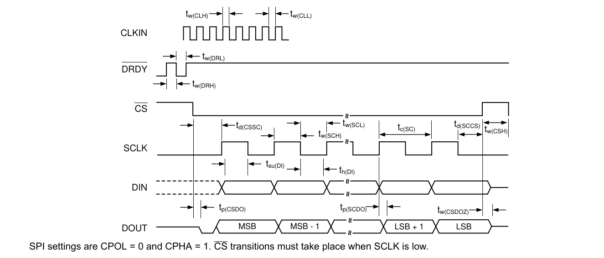

**Figure 6-2. SYNC/RESET Timing Requirements**


**Figure 6-3. Power-On-Reset Timing**


## 7 Parameter Measurement Information

### 7.1 Noise Measurements

Adjust the data rate and gain to optimize the ADS131M08 noise performance. When averaging is increased by reducing the data rate, noise drops correspondingly. Table 7-1 summarizes the ADS131M08 noise performance using the 1.2-V internal reference and a 3.0-V analog power supply. The data are representative of typical noise performance at TA = 25°C when fCLKIN = 8.192 MHz. The modulator clock frequency fMOD = fCLKIN / 2. The data shown are typical input-referred noise results with the analog inputs shorted together and taking an average of multiple readings across all channels. A minimum 1 second of consecutive readings are used to calculate the RMS noise for each reading. Table 7-2 shows the dynamic range and effective resolution calculated from the noise data. Equation 1 calculates dynamic range. Equation 2 calculates effective resolution. In each case, VREF corresponds to the internal 1.2-V reference, or the voltage on the REFIN pin if the external reference is used. In global-chop mode, noise is improved by a factor of √ 2.

The noise performance scales with the OSR and gain settings, but is independent from the configured power mode. Thus, the device exhibits the same noise performance in different power modes when selecting the same OSR and gain settings. However, the data rate at the OSR settings scales based on the applied clock frequency for the different power modes.


$$
Dynamic Range = 20 \times \log ({V}_{REF} \div  (\sqrt{2}\times Gain \times {V}_{RMS} ))\tag{Equation 1}
$$

$$
Effective Resolution = {log}_{2} ((2\times {V}_{REF})\div (Gain\times {V}_{RMS}))\tag{Equation 2}
$$


**Table 7-1. Noise (µVRMS) at TA = 25°C**

| OSR   | DATA RATE (kSPS), fCLKIN = 8.192 MHz   |   GAIN 1 |   GAIN 2 |   GAIN 4 |   GAIN 8 |   GAIN 16 |   GAIN 32 |   GAIN 64 |   GAIN 128 |
|-------|-----------------------------------------|--------|--------|--------|--------|--------|--------|--------|--------|
| 16384 | 0.25                                    |   1.90 |   1.69 |   1.56 |   0.95 |   0.64 |   0.42 |   0.42 |   0.42 |
| 8192  | 0.5                                     |   2.39 |   2.13 |   2.13 |   1.29 |   0.86 |   0.57 |   0.57 |   0.57 |
| 4096  | 1                                       |   3.38 |   2.99 |   2.88 |   1.74 |   1.17 |   0.77 |   0.77 |   0.77 |
| 2048  | 2                                       |   4.25 |   3.91 |   3.79 |   2.27 |   1.52 |   1.00 |   1.00 |   1.00 |
| 1024  | 4                                       |   5.35 |   4.68 |   4.52 |   2.70 |   1.82 |   1.20 |   1.20 |   1.20 |
| 512   | 8                                       |   7.56 |   6.62 |   6.37 |   3.82 |   2.55 |   1.69 |   1.69 |   1.69 |
| 256   | 16                                      |  10.68 |   9.56 |   9.09 |   5.42 |   3.63 |   2.39 |   2.39 |   2.40 |
| 128   | 32                                      |  21.31 |  15.26 |  13.52 |   7.89 |   5.21 |   3.41 |   3.42 |   3.42 |


**Table 7-2. Dynamic Range (Effective Resolution) at TA = 25°C**

| OSR   | DATA RATE (kSPS), fCLKIN = 8.192 MHz   |   GAIN 1 |   GAIN 2 |   GAIN 4 |   GAIN 8 |   GAIN 16 |   GAIN 32 |   GAIN 64 |   GAIN 128 |
|-------|-----------------------------------------|------------|------------|------------|------------|-----------|-----------|-----------|-----------|
| 16384 | 0.25                                    | 113 (20.3) | 108 (19.4) | 103 (18.6) | 101 (18.3) | 98 (17.8) | 96 (17.5) | 90 (16.5) | 84 (15.4) |
| 8192  | 0.5                                     | 111 (19.9) | 106 (19.1) | 100 (18.1) | 98 (17.8)  | 96 (17.4) | 93 (17.0) | 87 (16.0) | 81 (15.0) |
| 4096  | 1                                       | 108 (19.4) | 103 (18.6) | 97 (17.7)  | 96 (17.4)  | 93 (17.0) | 91 (16.6) | 85 (15.6) | 79 (14.6) |
| 2048  | 2                                       | 106 (19.1) | 101 (18.2) | 95 (17.3)  | 93 (17.0)  | 91 (16.6) | 88 (16.2) | 82 (15.2) | 76 (14.2) |
| 1024  | 4                                       | 104 (18.8) | 99 (18.0)  | 93 (17.0)  | 92 (16.8)  | 89 (16.3) | 87 (15.9) | 81 (14.9) | 75 (13.9) |
| 512   | 8                                       | 101 (18.3) | 96 (17.5)  | 90 (16.5)  | 89 (16.3)  | 86 (15.8) | 84 (15.4) | 78 (14.4) | 72 (13.4) |
| 256   | 16                                      | 98 (17.8)  | 93 (16.9)  | 87 (16.0)  | 86 (15.8)  | 83 (15.3) | 81 (14.9) | 75 (13.9) | 69 (12.9) |
| 128   | 32                                      | 92 (16.8)  | 89 (16.3)  | 84 (15.4)  | 83 (15.2)  | 80 (14.8) | 78 (14.4) | 72 (13.4) | 65 (12.4) |

## 8 Detailed Description

### 8.1 Overview

The ADS131M08 is a low-power, eight-channel, simultaneously  sampling,  24-bit,  delta-sigma  (ΔΣ)  analog-todigital  converter  (ADC)  with  a  low-drift  internal  reference  voltage.  The  dynamic  range,  size,  feature  set,  and power consumption are optimized for cost-sensitive applications requiring simultaneous sampling.

The  ADS131M08  requires  both  analog  and  digital  supplies.  The  analog  power  supply  (AVDD  -  AGND)  can operate between 2.7 V and 3.6 V. An integrated negative charge pump allows absolute input voltages as low as 1.3 V below AGND, which enables measurements of input signals varying around ground with a single-ended power supply. The digital power supply (DVDD - DGND) accepts both 1.8-V and 3.3-V supplies. The device features  a  programmable  gain  amplifier  (PGA)  with  gains  up  to  128.  An  integrated  input  precharge  buffer enabled at gains greater than 4 ensures high input impedance at high PGA gain settings. The ADC receives its reference voltage from an integrated 1.2-V reference. The device allows differential input voltages as large as the reference. Three power-scaling modes allow designers to trade power consumption for ADC dynamic range.

Each  channel  on  the  ADS131M08  contains  a  digital  decimation  filter  that  demodulates  the  output  of  the  ΔΣ modulators. The filter enables data rates as high as 32 kSPS per channel in high-resolution mode. The relative phase of the samples can be configured between channels, thus enabling an accurate compensation for the sensor phase response. Offset and gain calibration registers can be programmed to automatically adjust output samples for measured offset and gain errors. The Functional Block Diagram provides a detailed diagram of the ADS131M08.

The device communicates via a serial programming interface (SPI)-compatible interface. Several SPI commands and internal registers control the operation of the ADS131M08. Other devices can be added to the same SPI bus by adding discrete CS control lines. The SYNC/RESET pin can be used to synchronize conversions between multiple ADS131M08 devices as well as to maintain synchronization with external events.

### 8.2 Functional Block Diagram

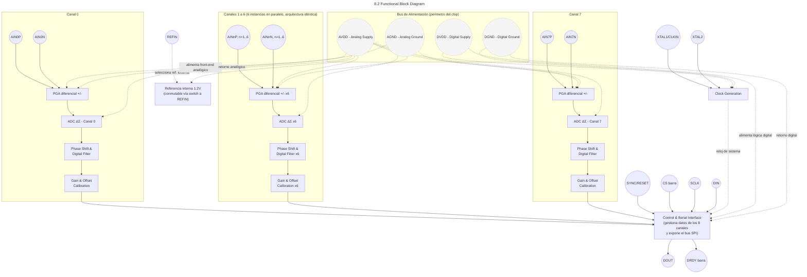


### 8.3 Feature Description

#### 8.3.1 Input ESD Protection Circuitry

Basic electrostatic discharge (ESD) circuitry protects the ADS131M08 inputs from ESD and overvoltage events in conjunction with external circuits and assemblies. Figure 8-1 depicts a simplified representation of the ESD circuit. The protection for input voltages exceeding AVDD can be modeled as a simple diode.

**Figure 8-1. Input ESD Protection Circuitry**

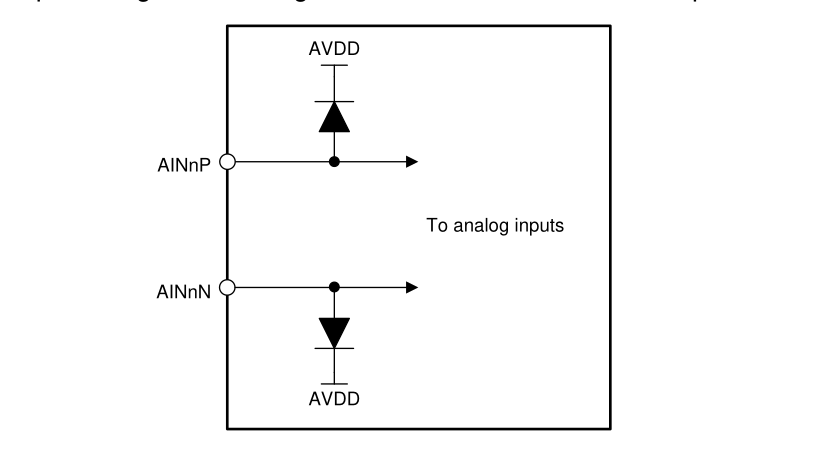

The ADS131M08 has an integrated negative charge pump that allows for input voltages below AGND with a unipolar supply. Consequently, shunt diodes between the inputs and AGND cannot be used to clamp excessive negative input voltages. Instead, the same diode that clamps overvoltage is used to clamp undervoltage at its reverse breakdown voltage. Take care to prevent input voltages or currents from exceeding the limits provided in the Absolute Maximum Ratings table.

#### 8.3.2 Input Multiplexer

Each channel of the ADS131M08 has a dedicated input multiplexer. The multiplexer controls which signals are routed to the ADC channels. Configure the input multiplexer using the MUXn[1:0] bits in the CHn\_CFG register. The input multiplexer allows the following inputs to be connected to the ADC channel:

- The analog input pins corresponding to the given channel
- AGND, which is helpful for offset calibration
- Positive DC test signal
- Negative DC test signal

See the Internal Test Signals section for more information about the test signals. Figure 8-2 shows a diagram of the input multiplexer on the ADS131M08.

**Figure 8-2. Input Multiplexer**

[Input Multiplexer](schematics/fig_8_2_Input_Multiplexer.kicad_sch)

#### 8.3.3 Programmable Gain Amplifier (PGA)

Each channel of the ADS131M08 features an integrated programmable gain amplifier (PGA) that provides gains of 1, 2, 4, 8, 16, 32, 64, and 128. The gains for all channels are individually controlled by the PGAGAINn bits for each channel in the GAIN1 register.

Varying  the  PGA  gain  scales  the  differential  full-scale  input  voltage  range  (FSR)  of  the  ADC.  Equation  3 describes the relationship between FSR and gain. Equation 3 uses the internal reference voltage, 1.2 V, as the scaling factor without accounting for gain error caused by tolerance in the reference voltage.

$$
FSR = \pm 1.2\times V\div Gain \tag{Equation 3}
$$


Table 8-1 shows the corresponding full-scale ranges for each gain setting, assuming the internal reference is used.

**Table 8-1. Full-Scale Range**

|   GAIN SETTING | FSR       |
|----------------|-----------|
|              1 | ±1.2 V    |
|              2 | ±600 mV   |
|              4 | ±300 mV   |
|              8 | ±150 mV   |
|             16 | ±75 mV    |
|             32 | ±37.5 mV  |
|             64 | ±18.75 mV |
|            128 | ±9.375 mV |

The input impedance of the PGA dominates the input impedance characteristics of the ADS131M08. The PGA input  impedance  for  gain  settings  up  to  4  behaves  according  to  Equation  4  without  accounting  for  device tolerance  and  change  over  temperature.  Minimize  the  output  impedance  of  the  circuit  that  drives  the ADS131M08 inputs to obtain the best possible gain error, INL, and distortion performance.

$$
330 k\Omega \times 4.096 MHz\div {f}_{MOD} \tag{Equation 4}
$$

where:

 · fMOD is the ΔΣ modulator frequency, fCLKIN / 2

The device uses an input precharge buffer for PGA gain settings of 8 and higher. The input impedance at these gain settings is very high. Specifying the input bias current for these gain settings is therefore more useful. A plot of input bias current for the high gain settings is provided in Figure 6-5.

#### 8.3.4 Voltage Reference

The  ADS131M08  has  two  reference  voltage  options:  the  internal  reference  and  an  external  reference.  The internal reference uses a low-drift band-gap voltage to supply the reference for the ADC. The internal reference has a nominal voltage of 1.2 V, allowing the differential input voltage to swing from -1.2 V to 1.2 V. The reference circuitry starts up very quickly to accommodate the fast-startup feature of this device. The device waits until after the reference circuitry is fully settled before generating conversion data. Do not place any capacitance on the REFIN pin if the current-detect mode is used. See the Current-Detect Mode section for more details about the current-detect mode.

The device also allows for an external reference voltage, which can be input at the REFIN pin. The nominal external reference voltage is 1.25 V. The full-scale range of the ADC is 1.2 V / gain when the reference voltage is 1.25 V. The ADC full-scale range maintains the ratio of 1.2 to 1.25 for all recommended reference voltages. For example, the ADC full-scale range is 1.248 V / gain if 1.3 V is applied to the REFIN pin instead of the nominal 1.25 V. The startup time for the external reference is governed by the external circuitry.

#### 8.3.5 Clocking and Power Modes

The master clock can either be sourced externally to the CLKIN pin or generated internally using the onboard oscillator  that  requires  a  crystal  connected  between  the  XTAL1/CLKIN  and  XTAL2  pins.    For  optimal performance,  the  modulator  sampling  clock  must  be  synchronous  with  the  serial  data  clock  (SCLK).    The modulator sampling clock is derived from the master clock, which means the master clock must be synchronous with SCLK.  Therefore, for best performance, supply a master clock to CLKIN and make sure data retrieval is synchronous to the clock signal at CLKIN.  When not in use, turn the internal oscillator off to save power.

The PWR[1:0] bits in the CLOCK register allow the device to be configured in one of three power modes: highresolution  (HR)  mode,  low-power  (LP)  mode,  and  very  low-power  (VLP)  mode.  Changing  the  PWR[1:0]  bits scales the internal bias currents to achieve the expected power levels. The external clock frequency must follow the guidance provided in the Recommended Operating Conditions table corresponding to the intended power mode in order for the device to perform according to the specification.

#### 8.3.6 ΔΣ Modulator

The  ADS131M08  uses  a  delta-sigma  (ΔΣ)  modulator  to  convert  the  analog  input  voltage  to  a  one's  density modulated  digital  bit-stream.  The  ΔΣ  modulator  oversamples  the  input  voltage  at  a  frequency  many  times greater than the output data rate. The modulator frequency, f MOD , of the ADS131M08 is equal to half the master clock frequency, that is, fMOD = fCLKIN / 2.

The output of the modulator is fed back to the modulator input through a digital-to-analog converter (DAC) as a means of error correction. This feedback mechanism shapes the modulator quantization noise in the frequency domain to make the noise more dense at higher frequencies and less dense in the band of interest. The digital decimation  filter  following  the  ΔΣ  modulator  significantly  attenuates  the  out-of-band  modulator  quantization noise, allowing the device to provide excellent dynamic range.

#### 8.3.7 Digital Filter

The ΔΣ modulator bit-stream feeds into a digital filter. The digital filter is a linear phase, finite impulse response (FIR), low-pass sinc-type filter that attenuates the out-of-band quantization noise of the ΔΣ modulator. The digital filter demodulates the output of the ΔΣ modulator by averaging. The data passing through the filter is decimated and downsampled, to reduce the rate at which data come out of the modulator (fMOD) to the output data rate (f DATA). The decimation factor is defined as per Equation 5 and is called the oversampling ratio (OSR) .

$$
OSR = {f}_{MOD}/ {f}_{DATA}\tag{Equation 5}
$$

The OSR is configurable and set by the OSR[2:0] bits in the CLOCK register. There are OSR settings in the ADS131M08, allowing different data rate settings for any given master clock frequency. Table 8-2 lists the OSR settings and their corresponding output data rates for the nominal CLKIN frequencies mentioned.

The OSR determines the amount of averaging of the modulator output in the digital filter and therefore also the filter bandwidth. The filter bandwidth directly affects the noise performance of the ADC because lower bandwidth results  in  lower  noise  whereas  higher  bandwidth  results  in  higher  noise.  See  Table  7-1  for  the  noise specifications for various OSR settings.

**Table 8-2. OSR Settings and Data Rates for Nominal Master Clock Frequencies**

| POWER MODE   | NOMINAL MASTER CLOCK FREQUENCY   | f MOD     |   OSR | OUTPUT DATA RATE   |
|--------------|----------------------------------|-----------|-------|--------------------|
| HR           | 8.192 MHz                        | 4.096 MHz |   128 | 32 kSPS            |
| HR           | 8.192 MHz                        | 4.096 MHz |   256 | 16 kSPS            |
| HR           | 8.192 MHz                        | 4.096 MHz |   512 | 8 kSPS             |
| HR           | 8.192 MHz                        | 4.096 MHz |  1024 | 4 kSPS             |
| HR           | 8.192 MHz                        | 4.096 MHz |  2048 | 2 kSPS             |
| HR           | 8.192 MHz                        | 4.096 MHz |  4096 | 1 kSPS             |
| HR           | 8.192 MHz                        | 4.096 MHz |  8192 | 500 SPS            |
| HR           | 8.192 MHz                        | 4.096 MHz | 16384 | 250 SPS            |
| LP           | 4.096 MHz                        | 2.048 MHz |   128 | 16 kSPS            |
| LP           | 4.096 MHz                        | 2.048 MHz |   256 | 8 kSPS             |
| LP           | 4.096 MHz                        | 2.048 MHz |   512 | 4 kSPS             |
| LP           | 4.096 MHz                        | 2.048 MHz |  1024 | 2 kSPS             |
| LP           | 4.096 MHz                        | 2.048 MHz |  2048 | 1 kSPS             |
| LP           | 4.096 MHz                        | 2.048 MHz |  4096 | 500 SPS            |
| LP           | 4.096 MHz                        | 2.048 MHz |  8192 | 250 SPS            |
| LP           | 4.096 MHz                        | 2.048 MHz | 16384 | 125 SPS            |
| VLP          | 2.048 MHz                        | 1.024 MHz |   128 | 8 kSPS             |
| VLP          | 2.048 MHz                        | 1.024 MHz |   256 | 4 kSPS             |
| VLP          | 2.048 MHz                        | 1.024 MHz |   512 | 2 kSPS             |
| VLP          | 2.048 MHz                        | 1.024 MHz |  1024 | 1 kSPS             |
| VLP          | 2.048 MHz                        | 1.024 MHz |  2048 | 500 SPS            |
| VLP          | 2.048 MHz                        | 1.024 MHz |  4096 | 250 SPS            |
| VLP          | 2.048 MHz                        | 1.024 MHz |  8192 | 125 SPS            |
| VLP          | 2.048 MHz                        | 1.024 MHz | 16384 | 62.5 SPS           |

##### 8.3.7.1 Digital Filter Implementation

Figure  8-3  shows  the  digital  filter  implementation  of  the  ADS131M08.    The  modulator  bit-stream  feeds  two parallel filter paths, a sinc³ filter, and a fast-settling filter path.

**Figure 8-3. Digital Filter Implementation**

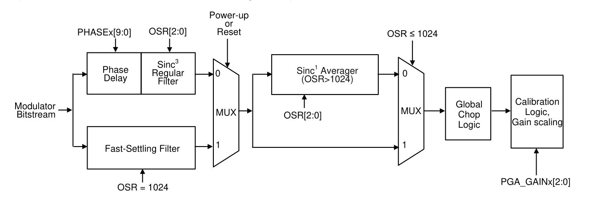

###### 8.3.7.1.1 Fast-Settling Filter

At power-up or after a device reset, the ADS131M08 selects the fast-settling filter to allow for settled output data generation  with  minimal  latency.  The  fast-settling  filter  has  the  characteristic  of  a  first-order  sinc  filter  (sinc¹ ). After two conversions, the device switches to and remains in the sinc³  filter path until the next time the device is reset or powered cycled.

The fast-settling filter exhibits wider bandwidth and less stop-band attenuation than the sinc³  filter. Consequently, the  noise  performance  when  using  the  fast-settling  filter  is  not  as  high  as  with  the  sinc³   filter.  The  first  two samples available from the ADS131M08 after a supply ramp or reset have the noise performance and frequency response  corresponding  to  the  fast-settling  filter  as  specified  in  the Electrical  Characteristics table,  whereas subsequent samples have the noise performance and frequency response consistent with the sinc³  filter. See the Fast Startup Behavior section for more details regarding the fast startup capabilities of the ADS131M08.

###### 8.3.7.1.2 sinc³  and sinc³  + sinc¹  Filter

The ADS131M08 selects the sinc³  filter path two conversion after power-up or device reset. For OSR settings of 128 to 1024 the sinc³  filter output directly feeds into the global-chop and calibration logic. For OSR settings of 2048 and higher the sinc³  filter is followed by a sinc¹  filter. As shown in Table 8-3, the sinc³  filter operates at a fixed OSR of 1024 in this case while the sinc¹  filter implements the additional OSRs of 2 to 16. That means when an OSR of 4096 (for example) is selected, the sinc³  filter operates at an OSR of 1024 and the sinc¹  filter at an OSR of 4.

The filter has infinite attenuation at integer multiples of the data rate except for integer multiples of f MOD. Like all digital  filters,  the  digital  filter  response  of  the  ADS131M08  repeats  at  integer  multiples  of  the  modulator frequency, f MOD . The data rate and filter notch frequencies scale with fMOD.

When possible, plan frequencies for unrelated periodic processes in the application for integer multiples of the data rate such that any parasitic effect they have on data acquisition is effectively cancelled by the notches of the  digital  filter.  Avoid  frequencies  near  integer  multiples  of  f MOD  whenever  possible  because  tones  in  these bands can alias to the band of interest.

The  sinc³   and  sinc³   +  sinc¹   filters  for  a  given  channel  require  time  to  settle  after  a  channel  is  enabled,  the channel multiplexer or gain setting is changed, or a resynchronization event occurs. See the Synchronization section for  more  details  on  resynchronization.  Table  8-3  lists  the  settling  times  of  the  sinc³ and  sinc³ +  sinc¹ filters for each OSR setting. The ADS131M08 does not gate unsettled data. Therefore, the host must account for the filter settling time and disregard unsettled data if any are read. The data at the next DRDY falling edge after the filter settling time listed in Table 8-3 has expired can be considered fully settled.

**Table 8-3. Digital Filter Startup Times After Power-Up or Resynchronization**

|   OSR (OVERALL) |   OSR (sinc³ ) | OSR (sinc¹ )   |   SETTLING TIME (tCLKIN ) |
|-----------------|-----------------|-----------------|----------------------------|
|             128 |             128 | N/A             |                        856 |
|             256 |             256 | N/A             |                       1112 |
|             512 |             512 | N/A             |                       1624 |
|            1024 |            1024 | N/A             |                       2648 |
|            2048 |            1024 | 2               |                       4696 |
|            4096 |            1024 | 4               |                       8792 |
|            8192 |            1024 | 8               |                      16984 |
|           16384 |            1024 | 16              |                      33368 |

##### 8.3.7.2 Digital Filter Characteristic

**Equation 6 calculates the z-domain transfer function of a sinc³  filter that is used for OSRs of 1024 and lower.**

$$
{\left| {H(z)} \right|} = {{\left| {(1 - {z}^{N})\div (N(1-{z}^{-1}))} \right|}}^{3}  \tag{Equation 6}
$$

where N is the OSR.

**Equation 7 calculates the transfer function of a sinc³  filter in terms of the continuous-time frequency parameter f .**

$$
H(f) = {{\left| {\sin ((N \times \pi \times f)/({f}_{MOD})) / (N \times \sin ((\pi \times f)/{f}_{MOD}))} \right|}}^{3}  \tag{Equation 7}
$$

where N is the OSR.

Figure 8-4 through Figure 8-7 show the digital filter response of the fast-settling filter and the sinc3 filter for OSRs of 1024 and lower. Figure 8-6 and Figure 8-7 show the digital filter response of the sinc3 + sinc1 filter for an OSR of 4096.

<!-- image -->

#### 8.3.8 DC Block Filter

The ADS131M08 includes an optional high-pass filter to eliminate any systematic offset or low-frequency noise. The filter is enabled by writing any value in the DCBLOCK[3:0] bits in the CD\_TH\_LSB register besides 0h. The DC  block  filter  can  be  enabled  and  disabled  on  a  channel-by-channel  basis  by  the  DCBLKn\_DIS  bit  in  the CHn\_CFG register for each respective channel.

Figure 8-8 shows the topology of the DC block filter. Coefficient a represents a register configurable value that configures the cutoff frequency of the filter. The cutoff frequency is configured using the DCBLOCK[3:0] bits in the CD\_TH\_LSB register. Table 8-4 describes the characteristics of the filter for various DCBLOCK[3:0] settings. The data provided in Table 8-4 is provided for an 8.192-MHz CLKIN frequency and a 4-kSPS data rate. The frequency response of the filter response scales directly with the frequency ofCLKIN and the data rate.

**Figure 8-8. DC Block Filter Topology**


**Table 8-4. DC Block Filter Characteristics**

| DCBLOCK[3:0]   | a COEFFICIENT | -3-dB CORNER (1) | PASS-BAND ATTENUATION (1) 50 Hz    | PASS-BAND ATTENUATION (1) 60 Hz   | SETTLING TIME (Samples) SETTLED >99%   | SETTLING TIME (Samples) FULLY SETTLED     |
|----------------|---------------|------------------|-----------------------------|-----------------------------|---------------------------|---------------------------|
| 0h             | DC block filter disabled | DC block filter disabled | DC block filter disabled    | DC block filter disabled    | DC block filter disabled  | DC block filter disabled  |
| 1h             | 1/4                      | 181 Hz                   | 11.5 dB                     | 10.1 dB                     | 17                        | 88                        |
| 2h             | 1/8                      | 84.8 Hz                  | 5.89 dB                     | 4.77 dB                     | 36                        | 187                       |
| 3h             | 1/16                     | 41.1 Hz                  | 2.24 dB                     | 1.67 dB                     | 72                        | 387                       |
| 4h             | 1/32                     | 20.2 Hz                  | 657 mdB                     | 466 mdB                     | 146                       | 786                       |
| 5h             | 1/64                     | 10.0 Hz                  | 171 mdB                     | 119 mdB                     | 293                       | 1585                      |
| 6h             | 1/128                    | 4.99 Hz                  | 43.1 mdB                    | 29.9 mdB                    | 588                       | 3182                      |
| 7h             | 1/256                    | 2.49 Hz                  | 10.8 mdB                    | 7.47 mdB                    | 1178                      | 6376                      |
| 8h             | 1/512                    | 1.24 Hz                  | 2.69 mdB                    | 1.87 mdB                    | 2357                      | 12764                     |
| 9h             | 1/1024                   | 622 mHz                  | 671 µdB                     | 466 µdB                     | 4714                      | 25540                     |
| Ah             | 1/2048                   | 311 mHz                  | 168 µdB                     | 116 µdB                     | 9430                      | 51093                     |
| Bh             | 1/4096                   | 155 mHz                  | 41.9 µdB                    | 29.1 µdB                    | 18861                     | 102202                    |
| Ch             | 1/8192                   | 77.7 mHz                 | 10.5 µdB                    | 7.27 µdB                    | 37724                     | 204447                    |
| Dh             | 1/16384                  | 38.9 mHz                 | 2.63 µdB                    | 1.82 µdB                    | 75450                     | 409156                    |
| Eh             | 1/32768                  | 19.4 mHz                 | 655 ndB                     | 455 ndB                     | 150901                    | 820188                    |
| Fh             | 1/65536                  | 9.70 mHz                 | 164 ndB                     | 114 ndB                     | 301803                    | 1627730                   |

- (1) Values given are for a 4-kSPS data rate with a 8.192-MHz CLKIN frequency.

#### 8.3.9 Internal Test Signals

The  ADS131M08  features  an  internal  analog  test  signal  that  is  useful  for  troubleshooting  and  diagnosis.  A positive  or  negative  DC  test  signal  can  be  applied  to  the  channel  inputs  through  the  input  multiplexer.  The multiplexer is controlled through the MUXn[1:0] bits in the CHn\_CFG register. The test signals are created by internally dividing the internal reference voltage. The same signal is shared by all channels.

The test signal is nominally 2 / 15 × VREF. The test signal automatically adjusts its voltage level with the gain setting such that the ADC always measures a signal that is 2 / 15 × VDiff Max. For example, at a gain of 1, this voltage equates to 160 mV. At a gain of 2, this voltage is 80 mV.

#### 8.3.10 Channel Phase Calibration

The ADS131M08 allows fine adjustment of the sample phase between channels through the use of channel phase calibration. This feature is helpful when different channels are measuring the outputs of different types of sensors  that  have  different  phase  responses.  For  example,  in  power  metrology  applications,  voltage  can  be measured by a voltage divider, whereas current is measured using a current transformer that exhibits a phase difference  between  its  input  and  output  signals.  The  differences  in  phase  between  the  voltage  and  current measurement must be compensated to measure the power and related parameters accurately.

The  phase  setting  of  the  different  channels  is  configured  by  the  PHASEn[9:0]  bits  in  the  CHn\_CFG  register corresponding  to  the  channel  whose  phase  adjustment  is  desired.  The  register  value  is  a  10-bit  two's complement  value  corresponding  to  the  number  of  modulator  clock  cycles  of  phase  offset  compared  to  a reference phase of 0 degrees.

The mechanism for achieving phase adjustment derives from the ΔΣ architecture. The ΔΣ modulator produces samples continuously at the modulator frequency, fMOD. These samples are filtered and decimated to the output data rate by the digital filter. The ratio between fMOD and the data rate is the oversampling ratio (OSR). Each conversion result corresponds to an OSR number of modulator samples provided to the digital filter. When the different  channels  of  the  ADS131M08 have no programmed phase offset between them, the modulator clock cycles corresponding to the conversion results of the different channels are aligned in the time domain. Figure 8-9 depicts an example scenario where the voltage input to channel 1 has no phase offset from channel 0.

### Figure 8-9. Two Channel Outputs With Equal Phase Settings

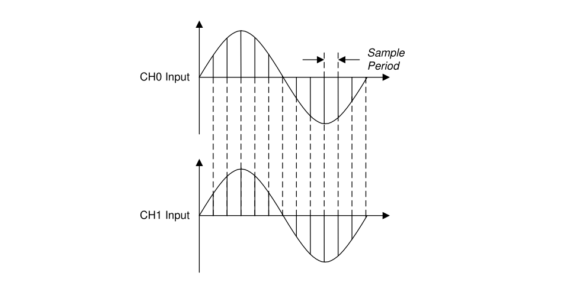

However, the sample period of one channel can be shifted with respect to another. If the inputs to both channels are sinusoids of the same frequency and the samples for these channels are retrieved by the host at the same time, the effect is that the phase of the channel with the modified sample period appears shifted .  Figure 8-10 depicts how the period corresponding to the samples are shifted between channels. Figure 8-11 illustrates how the samples appear as having generated a phase shift when they are retrieved by the host.

**Figure 8-10. Channel 1 With a Positive Sample Phase Shift With Respect to Channel 0**

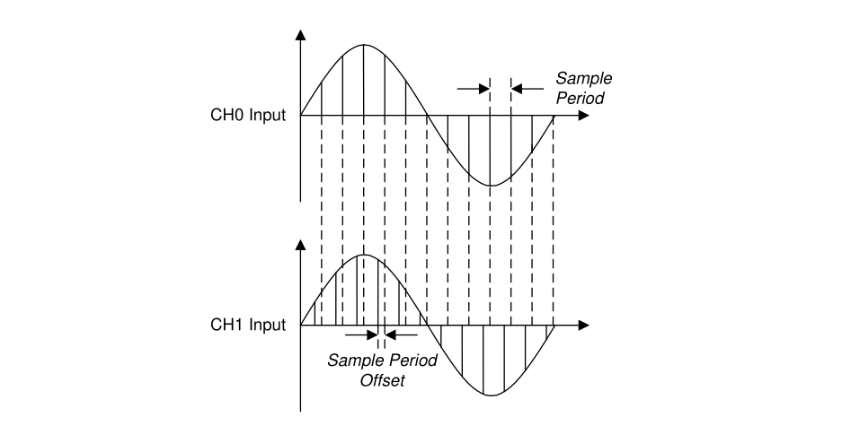

**Figure 8-11. Channels 1 and 0 From the Perspective of the Host**


The valid setting range is from -OSR / 2 to (OSR / 2) - 1, except for OSRs greater than 1024, where the phase calibration setting is limited to -512 to 511. If a value outside of -OSR / 2 and (OSR / 2) - 1 is programmed, the device internally clips the value to the nearest limit. For example, if the OSR setting is programmed to 128 and the PHASEn[9:0] bits are programmed to 0001100100b corresponding to 100 modulator clock cycles, the device sets  the  phase  of  the  channel  to  63  because  that  value  is  the  upper  limit  of  phase  calibration  for  that  OSR setting. Table 8-5 gives the range of phase calibration settings for various OSR settings.

**Table 8-5. Phase Calibration Setting Limits for Different OSR Settings**

|   OSR SETTING | PHASE OFFSET RANGE (tMOD )   | PHASEn[9:0] BITS RANGE         |
|---------------|-------------------------------|--------------------------------|
|           128 | -64 to 63                     | 11 1100 0000b to 00 0011 1111b |
|           256 | -128 to 127                   | 11 1000 0000b to 00 0111 1111b |
|           512 | -256 to 255                   | 11 0000 0000b to 00 1111 1111b |
|          1024 | -512 to 511                   | 10 0000 0000b to 01 1111 1111b |
|          2048 | -512 to 511                   | 10 0000 0000b to 01 1111 1111b |
|          4096 | -512 to 511                   | 10 0000 0000b to 01 1111 1111b |
|          8192 | -512 to 511                   | 10 0000 0000b to 01 1111 1111b |
|         16384 | -512 to 511                   | 10 0000 0000b to 01 1111 1111b |

Follow these steps to create a phase shift larger than half the sample period for OSRs less than 2048:

- Create a phase shift corresponding to an integer number of sample periods by modifying the indices between channel data in software
- Use the phase calibration function of the ADS131M08 to create the remaining fractional sample period phase shift

For example, to create a phase shift of 2.25 samples between channels 0 and 1, create a phase shift of two samples by aligning sample N in the channel 0 output data stream with sample N+2 in the channel 1 output data stream  in  the  host  software.  Make  the  remaining  0.25  sample  adjustment  using  the  ADS131M08  phase calibration function.

The phase calibration settings of the channels affect the timing of the data-ready interrupt signal, DRDY. See the Data Ready (DRDY) section for more details regarding how phase calibration affects the DRDY signal.

#### 8.3.11 Calibration Registers

The  calibration  registers  allow  for  the  automatic  computation  of  calibrated  ADC  conversion  results  from  preprogrammed values. The host can rely on the device to automatically correct for system gain and offset after the error  correction  terms  are  programmed  into  the  corresponding  device  registers.  The  measured  calibration coefficients  must  be  store  in  external  non-volatile  memory  and  programmed  into  the  registers  each  time  the ADS131M08 powers up because the ADS131M08 registers are volatile.

The offset calibration registers are used to correct for system offset error, otherwise known as zero error . Offset error corresponds to the ADC output when the input to the system is zero. The ADS131M08 corrects for offset errors by subtracting the contents of the OCALn[23:0] register bits in the  CHn\_OCAL\_MSB  and CHn\_OCAL\_LSB registers from the conversion result for that channel before being output. There are separate CHn\_OCAL\_MSB  and  CHnOCAL\_LSB  registers  for  each  channel,  which  allows  separate  offset  calibration coefficients to be programmed for each channel. The contents of the OCALn[23:0] bits are interpreted by the device as 24-bit two's complement values, which is the same format as the ADC data.

The gain calibration registers are used to correct for system gain error. Gain error corresponds to the deviation of gain  of  the  system  from  its  ideal  value.  The  ADS131M08  corrects  for  gain  errors  by  multiplying  the  ADC conversion result by the value given by the contents of the GCALn[23:0] register bits in the CHn\_GCAL\_MSB and CHn\_GCAL\_LSB registers before being output. There are separate CHn\_GCAL\_MSB and CHn\_GCAL\_LSB  registers  for  each  channel,  which  allows  separate  gain  calibration  coefficients  to  be programmed for each channel. The contents of the GCALn[23:0] bits are interpreted by the device as 24-bit unsigned values corresponding to linear steps ranging from gains of 0 to 2 - (1 / 2 23 ). Table 8-6 describes the relationship between the GCALn[23:0] bit values and the gain calibration factor.

**Table 8-6. GCALn[23:0] Bit Mapping**

| GCALn[23:0] VALUE   | GAIN CALIBRATION FACTOR   |
|---------------------|---------------------------|
| 000000h             | 0                         |
| 000001h             | 1.19 × 10 -7              |
| 800000h             | 1                         |
| FFFFFEh             | 2 - 2.38 × 10 -7          |
| FFFFFFh             | 2 - 1.19 × 10 -7          |

The calibration registers do not need to be enabled because they are always in use. The OCALn[23:0] bits have a default value of 000000h resulting in no offset correction. Similarly, the GCALn[23:0] bits default to 800000h resulting in a gain calibration factor of 1.

Figure 8-12 depicts a block diagram illustrating the mechanics of the calibration registers on one channel of the ADS131M08.

**Figure 8-12. Calibration Block Diagram**

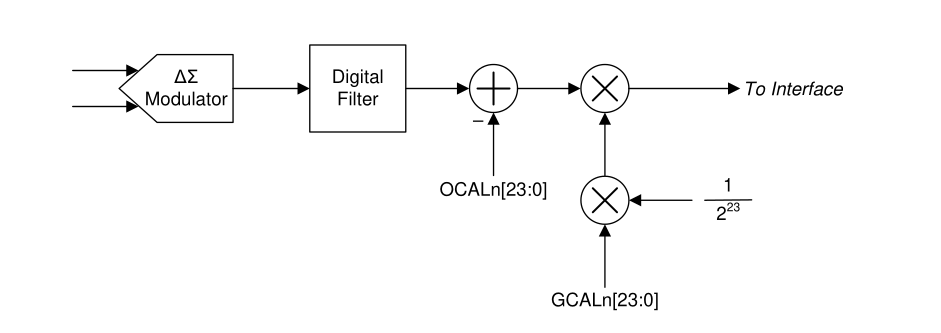

#### 8.3.12 Communication Cyclic Redundancy Check (CRC)

The ADS131M08 features a cyclic redundancy check (CRC) engine on both input and output data to mitigate SPI communication errors. The CRC word is 16 bits wide for either input or output CRC. Coverage includes all words in the SPI frame where the CRC is enabled, including padded bits in a 32-bit word size.

CRC on the SPI input is optional and can be enabled and disabled by writing the RX\_CRC\_EN bit in the MODE register. Input CRC is disabled by default. When the input CRC is enabled, the device checks the provided input CRC against the CRC generated based on the input data. A CRC error occurs if the CRC words do not match. The device does not execute any commands, except for the WREG command, if the input CRC check fails. A WREG command always executes even when the CRC check fails. The device sets the CRC\_ERR bit in the STATUS register for all cases of a CRC error. The response on the output in the SPI frame following the frame where  the  CRC  error  occurred  is  that  of  a  NULL  command,  which  means  the  STATUS  register  plus  the conversion data are output in the following SPI frame. The CRC\_ERR bit is cleared when the STATUS register is output.

The output CRC cannot be disabled and always appears at the end of the output frame. The host can ignore the data if the output CRC is not used.

There are two types of CRC polynomials available: CCITT CRC and ANSI CRC (CRC-16). The CRC setting determines the algorithm for both the input and output CRC. The CRC type is programmed by the CRC\_TYPE bit in the MODE register. Table 8-7 lists the details of the two CRC types.

The seed value of the CRC calculation is FFFFh.

**Table 8-7. CRC Types**

| CRC TYPE   | POLYNOMIAL            | BINARY POLYNOMIAL   |
|------------|-----------------------|---------------------|
| CCITT CRC  | x^16 + x^12 + x^5 + 1 | 0001 0000 0010 0001 |
| ANSI CRC   | x^16 + x^15 + x^2 + 1 | 1000 0000 0000 0101 |

#### 8.3.13 Register Map CRC

The ADS131M08 performs a CRC on its own register map as a means to check for unintended changes to the registers. Enable the register map CRC by setting the REG\_CRC\_EN bit in the MODE register. When enabled, the device constantly calculates the register map CRC using each bit in the writable register space. The register addresses covered by the register map CRC on the ADS131M08 are 02h through 30h. The CRC is calculated beginning with the MSB of register 02h and ending with the LSB of register 30h using the polynomial selected in the CRC\_TYPE bit in the MODE register.

The calculated CRC is a 16-bit value and is stored in the REGMAP\_CRC register. The calculation is done using one register map bit per CLKIN period and constantly checks the result against the previous calculation. The REG\_MAP bit in the STATUS register is set to flag the host if the register map CRC changes, including changes resulting from register writes. The bit is cleared by reading the STATUS register, or by the STATUS register being output as a response to the NULL command.

### 8.4 Device Functional Modes

Figure 8-13 shows a state diagram depicting the major functional modes of the ADS131M08 and the transitions between them.

**Figure 8-13. State Diagram Depicting Device Functional Modes**

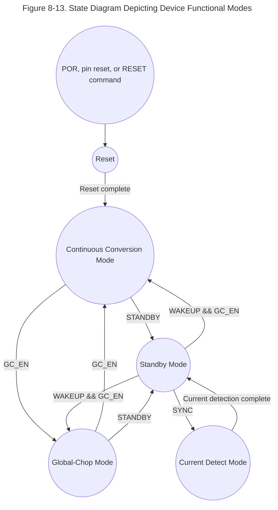

#### 8.4.1 Power-Up and Reset

The ADS131M08 is reset in one of three ways: by a power-on reset (POR), by the SYNC/RESET pin, or by a RESET command. After a reset occurs, the configuration registers are reset to the default values and the device begins  generating  conversion  data  as  soon  as  a  valid  MCLK  is  provided.  In  all  three  cases  a  low  to  high transition on the DRDY pin indicates that the SPI interface is ready for communication. The device ignores any SPI communication before this point.

##### 8.4.1.1 Power-On Reset

Power-on reset (POR) is the reset that occurs when a valid supply voltage is first applied. The POR process requires tPOR from when the supply voltages reach 90% of their nominal value. Internal circuitry powers up and the registers are set to their default state during this time. The DRDY pin transitions from low to high immediately after tPOR indicating the SPI interface is ready for communication. The device ignores any SPI communication before this point.

##### 8.4.1.2 SYNC/RESET Pin

The SYNC/RESET pin is an active low, dual-function pin that generates a reset if the pin is held low longer than tw(RSL). The device maintains a reset state until SYNC/RESET is returned high. The host must wait for at least tREGACQ after SYNC/RESET is brought high or for the DRDY rising edge before communicating with the device. Conversion data are generated immediately after the registers are reset to their default values, as described in the Fast Startup Behavior section.

##### 8.4.1.3 RESET Command

The ADS131M08 can be reset via the SPI RESET command (0011h). The device communicates in frames of a fixed  length.  See  the SPI  Communication  Frames section  for  details  regarding  SPI  data  framing  on  the ADS131M08. The RESET command occurs in the first word of the data frame, but the command is not latched by the device until the entire frame is complete. After the response completes channel data and CRC words are clocked out. Terminating the frame early causes the RESET command to be ignored. Ten words are required to complete a frame on the ADS131M08.

A reset occurs immediately after the command is latched. The host must wait for tREGACQ before communicating with  the  device  to  ensure  the  registers  have  assumed  their  default  settings.  Conversion  data  are  generated immediately  after  the  registers  are  reset  to  their  default  values,  as  described  in  the Fast  Startup  Behavior section.

#### 8.4.2 Fast Startup Behavior

The ADS131M08 begins generating conversion data shortly after startup as soon as a valid CLKIN signal is provided  to  the  ΔΣ  modulators.  The  fast  startup  feature  is  useful  for  applications  such  as  circuit  breakers powered from the mains that require a fast determination of the input voltage soon after power is applied to the device.  Fast  startup  is  accomplished  via  two  mechanisms.  First,  the  device  internal  power-supply  circuitry  is designed specifically to enable fast startup. Second, the digital decimation filter dynamically switches from a fastsettling filter to a sinc³  filter when the sinc³  filter has had time to settle.

After the supplies are ramped to 90% of their final values, the device requires tPOR for the internal circuitry to settle. The end of t POR is indicated by a transition of DRDY from low to high. The transition of DRDY from low to high also indicates the SPI interface is ready to accept commands.

The ΔΣ modulators of the ADS131M08 require CLKIN to toggle after tPOR to begin working. The modulators begin sampling the input signal after an initial wait time delay of (256 + 44) × tMOD when CLKIN begins toggling. Therefore, provide a valid clock signal on CLKIN as soon as possible after the supply ramp to achieve the fastest possible startup time.

The data generated by the ΔΣ modulators are fed to the digital filter blocks. The data are provided to both the fast-settling filter and the sinc³  filter paths. The fast-settling filter requires only one data rate period to provide settled data. Meanwhile, the sinc³  filter requires three data rate periods to settle. The fast-settling filter generates the output data for the two interim ADC output samples indicated by DRDY transitioning from high to low while the sinc³  filter is settling. The device disables the fast-settling filter and provides conversion data from the sinc³ filter path for the third and following samples. Figure 8-14 shows the behavior of the fast-startup feature when using an external clock that is provided to the device right after the supplies have ramped. Table 8-8 shows the values for the various startup and settling times relevant to the device startup.

**Figure 8-14. Fast Startup Behavior and Settling Times**

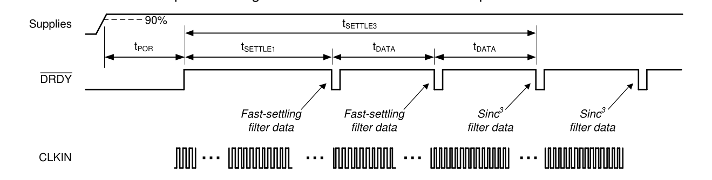

**Table 8-8. Fast Startup Settling Times for Default OSR = 1024**

| PARAMETER         | VALUE (DETAILS) (tMOD )   |   VALUE (tMOD ) |   VALUE AT fCLKIN = 8.192 MHz (ms) |
|-------------------|----------------------------|------------------|-------------------------------------|
| tDATA = 1/fDATA | 1024                       |             1024 |                               0.250 |
| tSETTLE1         | 256 + 44 + 1024            |             1324 |                               0.323 |
| tSETTLE3         | 256 + 44 + 3 x 1024        |             3372 |                               0.823 |

The fast-settling filter provides conversion data that are significantly noisier than the data that comes from the sinc³   filter  path,  but  allows the device to provide settled conversion data during the longer settling time of the more accurate sinc³  digital filter. If the level of precision provided by the fast-settling filter is insufficient even for the first samples immediately following startup, ignore the first two instances of DRDY toggling from high to low and begin collecting data on the third instance.

The startup process following a RESET command or a pin reset using the SYNC/RESET pin is similar to what occurs after power up. However there is no tPOR in the case of a command or pin reset because the supplies are already ramped. After reset, the device waits for the initial wait time delay of (256 + 44) × tMOD  before providing modulator samples to the two digital filters. The fast-settling filter is enabled for the first two output samples.

#### 8.4.3 Conversion Modes

There  are  two  ADC  conversion  modes  on  the  ADS131M08:  continuous-conversion  and  global-chop  mode. Continuous-conversion mode is a mode where ADC conversions are generated constantly by the ADC at a rate defined  by  fMOD  /  OSR.  Global-chop  mode  differs  from  continuous-conversion  mode  because  global-chop periodically chops (or swaps) the inputs, which reduces system offset errors at the cost of settling time between the points when the inputs are swapped. In either continuous-conversion or global-chop mode, there are three power modes that provide flexible options to scale power consumption with bandwidth and dynamic range. The Power Modes section discusses these power modes in further detail.

##### 8.4.3.1 Continuous-Conversion Mode

Continuous-conversion mode is the mode in which ADC data are generated constantly at the rate of fMOD / OSR. New  data  are  indicated  by  a  DRDY  falling  edge  at  this  rate.  Continuous-conversion  mode  is  intended  for measuring AC signals because this mode allows for higher output data rates than global-chop mode.

##### 8.4.3.2 Global-Chop Mode

The ADS131M08 incorporates a global-chop mode option to reduce offset error and offset drift inherent to the device due to mismatch in the internal circuitry to very low levels. When global-chop mode is enabled by setting the  GC\_EN  bit  in  the  GLOBAL\_CHOP\_CFG  register,  the  device  uses  the  conversion  results  from  two consecutive  internal  conversions  taken  with  opposite  input  polarity  to  cancel  the  device  offset  voltage. Conversion n is  taken  with  normal  input  polarity.  The  device  then  reverses  the  internal  input  polarity  for conversion n + 1 . The average of two consecutive conversions ( n and n + 1 , n + 1 and n + 2 and so on) yields the final offset compensated result.

Figure  8-15  shows  a  block  diagram  of  the  global-chop  mode  implementation.  The  combined  PGA  and  ADC internal offset voltage is modeled as VOFS. Only this device inherent offset voltage is reduced by global-chop mode. Offset in the external circuitry connected to the analog inputs is not affected by global-chop mode.

**Figure 8-15. Global-Chop Mode Implementation**

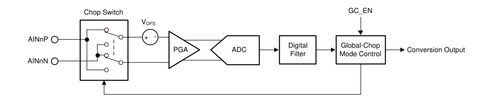

The conversion period in global-chop mode differs from the conversion time when global-chop mode is disabled (tDATA = OSR x tMOD). Figure 8-16 shows the conversion timing for an ADC channel using global-chop mode.

**Figure 8-16. Conversion Timing With Global-Chop Mode Enabled**

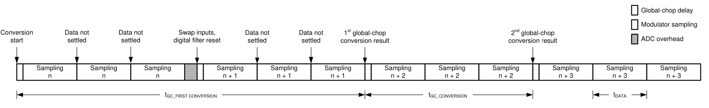

Every time the device swaps the input polarity, the digital filter is reset. The ADC then always takes three internal conversions to produce one settled global-chop conversion result.

The ADS131M08 provides a programmable delay (tGC\_DLY) between the end of the previous conversion period and the beginning of the subsequent conversion period after the input polarity is swapped. This delay is to allow for external input circuitry to settle because the chopping switches interface directly with the analog inputs. The GC\_DLY[3:0]  bits  in  the  GLOBAL\_CHOP\_CFG  register  configure  the  delay  after  chopping  the  inputs.  The global-chop delay is selected in terms of modulator clock periods from 2 to 65,536 x tMOD .

The effective conversion period in global-chop mode follows Equation 8. A DRDY falling edge is generated each time a new global-chop conversion becomes available to the host.

The conversion process of all ADC channels in global-chop mode is restarted in the following two conditions so that all channels start sampling at the same time:

- Falling edge of SYNC/RESET pin
- Change of OSR setting

The conversion period of the first conversion after the ADC channels have been reset is considerably longer than  the  conversion  period  of  all  subsequent  conversions  mentioned  in  Equation  8,  because  the  device  first needs to perform two fully settled internal conversions with the input polarity swapped. The conversion period for the first conversion in global-chop mode follows Equation 9.


$$
t_{GC\_CONVERSION} = t_{GC\_DLY} + 3 \times OSR + t_{MOD}    \tag{Equation 8}
$$

$$
t_{GC\_FIRST\_CONVERSION} = t_{GC\_DLY} + 3 \times OSR \times t_{MOD} + t_{GC\_DLY} + 3 \times OSR \times t_{MOD} + 44 \times t_{MOD}   \tag{Equation 9}
$$


Using global-chop mode reduces the ADC noise shown in Table 7-1 at a given OSR by a factor of √2 because two  consecutive  internal  conversions  are  averaged  to  yield  one  global-chop  conversion  result.  The  DC  test signal cannot be measured in global-chop mode.

Phase calibration is automatically disabled in global-chop mode.

#### 8.4.4 Power Modes

In both continuous-conversion and global-chop mode, there are three selectable power modes that allow scaling of  power  with  bandwidth  and  performance:  high-resolution  (HR)  mode,  low-power  (LP)  mode,  and  very-lowpower (VLP) mode. The mode is selected by the PWR[1:0] bits in the CLOCK register. See the Recommended Operating Conditions table for restrictions on the CLKIN frequency for each power mode.

#### 8.4.5 Standby Mode

Standby  mode  is  a  low-power  state  in  which  all  channels  are  disabled,  and  the  reference  and  other  nonessential circuitry are powered down. This mode differs from completely powering down the device because the device  retains  its  register  settings.  Enter  standby  mode  by  sending  the  STANDBY  command  (0022h).  Stop toggling CLKIN when the device is in standby mode to minimize device power consumption. Exit standby mode by  sending  the  WAKEUP command (0033h). After exiting standby mode, the modulators begin sampling the input signal after a modulator settling time of 8 × tMOD when CLKIN begins toggling.

#### 8.4.6 Current-Detect Mode

Current-detect  mode  is  a  special  mode  that  is  helpful  for  applications  requiring  tamper  detection  when  the equipment is in a low-power state. In this mode, the ADS131M08 collects a configurable number of samples at a nominal data rate of 2.7 kSPS and compares the absolute value of the results to a programmable threshold. If a configurable number of results exceed the threshold, the host is notified via a DRDY falling edge and the device returns to standby mode. Enter current-detect mode by providing a negative pulse on SYNC/RESET with a pulse duration less than tw(RSL) when in standby mode. Current-detect mode can only be entered from standby mode.

The  device  uses  a  limited  power  operating  mode  to  generate  conversions  in  current-detect  mode.  The conversion  results  are  only  used  for  comparison  by  the  internal  digital  threshold  comparator  and  are  not accessible by the host. The device uses an internal oscillator that enables the device to capture the data without the use of the external clock input. Do not toggle CLKIN when in current-detect mode to minimize device power consumption. Do not place a capacitor on the REFIN pin if current-detect mode is used. Capacitance on this pin requires time to start up, and the resulting ADC conversions generated during current-detect mode are not valid when the voltage on the REFIN pin is charging.

Current-detect  mode  is  configured  in  the  CFG,  THRSHLD\_MSB,  and  THRSHLD\_LSB  registers.  Enable  and disable  current-detect  mode  by  toggling  the  CD\_EN  bit  in  the  CFG  register.  The  THRSHLD\_MSB  and THRSHLD\_LSB  registers  contain  the  CD\_THRSH[23:0]  bits  that  represent  the  digital  comparator  threshold value during current detection.

The number of samples used for current detection are programmed by the CD\_LEN[2:0] bits in the CFG register. The number of samples used for current detection range from 128 to 3584.

The programmable values in CD\_NUM[2:0] configure the number of samples that must exceed the threshold for a detection to occur. The purpose of requiring multiple samples for detection is to control noisy values that may exceed the threshold, but do not represent a high enough power level to warrant action by the host. In summary, the  conversion  result  must  exceed  the  value  programmed  in  CD\_THRSH[23:0]  a  number  of  times  as represented by the value stored in CD\_NUM[2:0].

The device can be configured to notify the host based on any of the results from either individual channels , all channels,  or  any  combination  of  channels.  The  CD\_ALLCH  bit  in  the  CFG  register  determines  how  many channels are required to exceed the programmed thresholds to trigger a current detection. When the bit is 1, all enabled channels are required to meet the current detection requirements in order for the host to be notified. If the bit is 0, any enabled channel triggers a current detection notification if the requirements are met. Enable and disable channels using the CHn\_EN bits in the CLK register to control which combination of channels must meet the requirements to trigger a current-detection notification.

Figure 8-17 illustrates a flow chart depicting the current-detection process on the ADS131M08.

**Figure 8-17. Current-Detect Mode Flow Chart**

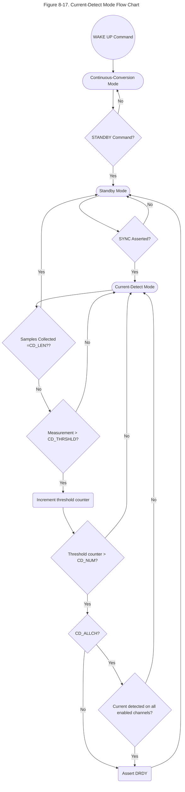

### 8.5 Programming

#### 8.5.1 Interface

The ADS131M08 uses an SPI-compatible interface to configure the device and retrieve conversion data. The device always acts as an SPI slave; SCLK and CS are inputs to the interface. The interface operates in SPI mode 1 where CPOL = 0 and CPHA = 1. In SPI mode 1, the SCLK idles low and data are launched or changed only  on  SCLK  rising  edges;  data  are  latched  or  read  by  the  master  and  slave  on  SCLK  falling  edges.  The interface  is  full-duplex,  meaning  data  can  be  sent  and  received  simultaneously  by  the  interface.  The  device includes the typical SPI signals: SCLK, CS, DIN (MOSI), and DOUT (MISO). In addition, there are two other digital  pins  that  provide  additional  functionality.  The  DRDY  pin  serves  as  a  flag  to  the  host  to  indicate  new conversion  data  are  available.  The  SYNC/RESET  pin  is  a  dual-function  pin  that  allows  synchronization  of conversions to an external event and allows for a hardware device reset.

##### 8.5.1.1 Chip Select (CS)

The CS pin is  an  active  low  input  signal  that  selects  the  device  for  communication.  The  device  ignores  any communication  and  DOUT  is  high  impedance  when  CS  is  held  high.  Hold  CS  low  for  the  duration  of  a communication frame to ensure proper communication. The interface is reset each time CS is taken high.

##### 8.5.1.2 Serial Data Clock (SCLK)

The SCLK pin is an input that serves as the serial clock for the interface. Output data on the DOUT pin transition on the rising edge of SCLK and input data on DIN are latched on the falling edge of SCLK.

##### 8.5.1.3 Serial Data Input (DIN)

The DIN pin is the serial data input pin for the device. Serial commands are shifted in through the DIN pin by the device with each SCLK falling edge when the CS pin is low.

##### 8.5.1.4 Serial Data Output (DOUT)

The DOUT pin is the serial data output pin for the device. The device shifts out command responses and ADC conversion  data  serially  with  each  rising  SCLK  edge  when  the  CS  pin  is  low.  This  pin  assumes  a  highimpedance state when CS is high.

##### 8.5.1.5 Data Ready (DRDY)

The DRDY pin is an active low output that indicates when new conversion data are ready in conversion mode or that the requirements are met for current detection when in current-detect mode. Connect the DRDY pin to a digital input on the host to trigger periodic data retrieval in conversion mode.

The timing of DRDY with respect to the sampling of a given channel on the ADS131M08 depends on the phase calibration  setting  of  the  channel  and  the  state  of  the  DRDY\_SEL[1:0]  bits  in  the  MODE  register.  Setting  the DRDY\_SEL[1:0]  bits  to  00b  configures  DRDY  to  assert  when  the  channel  with  the  largest  positive  phase calibration setting, or the most lagging, has a new conversion result. When the bits are 01b, the device asserts DRDY each time any channel data are ready. Finally, setting the bits to either 10b or 11b configures the device to assert DRDY when the channel with the most negative phase calibration setting, or the most leading, has new conversion  data.  Changing  the  DRDY\_SEL[1:0]  bits  has  no  effect  on  DRDY  behavior  in  global-chop  mode because phase calibration is automatically disabled in global-chop mode.

The timing of the first DRDY assertion after channels are enabled or after a synchronization pulse is provided depends on the phase calibration setting. If the channel that causes DRDY to assert has a phase calibration setting  less  than  zero,  the  first  DRDY  assertion  can  be  less  than  one  sample  period  from  the  channel  being enabled or the occurrence of the synchronization pulse. However, DRDY asserts in the next sample period if the phase setting puts the output timing too close to the beginning of the sample period.

Table 8-9 lists the phase calibration setting boundary at which DRDY either first asserts within a sample period, or in the next sample period. If the setting for the channel configured to control DRDY assertion is greater than the value listed in Table 8-9 for each OSR, DRDY asserts for the first time within a sample period of the channel being enabled or the synchronization pulse. If the phase setting value is equal to or more negative than the value  in  Table  8-9,  DRDY  asserts  in  the  following  sample  period.  See  the Synchronization section  for  more information about synchronization.

**Table 8-9. Phase Setting First DRDY Assertion Boundary**

| OSR   | PHASE SETTING BOUNDARY   | PHASEn[9:0] BIT SETTING BOUNDARY   |
|-------|--------------------------|------------------------------------|
| 128   | -19                      | 3EDh                               |
| 256   | -83                      | 3ADh                               |
| 512   | -211                     | 32Dh                               |
| 1024  | -467                     | 22Dh                               |
| >1024 | None                     | N/A                                |

The DRDY\_HIZ bit in the MODE register configures the state of the DRDY pin when deasserted. By default the bit  is  0b,  meaning  the  pin  is  actively  driven  high  using  a  push-pull  output  stage.  When  the  bit  is  1b,  DRDY behaves like an open-drain digital output. Use a 100-kΩ pullup resistor to pull the pin high when DRDY is not asserted.

The DRDY\_FMT bit in the MODE register determines the format of the DRDY signal. When the bit is 0b, new data are indicated by DRDY changing from high to low and remaining low until either all of the conversion data are shifted out of the device, or remaining low and going high briefly before the next time DRDY transitions low. When the DRDY\_FMT bit is 1b, new data are indicated by a short negative pulse on the DRDY pin. If the host does not read conversion data after the DRDY pulse when DRDY\_FMT is 1b, the device skips a conversion result  and  does  not  provide  another  DRDY  pulse  until  the  second  following  instance  when  data  are  ready because of how the pulse is generated. See the Collecting  Data  for  the  First  Time  or  After  a  Pause  in  Data Collection section for more information about the behavior of DRDY when data are not consistently read.

The DRDY pulse is blocked when new conversions complete while conversion data are read. Therefore, avoid reading  ADC  data  during  the  time  where  new  conversions  complete  in  order  to  achieve  consistent  DRDY behavior.

##### 8.5.1.6 Conversion Synchronization or System Reset (SYNC/RESET)

The SYNC/RESET pin is a multi-function digital input pin that serves primarily to allow the host to synchronize conversions  to  an  external  process  or  to  reset  the  device.  See  the Synchronization section  for  more  details regarding the synchronization function. See the SYNC/RESET Pin section for more details regarding how the device is reset.

##### 8.5.1.7 SPI Communication Frames

SPI  communication  on  the  ADS131M08  is  performed  in  frames.  Each  SPI  communication  frame  consists  of several  words.  The  word  size  is  configurable  as  either  16  bits,  24  bits,  or  32  bits  by  programming  the WLENGTH[1:0] bits in the MODE register.

The ADS131M08 implements a timeout feature for the SPI communication. Enable or disable the timeout using the  TIMEOUT bit in the MODE register. When enabled, the entire SPI frame (first SCLK to last SCLK) must complete within 2 15  CLKIN cycles otherwise the SPI will reset. This feature is provided as a means to recover SPI synchronization for cases where CS is tied low.

The  interface  is  full  duplex,  meaning  that  the  interface  is  capable  of  transmitting  data  on  DOUT  while simultaneously  receiving  data  on  DIN.  The  input  frame  that  the  host  sends  on  DIN  always  begins  with  a command.  The  first  word  on  the  output  frame  that  the  device  transmits  on  DOUT  always  begins  with  the response to the command that was written on the previous input frame. The number of words in a command depends on the command provided. For most commands, there are ten words in a frame. On DIN, the host provides the command, the command CRC if input CRC is enabled or a word of zeros if input CRC is disabled, and  eight  additional  words  of  zeros.  Simultaneously  on  DOUT,  the  device  outputs  the  response  from  the previous frame command, eight words of ADC data representing the eight ADC channels, and a CRC word. Figure 8-18 illustrates a typical command frame structure.

**Figure 8-18. Typical Communication Frame**

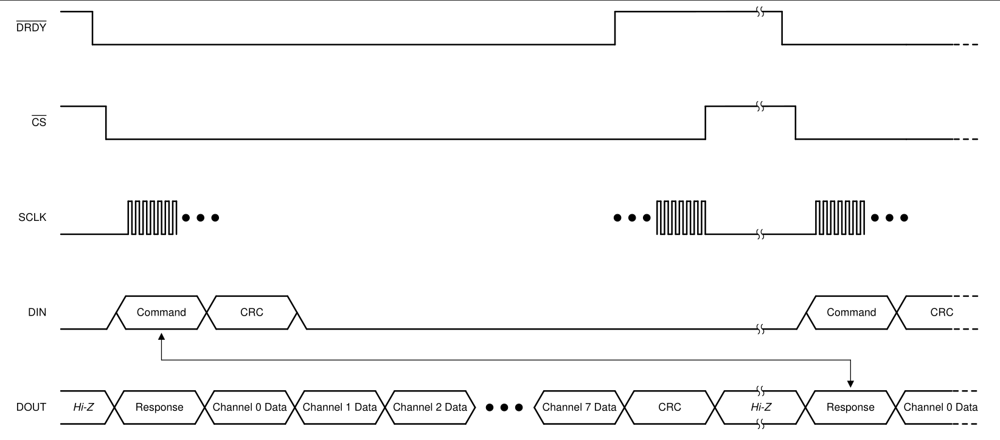

There are some commands that require more than ten words. In the case of a read register (RREG) command where more than a single register is read, the response to the command contains the acknowledgment of the command followed by the  register  contents  requested,  which  may  require  a  larger  frame  depending  on  how many  registers  are  read.  See  the RREG  (101a  aaaa  annn  nnnn) section  for  more  details  on  the  RREG command.

In the case of a write register (WREG) command where more than a single register is written, the frame extends to  accommodate the additional data. See the WREG (011a aaaa annn nnnn) section  for  more  details  on  the WREG command.

See  the Commands section  for  a  list  of  all  valid  commands  and  their  corresponding  responses  on  the ADS131M08.

Under special circumstances, a data frame can be shortened by the host. See the Short SPI Frames section for more information about artificially shortening communication frames.

##### 8.5.1.8 SPI Communication Words

An SPI communication frame with the ADS131M08 is made of words. Words on DIN can contain commands, register  settings  during  a  register  write,  or  a  CRC  of  the  input  data.  Words  on  DOUT  can  contain  command responses, register settings during a register read, ADC conversion data, or CRC of the output data.

Words can be 16, 24, or 32 bits. The word size is configured by the WLENGTH[1:0] bits in the MODE register. The device defaults to a 24-bit word size. Commands, responses, CRC, and registers always contain 16 bits of actual data. These words are always most significant bit (MSB) aligned, and therefore the least significant bits (LSBs) are zero-padded to accommodate 24- or 32-bit word sizes. ADC conversion data are nominally 24 bits. The ADC truncates its eight LSBs when the device is configured for 16-bit communication. There are two options for  32-bit  communication available for ADC data that are configured by the WLENGTH[1:0] bits in the MODE register. Either the ADC data can be LSB padded with zeros or the data can be MSB sign extended.

##### 8.5.1.9 ADC Conversion Data

The device provides conversion data for each channel at the data rate. The time when data are available relative to DRDY asserting is determined by the channel phase calibration setting and the DRDY\_SEL[1:0] bits in the MODE  register  when  in  continuous-conversion  mode.  All  data  are  available  immediately  following  DRDY assertion in global-chop mode. The conversion status of all channels is available as the DRDY[7:0] bits in the STATUS register. The STATUS register content is automatically output as the response to the NULL command.

Conversion data are 24 bits. The data LSBs are truncated when the device operates with a 16-bit word size. The LSBs are zero padded or the MSBs sign extended when operating with a 32-bit word size depending on the setting of the WLENGTH[1:0] bits in the MODE register.

Data are given in binary two's complement format. Use Equation 10 to calculate the size of one code (LSB).

$$
1 LBS = (2.4 / Gain)/ 2^{24} = +FSR / 2^{23}    \tag{Equation 10}
$$

A positive full-scale input VIN ≥ +FSR - 1 LSB = 1.2 / Gain - 1 LSB produces an output code of 7FFFFFh and a negative full-scale input (VIN  ≤  -FSR = -1.2 / Gain) produces an output code of 800000h. The output clips at these codes for signals that exceed full-scale.

Table 8-10 summarizes the ideal output codes for different input signals.

**Table 8-10. Ideal Output Code versus Input Signal**

| INPUT SIGNAL, VIN = VAINP - VAINN   | IDEAL OUTPUT CODE   |
|----------------------------------------|---------------------|
| ≥ FSR (2 23 - 1) / 2 23                | 7FFFFFh             |
| FSR / 2 23                             | 000001h             |
| 0                                      | 000000h             |
| -FSR / 2 23                            | FFFFFFh             |
| ≤ -FSR                                 | 800000h             |

Figure 8-19 shows the mapping of the analog input signal to the output codes.

**Figure 8-19. Code Transition Diagram**

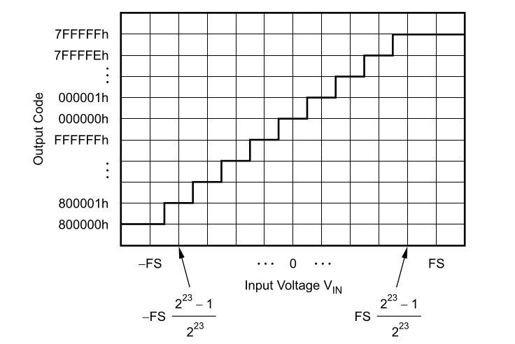

###### 8.5.1.9.1 Collecting Data for the First Time or After a Pause in Data Collection

Take special precaution when collecting data for the first time or when beginning to collect data again after a pause.  The  internal  mechanism  that  outputs  data  contains  a  first-in-first-out  (FIFO)  buffer  that  can  store  two samples of data per channel at a time. The DRDY flag for each channel in the STATUS register remains set until both  samples  for  each  channel  are  read  from  the  device.  This  condition  is  not  obvious  under  normal circumstances when the host is reading each consecutive sample from the device. In that case, the samples are cleared from the device each time new data are generated so the DRDY flag for each channel in the STATUS register is cleared with each read. However, both slots of the FIFO are full if a sample is missed or if data are not read for a period of time. Either strobe the SYNC/RESET pin to re-synchronize conversions and clear the FIFOs, or quickly read two data packets when data are read for the first time or after a gap in reading data. This process ensures predictable DRDY  pin behavior. See the Synchronization section for information about the synchronization feature. These methods do not need to be employed if each channel data was read for each output data period from when the ADC was enabled.

Figure 8-20 depicts an example of how to collect data after a period of the ADC running, but where no data are being  retrieved.  In  this  instance,  the  SYNC/RESET  pin  is  used  to  clear  the  internal  FIFOs  and  realign  the ADS131M08 output data with the host.

**Figure 8-20. Collecting Data After a Pause in Data Collection Using the SYNC/RESET Pin**

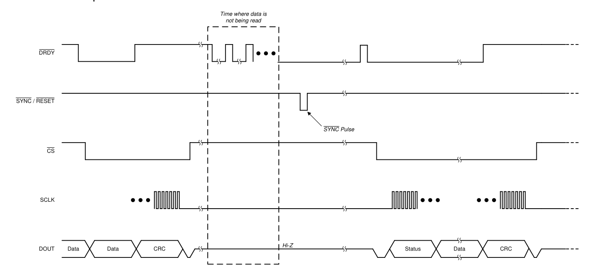

Another  functionally  equivalent  method  for  clearing  the  FIFO  after  a  pause  in  collecting  data  is  to  begin  by reading  two  samples  in  quick  succession.  Figure  8-21  depicts  this  method.  This  example  shows  when  the DRDY\_FMT bit in the MODE register is set to 0b indicating DRDY is a level output. There is a very narrow pulse on DRDY immediately after the first set of data are shifted out of the device. This pulse may be too narrow for some microcontrollers to  detect.  Therefore,  do  not  rely  upon  this  pulse  but  instead  immediately  read  out  the second data set after the first data set. The host operates synchronous to the device after the second word is read from the device.

**Figure 8-21. Collecting Data After a Pause in Data Collection by Reading Data Twice**

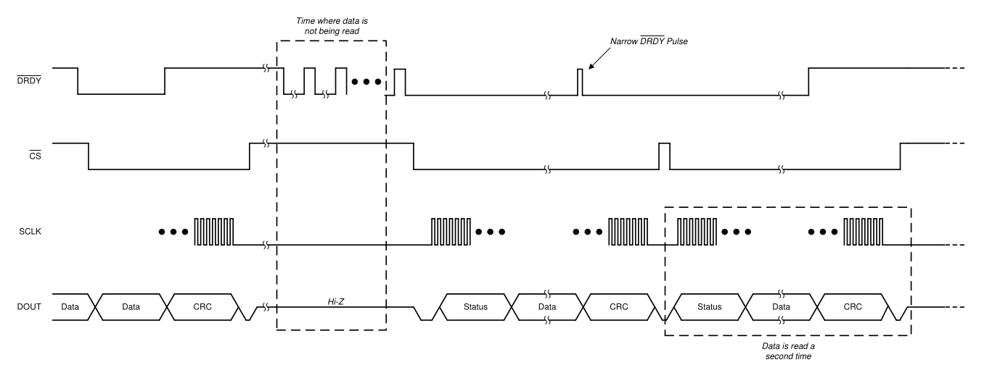

##### 8.5.1.10 Commands

Table 8-11 contains a list of all valid commands, a short description of their functionality, their binary command word, and the expected response that appears in the following frame.

**Table 8-11. Command Definitions**

| COMMAND   | DESCRIPTION                                                                     | COMMAND WORD         | RESPONSE                                       |
|-----------|---------------------------------------------------------------------------------|----------------------|------------------------------------------------|
| NULL      | No operation                                                                    | 0000 0000 0000 0000  | STATUS register                                |
| RESET     | Reset the device                                                                | 0000 0000 0001 0001  | 1111 1111 0010 1000                            |
| STANDBY   | Place the device into standby mode                                              | 0000 0000 0010 0010  | 0000 0000 0010 0010                            |
| WAKEUP    | Wake the device from standby mode to conversion mode                            | 0000 0000 0011 0011  | 0000 0000 0011 0011                            |
| LOCK      | Lock the interface such that only the NULL, UNLOCK, and RREG commands are valid | 0000 0101 0101 0101  | 0000 0101 0101 0101                            |
| UNLOCK    | Unlock the interface after the interface is locked                              | 0000 0110 0101 0101  | 0000 0110 0101 0101                            |
| RREG      | Read nnn nnnn plus 1 registers beginning at address a aaaa a                    | 101 a aaaa annn nnnn | dddd dddd dddd dddd or 111 a aaa annn nnnn (1) |
| WREG      | Write nnn nnnn plus 1 registers beginning at address a aaaa a                   | 011 a aaaa annn nnnn | 010 a aaaa ammm mmmm (2)                       |

(1) When nnn nnnn is 0, the response is the requested register data dddd dddd dddd dddd . When nnn nnnn is greater than 0, the response begins with 111 a aaaa annn nnnn , followed by the register data.

(2) In this case mmm mmmm represents the number of registers that are actually written minus one. This value may be less than nnn nnnn in some cases.

###### 8.5.1.10.1 NULL (0000 0000 0000 0000)

The NULL command is the no-operation command that results in no registers read or written, and the state of the device remains unchanged. The intended use case for the NULL command is during ADC data capture. The command response for the NULL command is the contents of the STATUS register. Any invalid command also gives the NULL response.

###### 8.5.1.10.2 RESET (0000 0000 0001 0001)

The RESET command resets the ADC to its register defaults. The command is latched by the device at the end of  the  frame.  A  reset  occurs  immediately after the command is latched. The host must wait for t REGACQ  after reset  before  communicating with the device to ensure the registers have assumed their default settings. The device sends an acknowledgment of FF28h when the ADC is properly RESET. The device responds with 0011h if  the  command  word  is  sent  but  the  frame  is  not  completed  and  therefore  the  device  is  not  reset.  See  the RESET Command section  for  more  information  regarding  the  operation  of  the  reset  command.  Figure  8-22 illustrates a properly sent RESET command frame.

**Figure 8-22. RESET Command Frame**

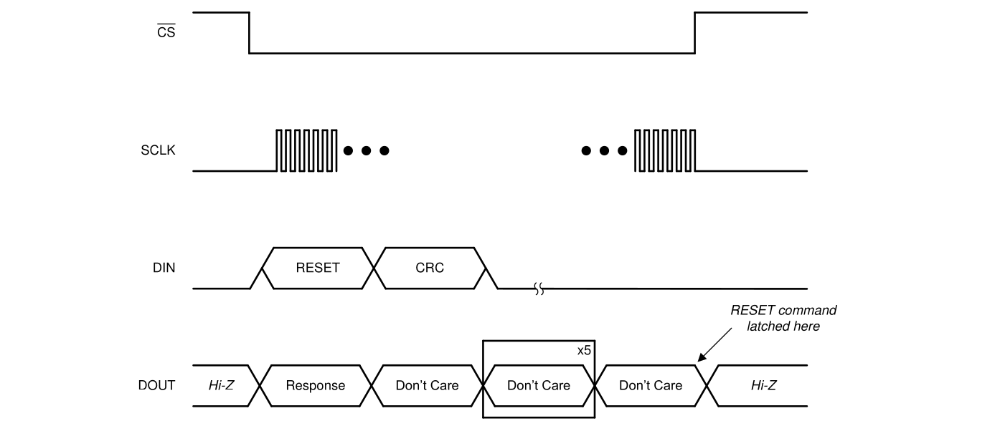

###### 8.5.1.10.3 STANDBY (0000 0000 0010 0010)

The  STANDBY command places the device  in  a  low-power  standby  mode.  The  command  is  latched  by  the device at the end of the frame. The device enters standby mode immediately after the command is latched. See the Standby Mode section for more information. This command has no effect if the device is already in standby mode.

###### 8.5.1.10.4 WAKEUP (0000 0000 0011 0011)

The WAKEUP command returns the device to conversion mode from standby mode. This command has no effect if the device is already in conversion mode.

###### 8.5.1.10.5 LOCK (0000 0101 0101 0101)

The LOCK command locks the interface, preventing the device from accidentally latching unwanted commands that can change the state of the device. When the interface is locked, the device only responds to the NULL, RREG, and UNLOCK commands. The device continues to output conversion data even when locked.

###### 8.5.1.10.6 UNLOCK (0000 0110 0110 0110)

The UNLOCK command unlocks the interface if previously locked by the LOCK command.

###### 8.5.1.10.7 RREG (101 a aaaa annn nnnn )

The RREG is used to read the device registers. The binary format of the command word is 101 a aaaa annn nnnn , where a aaaa a is the binary address of the register to begin reading and nnn nnnn is the unsigned binary number  of  consecutive  registers  to  read  minus  one.  There  are  two  cases  for  reading  registers  on  the ADS131M08. When reading a single register ( nnn nnnn = 000 0000b), the device outputs the register contents in the command response word of the following frame. If multiple registers are read using a single command ( nnn nnnn = 000 0000b), the device outputs the requested register data sequentially in order of addresses.

###### 8.5.1.10.7.1 Reading a Single Register

Read a single register from the device by specifying nnn nnnn as zero in the RREG command word. As with all SPI commands on the ADS131M08, the response occurs on the output in the frame following the command. Instead of a unique acknowledgment word, the response word is the contents of the register whose address is specified in the command word. Figure 8-23 shows an example of reading a single register.

**Figure 8-23. Reading a Single Register**

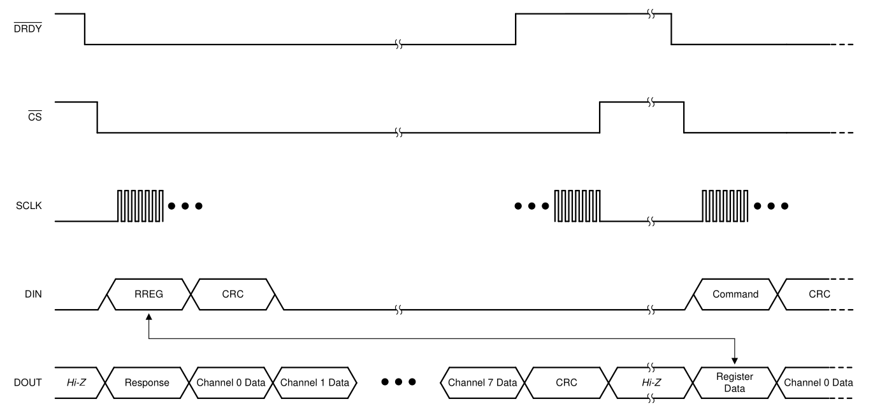

###### 8.5.1.10.7.2 Reading Multiple Registers

Multiple registers are read from the device when nnn nnnn is specified as a number greater than zero in the RREG command word. Like all SPI commands on the ADS131M08, the response occurs on the output in the frame following the command. Instead of a single acknowledgment word, the response spans multiple words in order  to  shift  out  all  requested  registers.  Continue  toggling  SCLK  to  accommodate  outputting  the  entire  data stream.  ADC  conversion  data  are  not  output  in  the  frame  following  an  RREG  command  to  read  multiple registers. Figure 8-24 shows an example of reading multiple registers.

**Figure 8-24. Reading Multiple Registers**

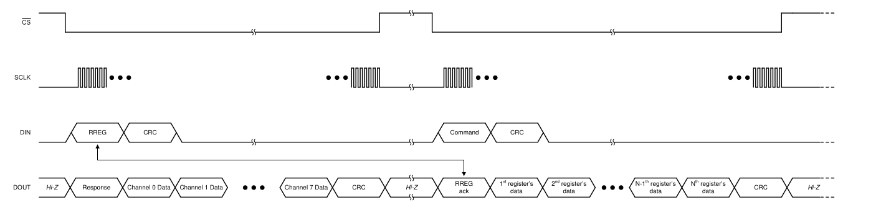

###### 8.5.1.10.8 WREG (011a aaaa annn nnnn)

The WREG command allows writing an arbitrary number of contiguous device registers. The binary format of the command word is 011 a aaaa annn nnnn , where a aaaa a is the binary address of the register to begin writing and nnn nnnn is the unsigned binary number of consecutive registers to write minus one. Send the data to be written  immediately  following  the  command  word.  Write  the  intended  contents  of  each  register  into  individual words, MSB aligned.

If the input CRC is enabled, write this CRC after the register data. The registers are written to the device as they are  shifted  into  DIN.  Therefore,  a  CRC  error  does  not  prevent  an  erroneous  value  from  being  written  to  a register. An input CRC error during a WREG command sets the CRC\_ERR bit in the STATUS register.

The  device  ignores  writes  to  read-only  registers  or  to  out-of-bounds  addresses.  Gaps  in  the  register  map address space are still included in the parameter nnn nnnn , but are not writeable so no change is made to them. The response to the WREG command that occurs in the following frame appears as 010 a aaaa ammm mmmm where mmm mmmm is the number of registers actually written minus one. This number can be checked by the host against nnn nnnn to ensure the expected number of registers are written.

Figure 8-25 shows a typical WREG sequence. In this example, the number of registers to write is larger than the number of  ADC  channels  and,  therefore,  the  frame  is  extended  beyond  the  ADC  channels  and  output  CRC word. Ensure all of the ADC data and output CRC are shifted out during each transaction where new data are available. Therefore, the frame must be extended beyond the number of words required to send the register data in some cases.

**Figure 8-25. Writing Registers**

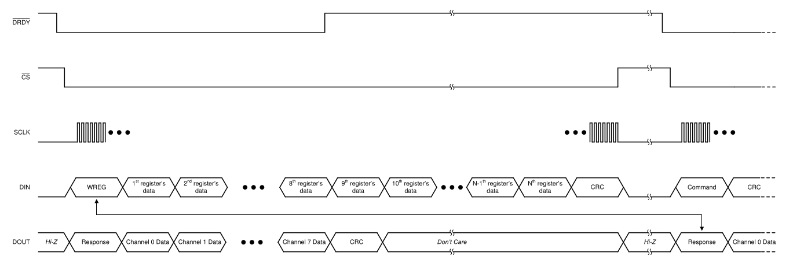

###### 8.5.1.11 Short SPI Frames

The SPI frame can be shortened to only send commands and receive responses if the ADCs are disabled and no ADC data are being output by the device. Read out all of the expected output data words from each sample period if the ADCs are enabled. Reading all of the data output with each frame ensures predictable DRDY pin behavior. If reading out all the data on each output data period is not feasible, see the Collecting Data for the First Time or After a Pause in Data Collection section on how to begin reading data again after a pause from when the ADCs were last enabled.

A short frame is not possible when using the RESET command. A full frame must be provided for a device reset to take place when providing the RESET command.

#### 8.5.2 Synchronization

Synchronization can be performed by the host to ensure the ADC conversions are synchronized to an external event. For example, synchronization can realign the data capture to the expected timing of the host if a glitch on the clock causes the host and device to become out of synchronization.

Provide a negative pulse on the SYNC/RESET pin with a duration less than tw(RSL) but greater than a CLKIN period to trigger synchronization. The device internally compares the leading negative edge of the pulse to its internal  clock  that  tracks  the  data  rate.  The  internal  data  rate  clock  has  timing  equivalent  to  the  DRDY  pin  if configured to assert with a phase calibration setting of 0b. If the negative edge on SYNC/RESET aligns with the internal data rate clock, the device is determined to be synchronized and therefore no action is taken. If there is misalignment,  the  digital  filters  on  the  device  are  reset  to  be  synchronized  with  the  SYNC/RESET  pulse. Conversions are immediately restarted when the SYNC/RESET pin is toggled in global-chop mode.

The phase calibration settings on all channels are retained during synchronization. Thus, channels with non-zero phase  calibration  settings  generate  conversion  results  less  than  a  data  rate  period  after  the  synchronization event occurs. However, the results can be corrupted and are not settled until the respective channels have at least three conversion cycles for the sinc³  filter to settle.

### 8.6 Registers

Table  8-12  lists  the  ADS131M08  registers.  All  register  offset  addresses  not  listed  in  Table  8-12  should  be considered as reserved locations and the register contents should not be modified.

**Table 8-12. Register Map**


| ADDRESS | REGISTER | RESET VALUE | BIT 15 to BIT 0 |
|-------|-------|-------|-------|
| **DEVICE SETTINGS AND INDICATORS (Read-Only Registers)** |  |  |   |
| 00h | ID | 28xxh | Register Field Descriptions are defined in **Table 8-14. ID Register Field Descriptions**, provided below. |
| 01h | STATUS | 0500h | Register Field Descriptions are defined in **Table 8-15. STATUS Register Field Descriptions**, provided below. |
| **GLOBAL SETTINGS ACROSS CHANNELS** |  |  |  |
| 02h | MODE | 0510h | Register Field Descriptions are defined in **Table 8-16. MODE Register Field Descriptions**, provided below. |
|03h| CLOCK | FF0Eh | Register Field Descriptions are defined in **Table 8-17. CLOCK Register Field Descriptions**, provided below. |
| 04h | GAIN1 | 0000h | Register Field Descriptions are defined in **Table 8-18. GAIN1 Register Field Descriptions**, provided below. |
| 05h | GAIN2 |  0000h |Register Field Descriptions are defined in **Table 8-19. GAIN2 Register Field Descriptions**, provided below. |
| 06h | CFG | 0600h | Register Field Descriptions are defined in **Table 8-20. CFG Register Field Descriptions**, provided below. |
| 07h | THRSHLD_MSB | 0000h | Register Field Descriptions are defined in **Table 8-21. THRSHLD_MSB Register Field Descriptions**, provided below. |
| 08h | THRSHLD_LSB | 0000h | Register Field Descriptions are defined in **Table 8-22. THRSHLD_LSB Register Field Descriptions**, provided below. |
| **CHANNEL-SPECIFIC SETTINGS** |  |  |  |
| 09h | CH0_CFG | 0000h | Register Field Descriptions are defined in **Table 8-23. CH0_CFG Register Field Descriptions**, provided below. |
| 0Ah | CH0_OCAL0_MSB | 0000h |  Register Field Descriptions are defined in **Table 8-24. CH0_OCAL_MSB Register Field Descriptions**, provided below. |
| 0Bh | CH0_OCAL_LSB | 0000h | Register Field Descriptions are defined in **Table 8-25. CH0_OCAL_LSB Register Field Descriptions**, provided below. |
| 0Ch | CH0_GCAL_MSB | 8000h | Register Field Descriptions are defined in **Table 8-26. CH0_GCAL_MSB Register Field Descriptions**, provided below. |
| 0Dh | CH0_GCAL_LSB | 0000h | Register Field Descriptions are defined in **Table 8-27. CH0_GCAL_LSB Register Field Descriptions**, provided below. |
| 0Eh | CH1_CFG | 0000h | Register Field Descriptions are defined in **Table 8-28. CH1_CFG Register Field Descriptions**, provided below. |
| 0Fh | CH1_OCAL_MSB | 0000h | Register Field Descriptions are defined in **Table 8-29. CH1_OCAL_MSB Register Field Descriptions**, provided below. |
| 10h | CH1_OCAL_LSB | 0000h | Register Field Descriptions are defined in **Table 8-30. CH1_OCAL_LSB Register Field Descriptions**, provided below. |  
| 11h | CH1_GCAL_MSB | 8000h | Register Field Descriptions are defined in **Table 8-31. CH1_GCAL_MSB Register Field Descriptions**, provided below. |
| 12h | CH1_GCAL_LSB | 0000h | Register Field Descriptions are defined in **Table 8-32. CH1_GCAL_LSB Register Field Descriptions**, provided below. | 
| 13h | CH2_CFG | 0000h |  Register Field Descriptions are defined in **Table 8-33. CH2_CFG Register Field Descriptions**, provided below. |  
| 14h | CH2_OCAL_MSB  | 0000h |  Register Field Descriptions are defined in **Table 8-34. CH2_OCAL_MSB Register Field Descriptions**, provided below. |
| 15h | CH2_OCAL_LSB | 0000h | Register Field Descriptions are defined in **Table 8-35. CH2_OCAL_LSB Register Field Descriptions**, provided below. | 
| 16h | CH2_GCAL_MSB | 8000h | Register Field Descriptions are defined in **Table 8-36. CH2_GCAL_MSB Register Field Descriptions**, provided below. |
| 17h | CH2_GCAL_LSB | 0000h |  Register Field Descriptions are defined in **Table 8-37. CH2_GCAL_LSB Register Field Descriptions**, provided below. |
| 18h | 0000h | CH3_CFG  |  Register Field Descriptions are defined in **Table 8-38. CH3_CFG Register Field Descriptions**, provided below. |
| 19h | CH3_OCAL_MSB | 0000h | Register Field Descriptions are defined in **Table 8-39. CH3_OCAL_MSB Register Field Descriptions**, provided below. |
| 1Ah | CH3_OCAL_LSB | 0000h | Register Field Descriptions are defined in **Table 8-40. CH3_OCAL_LSB Register Field Descriptions**, provided below. |
| 1Bh |CH3_GCAL_MSB | 8000h | Register Field Descriptions are defined in **Table 8-41. CH3_GCAL_MSB Register Field Descriptions**, provided below. |
| 1Ch | CH3_GCAL_LSB | 0000h | Register Field Descriptions are defined in **Table 8-42. CH3_GCAL_LSB Register Field Descriptions**, provided below. |
| 1Dh | CH4_CFG | 0000h | Register Field Descriptions are defined in **Table 8-43. CH4_CFG Register Field Descriptions**, provided below. |
| 1Eh | CH4_OCAL_MSB | 0000h | Register Field Descriptions are defined in **Table 8-44. CH4_OCAL_MSB Register Field Descriptions**, provided below. |
| 1Fh | VCH4_OCAL_LSB | 0000h | Register Field Descriptions are defined in **Table 8-45. CH4_OCAL_LSB Register Field Descriptions**, provided below. | 
| 20h | CH4_GCAL_MSB | 8000h | Register Field Descriptions are defined in **Table 8-46. CH4_GCAL_MSB Register Field Descriptions**, provided below. |
| 21h | CH4_GCAL_LSB | 0000h | Register Field Descriptions are defined in **Table 8-47. CH4_GCAL_LSB Register Field Descriptions**, provided below. |
| 22h | CH5_CFG | 0000h | Register Field Descriptions are defined in **Table 8-48. CH5_CFG Register Field Descriptions**, provided below. |
| 23h | CH5_OCAL_MSB | 0000h | Register Field Descriptions are defined in **Table 8-49. CH5_OCAL_MSB Register Field Descriptions**, provided below.  |
| 24h | CH5_OCAL_LSB | 0000h | Register Field Descriptions are defined in **Table 8-50. CH5_OCAL_LSB Register Field Descriptions**, provided below. |
| 25h | CH5_GCAL_MSB | 8000h |  Register Field Descriptions are defined in **Table 8-51. CH5_GCAL_MSB Register Field Descriptions**, provided below.  |
| 26h | CH5_GCAL_LSB | 0000h |  Register Field Descriptions are defined in **Table 8-52. CH5_GCAL_LSB Register Field Descriptions**, provided below. |
| 27h | CH6_CFG | 0000h | Register Field Descriptions are defined in **Table 8-53. CH6_CFG Register Field Descriptions**, provided below.  |
| 28h | CH6_OCAL_MSB | 0000h |  Register Field Descriptions are defined in **Table 8-54. CH6_OCAL_MSB Register Field Descriptions**, provided below. |
| 29h | CH6_OCAL_LSB | 0000h | Register Field Descriptions are defined in **Table 8-55. CH6_OCAL_LSB Register Field Descriptions**, provided below. |
| 2Ah | CH6_GCAL_MSB | 8000h | Register Field Descriptions are defined in **Table 8-56. CH6_GCAL_MSB Register Field Descriptions**, provided below. |
| 2Bh | CH6_GCAL_LSB | 0000h | Register Field Descriptions are defined in **Table 8-57. CH6_GCAL_LSB Register Field Descriptions**, provided below. |
| 2Ch | CH7_CFG | 0000h | Register Field Descriptions are defined in **Table 8-58. CH7_CFG Register Field Descriptions**, provided below.  |
| 2Dh | CH7_OCAL_MSB | 0000h | Register Field Descriptions are defined in **Table 8-59. CH7_OCAL_MSB Register Field Descriptions**, provided below. |
| 2Eh | CH7_OCAL_LSB | 0000h | Register Field Descriptions are defined in **Table 8-60. CH7_OCAL_LSB Register Field Descriptions**, provided below. |
| 2Fh | CH7_GCAL_MSB | 8000h | Register Field Descriptions are defined in **Table 8-61. CH7_GCAL_MSB Register Field Descriptions**, provided below. |
| 30h | CH7_GCAL_LSB | 0000h | Register Field Descriptions are defined in **Table 8-62. CH7_GCAL_LSB Register Field Descriptions**, provided below. |
| 3Eh | REGMAP_CRC | 0000h | Register Field Descriptions are defined in **Table 8-63. REGMAP_CRC Register Field Descriptions**, provided below. |
| 3Fh | RESERVED | 0000h | Register Field Descriptions are defined in **Table 8-64. RESERVED Register Field Descriptions**, provided below. |


Complex bit access types are encoded to fit into small table cells. Table 8-13 shows the codes that are used for access types in this section.

**Table 8-13. Access Type Codes**

| Access Type            | Code                   | Description                            |
|------------------------|------------------------|----------------------------------------|
| Read Type              | Read Type              | Read Type                              |
| R                      | R                      | Read                                   |
| Write Type             | Write Type             | Write Type                             |
| W                      | W                      | Write                                  |
| Reset or Default Value | Reset or Default Value | Reset or Default Value                 |
| - n                    |                        | Value after reset or the default value |

#### 8.6.1 ID Register (Address = 00h) [reset = 28xxh]

The ID register is described in Table 8-14.

Return to the Summary Table.


**Table 8-14. ID Register Field Descriptions**

| Bit   | Field        | Type   | Reset     | Description                                          |
|-------|--------------|--------|-----------|------------------------------------------------------|
| 15:12 | RESERVED     | R      | 0010b     | Reserved always reads 0010b.                         |
| 11:8  | CHANCNT[3:0] | R      | 1000b     | Channel count always reads 1000b.                    |
| 7:0   | RESERVED     | R      | xxxxxxxxb | Reserved; Values are subject to change without notice |

#### 8.6.2 STATUS Register (Address = 01h) [reset = 0500h]

The STATUS register is  described in Table 8-15.

Return to the Summary Table.


**Table 8-15. STATUS Register Field Descriptions** 

| Bit   | Field        | Type   | Reset   | Description                                                                                                                                       |
|-------|--------------|--------|---------|---------------------------------------------------------------------------------------------------------------------------------------------------|
| 15 | LOCK | R | 0b | SPI interface lock indicator; 0b = Unlocked (default); 1b = Locked |
| 14 | F_RESYNC | R | 0b | ADC resynchronization indicator. Bit is set each time the ADC resynchronizes; 0b = No resynchronization (default); 1b = Resynchronization occurred |
| 13 | REG_MAP | R | 0b | Register map CRC fault indicator; 0b = No change in the register map CRC (default); 1b = Register map CRC changed |
| 12 | CRC_ERR | R | 0b | SPI input CRC error indicator; 0b = No CRC error (default); 1b = Input CRC error occured |
| 11 | CRC_TYPE | R | 0b | CRC type; 0b = 16 bit CCITT (default); 1b = 16 bit ANSI |
| 10 | RESET | R | 1b | Reset status; 0b = Not reset: 1b = Reset occured (default) |
| 9:8 | WLENGTH[1:0] | R      | 01b     | Data word length; 00b = 16 bit; 01b = 24 bits (default); 10b = 32 bits - zero padding; 11b = 32 bits - sign extension for 24 bit ADC data |
| 7 | DRDY7 | R | 0b | Channel 7 ADC data available indicator; 0b = No new data available; 1b = New data are available |
| 6 | DRDY6 | R | 0b | Channel 6 ADC data available indicator; 0b = No new data available; 1b = New data are available |
| 5 | DRDY5 | R | 0b | Channel 5 ADC data available indicator; 0b = No new data available; 1b = New data are available |
| 4 | DRDY4 | R | 0b | Channel 4 ADC data available indicator; 0b = No new data available; 1b = New data are available |
| 3 | DRDY3 | R | 0b | Channel 3 ADC data available indicator; 0b = No new data available; 1b = New data are available |
| 2 | DRDY2 | R | 0b | Channel 2 ADC data available indicator; 0b = No new data available; 1b = New data are available |
| 1 | DRDY1 | R | 0b | Channel 1 ADC data available indicator; 0b = No new data available; 1b = New data are available |
| 0 | DRDY0 | R | 0b | Channel 0 ADC data available indicator; 0b = No new data available; 1b = New data are available |

### 8.6.3 MODE Register (Address = 02h) [reset = 0510h]

The MODE register is described in Table 8-16.

Return to the Summary Table.


**Table 8-16. MODE Register Field Descriptions** 

| Bit   | Field         | Type   | Reset   | Description                                                                                                                                                                                    |
|-------|---------------|--------|---------|------------------------------------------------------------------------------------------------------------------------------------------------------------------------------------------------|
| 15:14 | RESERVED | R/W | 00b | Reserved always reads 00b |
| 13 | REG_CRC_EN | R/W | 0b | Register Map CRC enable; 0b = Disabled (default); 1b = Enabled |
| 12 | RX_CRC_EN | R/W | 0b | SPI input CRC enable; 0b = Disabled (default); 1b = Enabled |
| 11 | CRC_TYPE | R/W | 0b | SPI and register map CRC type; 0b = 16-bit CCITT (default); 1b = 16-bit ANSI |
| 10 | RESET | R/W | 1b | Reset write 0b to clear this bit in the STATUS register; 0b = No reset; 1b = Reset happened (default by definition) |
| 9:8 | WLENGTH[1:0] | R/W | 01b | Data word length selection; 00b = 16 bits; 01b = 24 bits (default); 10b = 32 bits: LSB zero padding; 11b = 32 bits: MSB sign extension |
| 7:5 | RESERVED | R/W | 000b | Reserved always write 000b |
| 4 | TIMEOUT | R/W | 1b | SPI Timeout enable; 0b = Disabled; 1b = Enabled (default) |
| 3:2 | DRDY_SEL[1:0] | R/W | 00b | DRDY pin signal source selection; 00b = Most lagging enabled channel (default); 01b = Logic OR of all the enabled channels; 10b = Most leading enabled channel; 11b = Most leading enabled channel |
| 1 | DRDY_HiZ | R/W | 0b | DRDY pin state when conversion data is not available; 0b = Logic high (default); 1b = High impedance                 |
| 0 | DRDY_FMT | R/W | 0b | DRDY signal format when conversion data is available; 0b = Logic low (default); 1b = Low pulse with a fixed duration |

### 8.6.4 CLOCK Register (Address = 03h) [reset = FF0Eh ]

The CLOCK register is described in Table 8-17.

Return to the Summary Table.


**Table 8-17. CLOCK Register Field Descriptions** 

|   Bit | Field     | Type   | Reset   | Description                                                     |
|-------|-----------|--------|---------|-----------------------------------------------------------------|
| 15 | CH7_EN | R/W | 1b | Channel 7 ADC enable; 0b = Disabled; 1b = Enabled (default)       |
| 14 | CH6_EN | R/W | 1b | Channel 6 ADC enable; 0b = Disabled; 1b = Enabled (default)       |
| 13 | CH5_EN | R/W | 1b | Channel 5 ADC enable; 0b = Disabled; 1b = Enabled (default)       |
| 12 | CH4_EN | R/W | 1b | Channel 4 ADC enable; 0b = Disabled; 1b = Enabled (default)       |
| 11 | CH3_EN | R/W | 1b | Channel 3 ADC enable; 0b = Disabled; 1b = Enabled (default)       |
| 10 | CH2_EN | R/W | 1b | Channel 2 ADC enable; 0b = Disabled; 1b = Enabled (default)       |
| 9 | CH1_EN | R/W | 1b | Channel 1 ADC enable; 0b = Disabled; 1b = Enabled (default)       |
| 8 | CH0_EN | R/W | 1b | Channel 0 ADC enable; 0b = Disabled; 1b = Enabled (default)       |
| 7 | XTAL_DIS | R/W | 0b | Crystal oscillator disable; 0b = Enabled (default); 1b = Disabled |
| 6 | EXTREF_EN | R/W | 0b | External reference enable; 0b = Disabled (default); 1b = Enabled  |
| 5 | RESERVED | R/W | 0b | Reserved always write 0b |
| 4:2 | OSR[2:0] | R/W | 011b | Modulator oversampling ratio selection; 000b = 128; 001b = 256; 010b = 512; 011b = 1024 (default); 100b = 2048; 101b = 4096; 110b = 8192; 111b = 16256 |
| 1:0 | PWR | R/W | 10b | Power mode selection; 00b = Very-low-power; 01b = Low-power; 10b = High-resolution (default); 11b = High-resolution |

#### 8.6.5 GAIN1 Register (Address = 4h) [reset = 0000h]

The GAIN1 register is  described in Table 8-18.

Return to the Summary Table.


**Table 8-18. GAIN1 Register Field Descriptions**

| Bit   | Field         | Type   | Reset   | Description                                                                                                             |
|-------|---------------|--------|---------|-------------------------------------------------------------------------------------------------------------------------|
| 15    | RESERVED      | R/W    | 0b      | Reserved always write 0b |
| 14:12 | PGAGAIN3[2:0] | R/W    | 000b    | PGA gain selection for channel 3; 000b = 1 (default); 001b = 2; 010b = 4; 011b = 8; 100b = 16; 101b = 32; 110b = 64; 111b = 128 |
| 11    | RESERVED      | R/W    | 0b      | Reserved always write 0b |
| 10:8  | PGAGAIN2[2:0] | R/W    | 000b    | PGA gain selection for channel 2; 000b = 1 (default); 001b = 2; 010b = 4; 011b = 8; 100b = 16; 101b = 32; 110b = 64; 111b = 128 |
| 7     | RESERVED      | R/W    | 0b      | Reserved always write 0b |
| 6:4   | PGAGAIN1[2:0] | R/W    | 000b    | PGA gain selection for channel 1; 000b = 1 (default); 001b = 2; 010b = 4; 011b = 8; 100b = 16; 101b = 32; 110b = 64; 111b = 128 |
| 3     | RESERVED      | R/W    | 0b      | Reserved always write 0b |
| 2:0   | PGAGAIN0[2:0] | R/W    | 000b    | PGA gain selection for channel 0; 000b = 1 (default); 001b = 2; 010b = 4; 011b = 8; 100b = 16; 101b = 32; 110b = 64; 111b = 128 |

## 8.6.6 GAIN2 Register (Address = 5h) [reset = 0000h]

The GAIN2 register is described in Table 8-19.

Return to the Summary Table.


**Table 8-19. GAIN2 Register Field Descriptions**

| Bit   | Field         | Type   | Reset   | Description                                                                                                   |
|-------|---------------|--------|---------|---------------------------------------------------------------------------------------------------------------|
| 15    | RESERVED      | R/W    | 0b      | Reserved always write 0b |
| 14:12 | PGAGAIN7[2:0] | R/W    | 000b    | PGA gain selection for channel 7; 000b = 1; 001b = 2; 010b = 4; 011b = 8; 100b = 16; 101b = 32; 110b = 64; 111b = 128 |
| 11    | RESERVED      | R/W    | 0b      | Reserved always write 0b |
| 10:8  | PGAGAIN6[2:0] | R/W    | 000b    | PGA gain selection for channel 6; 000b = 1; 001b = 2; 010b = 4; 011b = 8; 100b = 16; 101b = 32; 110b = 64; 111b = 128 |
| 7     | RESERVED      | R/W    | 0b      | Reserved always write 0b |
| 6:4   | PGAGAIN5[2:0] | R/W    | 000b    | PGA gain selection for channel 5; 000b = 1; 001b = 2; 010b = 4; 011b = 8; 100b = 16; 101b = 32; 110b = 64; 111b =128  |
| 3     | RESERVED      | R/W    | 0b      | Reserved always write 0b |
| 2:0   | PGAGAIN4[2:0] | R/W    | 000b    | PGA gain selection for channel 4; 000b = 1; 001b = 2; 010b = 4; 011b = 8; 100b = 16; 101b = 32; 110b = 64; 111b = 128 |

#### 8.6.7 CFG Register (Address = 06h) [reset = 0600h]

The CFG register is described in Table 8-20.

Return to the Summary Table.


**Table 8-20. CFG Register Field Descriptions**

| Bit   | Field       | Type   | Reset   | Description |
|-------|-------------|--------|---------|-------------|
| 15:13 | RESERVED    | R/W    | 000b    | Reserved always write 000b |
| 12:9  | GC_DLY[3:0] | R/W    | 0011b   | Global-chop delay selection Delay in modulator clock periods before measurement begins; 0000b = 2; 0001b = 4; 0010b = 8; 0011b = 16; (default) 0100b = 32; 0101b = 64; 0110b = 128; 0111b = 256; 1000b = 512; 1001b = 1024; 1010b = 2048; 1011b = 4096; 1100b = 8192; 1101b = 16384; 1110b = 32768; 1111b = 65536 |
| 8     | GC_EN       | R/W    | 0b      | Global-chop enable; 0b = Disabled (default); 1b = Enabled |
| 7     | CD_ALLCH    | R/W    | 0b      | Current-detect channels selection Channels required to trigger current-detect; 0b = Any channel (default); 1b = All channels |
| 6:4   | CD_NUM[2:0] | R/W    | 000b    | Number of current-detect exceeded thresholds selection; Number of current-detect exceeded thresholds to trigger a detection; 000b = 1; (default) 001b = 2; 010b = 4; 011b = 8; 100b = 16; 101b = 32; 110b = 64    |
| 3:1   | CD_LEN[2:0] | R/W    | 000b    | Current-detect measurement length selection; Current-detect measurement length in conversion periods; 000b = 128; (default) 001b = 256; 010b = 512; 011b = 768; 100b = 1280; 101b = 1792; 110b = 2560; 111b = 3584 |
| 0     | CD_EN       | R/W    | 0b      | Current-detect mode enable; 0b = Disabled (default); 1b = Enabled |

#### 8.6.8 THRSHLD\_MSB Register (Address = 07h) [reset = 0000h]

The THRSHLD\_MSB register is described in Table 8-21.

Return to the Summary Table.


**Table 8-21. THRSHLD\_MSB Register Field Descriptions**

| Bit   | Field           | Type   | Reset              | Description                                                                                    |
|-------|-----------------|--------|--------------------|------------------------------------------------------------------------------------------------|
| 15:0  | CD_TH_MSB[23:8] | R/W    | 00000000 00000000b | Current-detect mode threshold register bits [23:8]. Value provided in two's complement format. |

#### 8.6.9 THRSHLD\_LSB Register (Address = 08h) [reset = 0000h]

The THRSHLD\_LSB register is described in Table 8-22.

Return to the Summary Table.


**Table 8-22. THRSHLD\_LSB Register Field Descriptions**

| Bit   | Field          | Type   | Reset     | Description                                                                                 |
|-------|----------------|--------|-----------|---------------------------------------------------------------------------------------------|
| 15:8  | CD_TH_LSB[7:0] | R/W    | 00000000b | Current-detect mode threshold register bits [7:0] Value provided in two's complement format |
| 7:4   | RESERVED       | R      | 0000b     | Reserved always reads 0000b                                                                 |
| 3:0   | DCBLOCK[3:0]   | R/W    | 0000b     | DC Block filter setting See Table 8-4 for details                                           |

#### 8.6.10 CH0\_CFG Register (Address = 09h) [reset = 0000h]

The CH0\_CFG register is described in Table 8-23.

Return to the Summary Table.


**Table 8-23. CH0\_CFG Register Field Descriptions**

| Bit   | Field       | Type   | Reset        | Description                                                                                                                                    |
|-------|-------------|--------|--------------|------------------------------------------------------------------------------------------------------------------------------------------------|
| 15:6  | PHASE0[9:0] | R/W    | 0000000000 b | Channel 0 phase delay Phase delay in modulator clock cycles provided in two's complement format. See Table 8-5 for details.                    |
| 5:3   | RESERVED    | R      | 000b         | Reserved always reads 000b                                                                                                                     |
| 2     | DCBLK0_DIS  | R/W    | 0b           | Channel 0 DC Block filter disable; 0b = Controlled by DCBLOCK[3:0] (default); 1b = Disabled for this channel                                     |
| 1:0   | MUX0[1:0]   | R/W    | 00b          | Channel 0 input selection; 00b = AIN0P and AIN0N (default); 01b = ADC inputs shorted; 10b = Positive DC test signal; 11b = Negative DC test signal |

#### 8.6.11 CH0\_OCAL\_MSB Register (Address = 0Ah) [reset = 0000h]

The CH0\_OCAL\_MSB register is described in Table 8-24.

Return to the Summary Table.


**Table 8-24. CH0\_OCAL\_MSB Register Field Descriptions**

| Bit   | Field           | Type   | Reset              | Description                                                                                   |
|-------|-----------------|--------|--------------------|-----------------------------------------------------------------------------------------------|
| 15:0  | OCAL0_MSB[15:0] | R/W    | 00000000 00000000b | Channel 0 offset calibration register bits [23:8]. Value provided in two's complement format. |

#### 8.6.12 CH0\_OCAL\_LSB Register (Address = 0Bh) [reset = 0000h]

The CH0\_OCAL\_LSB register is described in Table 8-25.

Return to the Summary Table.


**Table 8-25. CH0\_OCAL\_LSB Register Field Descriptions**

| Bit   | Field          | Type   | Reset     | Description                                                                                  |
|-------|----------------|--------|-----------|----------------------------------------------------------------------------------------------|
| 15:8  | OCAL0_LSB[7:0] | R/W    | 00000000b | Channel 0 offset calibration register bits [7:0]. Value provided in two's complement format. |
| 7:0   | RESERVED       | R      | 00000000b | Reserved always reads 00000000b                                                              |

### 8.6.13 CH0\_GCAL\_MSB Register (Address = 0Ch) [reset = 8000h]

The CH0\_GCAL\_MSB register is described in Table 8-26.

Return to the Summary Table.

**Table 8-26. CH0\_GCAL\_MSB Register Field Descriptions**

| Bit   | Field     | Type   | Reset              | Description                                                                                                          |
|-------|-----------|--------|--------------------|----------------------------------------------------------------------------------------------------------------------|
| 15:0  | GCAL0_MSB | R/W    | 1000000000 000000b | Channel 0 gain calibration register bits [23:8] Unsigned number for the gain range from 0.0 to 2.0*(2^24 - 1) / 2^24 |

## 8.6.14 CH0\_GCAL\_LSB Register (Address = 0Dh) [reset = 0000h]

The CH0\_GCAL\_LSB register is described in Table 8-27.

Return to the Summary Table.


**Table 8-27. CH0\_GCAL\_LSB Register Field Descriptions**

| Bit   | Field          | Type   | Reset     | Description                                                                                                         |
|-------|----------------|--------|-----------|---------------------------------------------------------------------------------------------------------------------|
| 15:8  | GCAL0_LSB[7:0] | R/W    | 00000000b | Channel 0 gain calibration register bits [7:0]; Unsigned number for the gain range from 0.0 to 2.0*(2^24 - 1) / 2^24 |
| 7:0   | RESERVED       | R      | 00000000b | Reserved always reads 00000000b                                                                                     |

#### 8.6.15 CH1\_CFG Register (Address = 0Eh) [reset = 0000h]

The CH1\_CFG register is described in Table 8-28.

Return to the Summary Table.

**Table 8-28. CH1\_CFG Register Field Descriptions**

| Bit   | Field       | Type   | Reset        | Description                                                                                                                                    |
|-------|-------------|--------|--------------|------------------------------------------------------------------------------------------------------------------------------------------------|
| 15:6  | PHASE1[9:0] | R/W    | 0000000000 b | Channel 1 phase delay Phase delay in modulator clock cycles provided in two's complement format. See Table 8-5 for details.                    |
| 5:3   | RESERVED    | R      | 000b         | Reserved always reads 000b                                                                                                                     |
| 2     | DCBLK1_DIS  | R/W    | 0b           | Channel 1 DC Block filter disable; 0b = Controlled by DCBLOCK[3:0] (default); 1b = Disabled for this channel                                     |
| 1:0   | MUX1        | R/W    | 00b          | Channel 1 input selection; 00b = AIN1P and AIN1N (default); 01b = ADC inputs shorted; 10b = Positive DC test signal; 11b = Negative DC test signal |

#### 8.6.16 CH1\_OCAL\_MSB Register (Address = 0Fh) [reset = 0000h]

The CH1\_OCAL\_MSB register is described in Table 8-29.

Return to the Summary Table.


**Table 8-29. CH1\_OCAL\_MSB Register Field Descriptions**

| Bit   | Field           | Type   | Reset              | Description                                                                                 |
|-------|-----------------|--------|--------------------|---------------------------------------------------------------------------------------------|
| 15:0  | OCAL1_MSB[15:0] | R/W    | 00000000 00000000b | Channel 1 offset calibration register bits [23:8] Value provided in two's complement format |

#### 8.6.17 CH1\_OCAL\_LSB Register (Address = 10h) [reset = 0000h]

The CH1\_OCAL\_LSB register is described in Table 8-30.

Return to the Summary Table.


**Table 8-30. CH1\_OCAL\_LSB Register Field Descriptions**

| Bit   | Field          | Type   | Reset     | Description                                                                                |
|-------|----------------|--------|-----------|--------------------------------------------------------------------------------------------|
| 15:8  | OCAL1_LSB[7:0] | R/W    | 00000000b | Channel 1 offset calibration register bits [7:0] Value provided in two's complement format |
| 7:0   | RESERVED       | R      | 00000000b | Reserved always reads 00000000b                                                            |

#### 8.6.18 CH1\_GCAL\_MSB Register (Address = 11h) [reset = 8000h]

The CH1\_GCAL\_MSB register is described in Table 8-31.

Return to the Summary Table.


**Table 8-31. CH1\_GCAL\_MSB Register Field Descriptions**

| Bit   | Field           | Type   | Reset              | Description                                                                                                        |
|-------|-----------------|--------|--------------------|--------------------------------------------------------------------------------------------------------------------|
| 15:0  | GCAL1_MSB[15:0] | R/W    | 1000000000 000000b | Channel 1 gain calibration register bits [23:8] Unsigned number for the gain range from 0.0 to 2.0*(2^24 - 1)/2^24 |

#### 8.6.19 CH1\_GCAL\_LSB Register (Address = 12h) [reset = 0000h]

The CH1\_GCAL\_LSB register is described in Table 8-32.

Return to the Summary Table.


**Table 8-32. CH1\_GCAL\_LSB Register Field Descriptions**

| Bit   | Field          | Type   | Reset     | Description                                                                                                         |
|-------|----------------|--------|-----------|---------------------------------------------------------------------------------------------------------------------|
| 15:8  | GCAL1_LSB[7:0] | R/W    | 00000000b | Channel 1 gain calibration register bits [7:0]; Unsigned number for the gain range from 0.0 to 2.0*(2^24 - 1) / 2^24 |
| 7:0   | RESERVED       | R      | 00000000b | Reserved always reads 00000000b                                                                                     |

#### 8.6.20 CH2\_CFG Register (Address = 13h) [reset = 0000h]

The CH2\_CFG register is described in Table 8-33.

Return to the Summary Table.


**Table 8-33. CH2\_CFG Register Field Descriptions**

| Bit   | Field       | Type   | Reset        | Description                                                                                                                                    |
|-------|-------------|--------|--------------|------------------------------------------------------------------------------------------------------------------------------------------------|
| 15:6  | PHASE2[9:0] | R/W    | 0000000000 b | Channel 2 phase delay; Phase delay in modulator clock cycles provided in two's complement format. See Table 8-5 for details.                    |
| 5:3   | RESERVED    | R      | 000b         | Reserved always reads 000b                                                                                                                     |
| 2     | DCBLK2_DIS  | R/W    | 0b           | Channel 2 DC Block filter disable; 0b = Controlled by DCBLOCK[3:0] (default); 1b = Disabled for this channel                                     |
| 1:0   | MUX2        | R/W    | 00b          | Channel 2 input selection; 00b = AIN2P and AIN2N (default); 01b = ADC inputs shorted; 10b = Positive DC test signal; 11b = Negative DC test signal |

#### 8.6.21 CH2\_OCAL\_MSB Register (Address = 14h) [reset = 0000h]

The CH2\_OCAL\_MSB register is described in Table 8-34.

Return to the Summary Table.

**Table 8-34. CH2\_OCAL\_MSB Register Field Descriptions**

| Bit   | Field           | Type   | Reset              | Description                                                                                 |
|-------|-----------------|--------|--------------------|---------------------------------------------------------------------------------------------|
| 15:0  | OCAL2_MSB[15:0] | R/W    | 00000000 00000000b | Channel 2 offset calibration register bits [23:8] Value provided in two's complement format |

#### 8.6.22 CH2\_OCAL\_LSB Register (Address = 15h) [reset = 0000h]

The CH2\_OCAL\_LSB register is described in Table 8-35.

Return to the Summary Table.

**Table 8-35. CH2\_OCAL\_LSB Register Field Descriptions**

| Bit   | Field          | Type   | Reset     | Description                                                                                |
|-------|----------------|--------|-----------|--------------------------------------------------------------------------------------------|
| 15:8  | OCAL2_LSB[7:0] | R/W    | 00000000b | Channel 2 offset calibration register bits [7:0]; Value provided in two's complement format |
| 7:0   | RESERVED       | R      | 00000000b | Reserved always reads 00000000b                                                            |

#### 8.6.23 CH2\_GCAL\_MSB Register (Address = 16h) [reset = 8000h]

The CH2\_GCAL\_MSB register is described in Table 8-36.

Return to the Summary Table.

**Table 8-36. CH2\_GCAL\_MSB Register Field Descriptions**

| Bit   | Field           | Type   | Reset              | Description                                                                                                          |
|-------|-----------------|--------|--------------------|----------------------------------------------------------------------------------------------------------------------|
| 15:0  | GCAL2_MSB[15:0] | R/W    | 1000000000 000000b | Channel 2 gain calibration register bits [23:8] Unsigned number for the gain range from 0.0 to 2.0*(2^24 - 1) / 2^24 |

#### 8.6.24 CH2\_GCAL\_LSB Register (Address = 17h) [reset = 0000h]

The CH2\_GCAL\_LSB register is described in Table 8-37.

Return to the Summary Table.

**Table 8-37. CH2\_GCAL\_LSB Register Field Descriptions**

| Bit   | Field          | Type   | Reset     | Description                                                                                                         |
|-------|----------------|--------|-----------|---------------------------------------------------------------------------------------------------------------------|
| 15:8  | GCAL2_LSB[7:0] | R/W    | 00000000b | Channel 2 gain calibration register bits [7:0] Unsigned number for the gain range from 0.0 to 2.0*(2^24 - 1) / 2^24 |
| 7:0   | RESERVED       | R      | 00000000b | Reserved always reads 00000000b                                                                                     |

#### 8.6.25 CH3\_CFG Register (Address = 18h) [reset = 0000h]

The CH3\_CFG register is described in Table 8-38.

Return to the Summary Table.

**Table 8-38. CH3\_CFG Register Field Descriptions**

| Bit   | Field       | Type   | Reset        | Description                                                                                                                                    |
|-------|-------------|--------|--------------|------------------------------------------------------------------------------------------------------------------------------------------------|
| 15:6  | PHASE3[9:0] | R/W    | 0000000000 b | Channel 3 phase delay; Phase delay in modulator clock cycles provided in two's complement format. See Table 8-5 for details.                    |
| 5:3   | RESERVED    | R      | 000b         | Reserved always reads 00000000b                                                                                                                |
| 2     | DCBLK3_DIS  | R/W    | 0b           | Channel 3 DC Block filter disable; 0b = Controlled by DCBLOCK[3:0] (default); 1b = Disabled for this channel                                     |
| 1:0   | MUX3        | R/W    | 00b          | Channel 3 input selection; 00b = AIN3P and AIN3N (default); 01b = ADC inputs shorted; 10b = Positive DC test signal; 11b = Negative DC test signal |

#### 8.6.26 CH3\_OCAL\_MSB Register (Address = 19h) [reset = 0000h]

The CH3\_OCAL\_MSB register is described in Table 8-39.

Return to the Summary Table.

**Table 8-39. CH3\_OCAL\_MSB Register Field Descriptions**

| Bit   | Field           | Type   | Reset              | Description                                                                                 |
|-------|-----------------|--------|--------------------|---------------------------------------------------------------------------------------------|
| 15:0  | OCAL3_MSB[15:0] | R/W    | 00000000 00000000b | Channel 3 offset calibration register bits [23:8] Value provided in two's complement format |

### 8.6.27 CH3\_OCAL\_LSB Register (Address = 1Ah) [reset = 0000h]

The CH3\_OCAL\_LSB register is described in Table 8-40.

Return to the Summary Table.

**Table 8-40. CH3\_OCAL\_LSB Register Field Descriptions**

| Bit   | Field          | Type   | Reset     | Description                                                                                |
|-------|----------------|--------|-----------|--------------------------------------------------------------------------------------------|
| 15:8  | OCAL3_LSB[7:0] | R/W    | 00000000b | Channel 3 offset calibration register bits [7:0] Value provided in two's complement format |
| 7:0   | RESERVED       | R      | 00000000b | Reserved always reads 00000000b                                                            |

#### 8.6.28 CH3\_GCAL\_MSB Register (Address = 1Bh) [reset = 8000h]

The CH3\_GCAL\_MSB register is described in Table 8-41.

Return to the Summary Table.

**Table 8-41. CH3\_GCAL\_MSB Register Field Descriptions**

| Bit   | Field           | Type   | Reset              | Description                                                                                                          |
|-------|-----------------|--------|--------------------|----------------------------------------------------------------------------------------------------------------------|
| 15:0  | GCAL3_MSB[15:0] | R/W    | 1000000000 000000b | Channel 3 gain calibration register bits [23:8] Unsigned number for the gain range from 0.0 to 2.0*(2^24 - 1) / 2^24 |

#### 8.6.29 CH3\_GCAL\_LSB Register (Address = 1Ch) [reset = 0000h]

The CH3\_GCAL\_LSB register is described in Table 8-42.

Return to the Summary Table.

**Table 8-42. CH3\_GCAL\_LSB Register Field Descriptions**

| Bit   | Field          | Type   | Reset     | Description                                                                                                         |
|-------|----------------|--------|-----------|---------------------------------------------------------------------------------------------------------------------|
| 15:8  | GCAL3_LSB[7:0] | R/W    | 00000000b | Channel 3 gain calibration register bits [7:0] Unsigned number for the gain range from 0.0 to 2.0*(2^24 - 1) / 2^24 |
| 7:0   | RESERVED       | R      | 00000000b | Reserved always reads 00000000b                                                                                     |

#### 8.6.30 CH4\_CFG Register (Address = 1Dh) [reset = 0000h]

The CH4\_CFG register is described in Table 8-43.

Return to the Summary Table.

**Table 8-43. CH4\_CFG Register Field Descriptions**

| Bit   | Field       | Type   | Reset        | Description                                                                                                                                    |
|-------|-------------|--------|--------------|------------------------------------------------------------------------------------------------------------------------------------------------|
| 15:6  | PHASE4[9:0] | R/W    | 0000000000 b | Channel 4 phase delay; Phase delay in modulator clock cycles provided in two's complement format. See Table 8-5 for details.                    |
| 5:3   | RESERVED    | R      | 000b         | Reserved always reads 000b                                                                                                                     |
| 2     | DCBLK4_DIS  | R/W    | 0b           | Channel 4 DC Block filter disable; 0b = Controlled by DCBLOCK[3:0] (default); 1b = Disabled for this channel                                     |
| 1:0   | MUX4        | R/W    | 00b          | Channel 4 input selection; 00b = AIN4P and AIN4N (default); 01b = ADC inputs shorted; 10b = Positive DC test signal; 11b = Negative DC test signal |

#### 8.6.31 CH4\_OCAL\_MSB Register (Address = 1Eh) [reset = 0000h]

The CH4\_OCAL\_MSB register is described in Table 8-44.

Return to the Summary Table.

**Table 8-44. CH4\_OCAL\_MSB Register Field Descriptions**

| Bit   | Field           | Type   | Reset              | Description                                                                                 |
|-------|-----------------|--------|--------------------|---------------------------------------------------------------------------------------------|
| 15:0  | OCAL4_MSB[15:0] | R/W    | 00000000 00000000b | Channel 4 offset calibration register bits [23:8] Value provided in two's complement format |

#### 8.6.32 CH4\_OCAL\_LSB Register (Address = 1Fh) [reset = 0000h]

The CH4\_OCAL\_LSB register is described in Table 8-45.

Return to the Summary Table.

**Table 8-45. CH4\_OCAL\_LSB Register Field Descriptions**

| Bit   | Field          | Type   | Reset     | Description                                                                                |
|-------|----------------|--------|-----------|--------------------------------------------------------------------------------------------|
| 15:8  | OCAL4_LSB[7:0] | R/W    | 00000000b | Channel 4 offset calibration register bits [7:0] Value provided in two's complement format |
| 7:0   | RESERVED       | R      | 00000000b | Reserved always reads 00000000b                                                            |

#### 8.6.33 CH4\_GCAL\_MSB Register (Address = 20h) [reset = 8000h]

The CH4\_GCAL\_MSB register is described in Table 8-46.

Return to the Summary Table.

**Table 8-46. CH4\_GCAL\_MSB Register Field Descriptions**

| Bit   | Field           | Type   | Reset              | Description                                                                                                          |
|-------|-----------------|--------|--------------------|----------------------------------------------------------------------------------------------------------------------|
| 15:0  | GCAL4_MSB[15:0] | R/W    | 1000000000 000000b | Channel 4 gain calibration register bits [23:8]; Unsigned number for the gain range from 0.0 to 2.0*(2^24 - 1) / 2^24 |

#### 8.6.34 CH4\_GCAL\_LSB Register (Address = 21h) [reset = 0000h]

The CH4\_GCAL\_LSB register is described in Table 8-47.

Return to the Summary Table.

**Table 8-47. CH4\_GCAL\_LSB Register Field Descriptions**

| Bit   | Field          | Type   | Reset     | Description                                                                                                         |
|-------|----------------|--------|-----------|---------------------------------------------------------------------------------------------------------------------|
| 15:8  | GCAL4_LSB[7:0] | R/W    | 00000000b | Channel 4 gain calibration register bits [7:0]; Unsigned number for the gain range from 0.0 to 2.0*(2^24 - 1) / 2^24 |
| 7:0   | RESERVED       | R      | 00000000b | Reserved always reads 00000000b                                                                                     |

#### 8.6.35 CH5\_CFG Register (Address = 22h) [reset = 0000h]

The CH5\_CFG register is  described in Table 8-48.

Return to the Summary Table.

***Table 8-48. CH5\_CFG Register Field Descriptions*

| Bit   | Field       | Type   | Reset        | Description                                                                                                                                  |
|-------|-------------|--------|--------------|----------------------------------------------------------------------------------------------------------------------------------------------|
| 15:6  | PHASE5[9:0] | R/W    | 0000000000 b | Channel 5 phase delay Phase delay in modulator clock cycles provided in two's complement format. See Table 8-5 for details.                  |
| 5:3   | RESERVED    | R      | 000b         | Reserved always reads 000b                                                                                                                   |
| 2     | DCBLK5_DIS  | R/W    | 0b           | Channel 5 DC Block filter disable; 0b = Controlled by DCBLOCK[3:0] (default); 1b = Disabled for this channel                                   |
| 1:0   | MUX5        | R/W    | 00b          | Channel 5 put selection; 00b = AIN5P and AIN5N (default); 01b = ADC inputs shorted; 10b = Positive DC test signal; 11b = Negative DC test signal |

### 8.6.36 CH5\_OCAL\_MSB Register (Address = 23h) [reset = 0000h]

CH5\_OCAL\_MSB is described in Table 8-49.

Return to the Summary Table.

**Table 8-49. CH5\_OCAL\_MSB Register Field Descriptions**

| Bit   | Field           | Type   | Reset              | Description                                                                                 |
|-------|-----------------|--------|--------------------|---------------------------------------------------------------------------------------------|
| 15:0  | OCAL5_MSB[15:0] | R/W    | 00000000 00000000b | Channel 5 offset calibration register bits [23:8] Value provided in two's complement format |

#### 8.6.37 CH5\_OCAL\_LSB Register (Address = 24h) [reset = 0000h]

The CH5\_OCAL\_LSB register is described in Table 8-50.

Return to the Summary Table.

**Table 8-50. CH5\_OCAL\_LSB Register Field Descriptions**

| Bit   | Field          | Type   | Reset     | Description                                                                                |
|-------|----------------|--------|-----------|--------------------------------------------------------------------------------------------|
| 15:8  | OCAL5_LSB[7:0] | R/W    | 00000000b | Channel 5 offset calibration register bits [7:0]; Value provided in two's complement format |
| 7:0   | RESERVED       | R      | 00000000b | Reserved always reads 00000000b                                                            |

#### 8.6.38 CH5\_GCAL\_MSB Register (Address = 25h) [reset = 8000h]

The CH5\_GCAL\_MSB register is described in Table 8-51.

Return to the Summary Table.

**Table 8-51. CH5\_GCAL\_MSB Register Field Descriptions**

| Bit   | Field           | Type   | Reset              | Description                                                                                                          |
|-------|-----------------|--------|--------------------|----------------------------------------------------------------------------------------------------------------------|
| 15:0  | GCAL5_MSB[15:0] | R/W    | 1000000000 000000b | Channel 5 gain calibration register bits [23:8]; Unsigned number for the gain range from 0.0 to 2.0*(2^24 - 1) / 2^24 |

#### 8.6.39 CH5\_GCAL\_LSB Register (Address = 26h) [reset = 0000h]

The CH5\_GCAL\_LSB register is described in Table 8-52.

Return to the Summary Table.

**Table 8-52. CH5\_GCAL\_LSB Register Field Descriptions**

| Bit   | Field          | Type   | Reset     | Description                                                                                                         |
|-------|----------------|--------|-----------|---------------------------------------------------------------------------------------------------------------------|
| 15:8  | GCAL5_LSB[7:0] | R/W    | 00000000b | Channel 5 gain calibration register bits [7:0] Unsigned number for the gain range from 0.0 to 2.0*(2^24 - 1) / 2^24 |
| 7:0   | RESERVED       | R      | 00000000b | Reserved always reads 00000000b                                                                                     |

#### 8.6.40 CH6\_CFG Register (Address = 27h) [reset = 0000h]

The CH6\_CFG register is described in Table 8-53.

Return to the Summary Table.

**Table 8-53. CH6\_CFG Register Field Descriptions**

| Bit   | Field       | Type   | Reset        | Description                                                                                                                                    |
|-------|-------------|--------|--------------|------------------------------------------------------------------------------------------------------------------------------------------------|
| 15:6  | PHASE6[9:0] | R/W    | 0000000000 b | Channel 6 phase delay; Phase delay in modulator clock cycles provided in two's complement format. See Table 8-5 for details.                    |
| 5:3   | RESERVED    | R      | 000b         | Reserved always reads 000b                                                                                                                     |
| 2     | DCBLK6_DIS  | R/W    | 0b           | Channel 6 DC Block filter disable; 0b = Controlled by DCBLOCK[3:0] (default); 1b = Disabled for this channel                                     |
| 1:0   | MUX6        | R/W    | 00b          | Channel 6 input selection; 00b = AIN6P and AIN6N (default); 01b = ADC inputs shorted; 10b = Positive DC test signal; 11b = Negative DC test signal |

#### 8.6.41 CH6\_OCAL\_MSB Register (Address = 28h) [reset = 0000h]

The CH6\_OCAL\_MSB register is described in Table 8-54.

Return to the Summary Table.

**Table 8-54. CH6\_OCAL\_MSB Register Field Descriptions**

| Bit   | Field           | Type   | Reset              | Description                                                                                 |
|-------|-----------------|--------|--------------------|---------------------------------------------------------------------------------------------|
| 15:0  | OCAL6_MSB[15:0] | R/W    | 00000000 00000000b | Channel 6 offset calibration register bits [23:8] Value provided in two's complement format |

#### 8.6.42 CH6\_OCAL\_LSB Register (Address = 29h) [reset = 0000h]

The CH6\_OCAL\_LSB register is described in Table 8-55.

Return to the Summary Table.

**Table 8-55. CH6\_OCAL\_LSB Register Field Descriptions**

| Bit   | Field          | Type   | Reset     | Description                                                                                |
|-------|----------------|--------|-----------|--------------------------------------------------------------------------------------------|
| 15:8  | OCAL6_LSB[7:0] | R/W    | 00000000b | Channel 6 offset calibration register bits [7:0]; Value provided in two's complement format |
| 7:0   | RESERVED       | R      | 00000000b | Reserved always reads 00000000b                                                            |

#### 8.6.43 CH6\_GCAL\_MSB Register (Address = 2Ah) [reset = 8000h]

The CH6\_GCAL\_MSB register is described in Table 8-56.

Return to the Summary Table.


**Table 8-56. CH6\_GCAL\_MSB Register Field Descriptions**

| Bit   | Field           | Type   | Reset              | Description                                                                                                          |
|-------|-----------------|--------|--------------------|----------------------------------------------------------------------------------------------------------------------|
| 15:0  | GCAL6_MSB[15:0] | R/W    | 1000000000 000000b | Channel 6 gain calibration register bits [23:8] Unsigned number for the gain range from 0.0 to 2.0*(2^24 - 1) / 2^24 |

#### 8.6.44 CH6\_GCAL\_LSB Register (Address = 2Bh) [reset = 0000h]

The CH6\_GCAL\_LSB register is described in Table 8-57.

Return to the Summary Table.

**Table 8-57. CH6\_GCAL\_LSB Register Field Descriptions**

| Bit   | Field          | Type   | Reset     | Description                                                                                                         |
|-------|----------------|--------|-----------|---------------------------------------------------------------------------------------------------------------------|
| 15:8  | GCAL6_LSB[7:0] | R/W    | 00000000b | Channel 6 gain calibration register bits [7:0]; Unsigned number for the gain range from 0.0 to 2.0*(2^24 - 1) / 2^24 |
| 7:0   | RESERVED       | R      | 00000000b | Reserved always reads 00000000b                                                                                     |

#### 8.6.45 CH7\_CFG Register (Address = 2Ch) [reset = 0000h]

The CH7\_CFG register is described in Table 8-58.

Return to the Summary Table.

**Table 8-58. CH7\_CFG Register Field Descriptions**

| Bit   | Field       | Type   | Reset        | Description |
|-------|-------------|--------|--------------|-------------|
| 15:6  | PHASE7[9:0] | R/W    | 0000000000 b | Channel 7 phase delay; Phase delay in modulator clock cycles provided in two's complement format. See Table 8-5 for details. |
| 5:3   | RESERVED    | R      | 000b         | Reserved always reads 000b |
| 2     | DCBLK7_DIS  | R/W    | 0b           | Channel 7 DC Block filter disable; 0b = Controlled by DCBLOCK[3:0] (default); 1b = Disabled for this channel |
| 1:0   | MUX7        | R/W    | 00b          | Channel 7 input selection; 00b = AIN7P and AIN7N (default); 01b = ADC inputs shorted; 10b = Positive DC test signal; 11b = Negative DC test signal |

#### 8.6.46 CH7\_OCAL\_MSB Register (Address = 2Dh) [reset = 0000h]

The CH7\_OCAL\_MSB register is described in Table 8-59.

Return to the Summary Table.

**Table 8-59. CH7\_OCAL\_MSB Register Field Descriptions**

| Bit   | Field           | Type   | Reset              | Description                                                                                 |
|-------|-----------------|--------|--------------------|---------------------------------------------------------------------------------------------|
| 15:0  | OCAL7_MSB[15:0] | R/W    | 00000000 00000000b | Channel 7 offset calibration register bits [23:8] Value provided in two's complement format |

#### 8.6.47 CH7\_OCAL\_LSB Register (Address = 2Eh) [reset = 0000h]

The CH7\_OCAL\_LSB register is described in Table 8-60.

Return to the Summary Table.

**Table 8-60. CH7\_OCAL\_LSB Register Field Descriptions**

| Bit   | Field          | Type   | Reset     | Description                                                                                |
|-------|----------------|--------|-----------|--------------------------------------------------------------------------------------------|
| 15:8  | OCAL7_LSB[7:0] | R/W    | 00000000b | Channel 7 offset calibration register bits [7:0]; Value provided in two's complement format |
| 7:0   | RESERVED       | R      | 00000000b | Reserved always reads 00000000b                                                            |

#### 8.6.48 CH7\_GCAL\_MSB Register (Address = 2Fh) [reset = 8000h]

The CH7\_GCAL\_MSB register is described in Table 8-61.

Return to the Summary Table.

**Table 8-61. CH7\_GCAL\_MSB Register Field Descriptions**

| Bit   | Field           | Type   | Reset              | Description                                                                                                          |
|-------|-----------------|--------|--------------------|----------------------------------------------------------------------------------------------------------------------|
| 15:0  | GCAL7_MSB[15:0] | R/W    | 10000000 00000000b | Channel 7 gain calibration register bits [23:8]; Unsigned number for the gain range from 0.0 to 2.0*(2^24 - 1) / 2^24 |

#### 8.6.49 CH7\_GCAL\_LSB Register (Address = 30h) [reset = 0000h]

The CH7\_GCAL\_LSB register is described in Table 8-62.

Return to the Summary Table.

**Table 8-62. CH7\_GCAL\_LSB Register Field Descriptions**

| Bit   | Field          | Type   | Reset     | Description                                                                                                         |
|-------|----------------|--------|-----------|---------------------------------------------------------------------------------------------------------------------|
| 15:8  | GCAL7_LSB[7:0] | R/W    | 00000000b | Channel 7 gain calibration register bits [7:0]; Unsigned number for the gain range from 0.0 to 2.0*(2^24 - 1) / 2^24 |
| 7:0   | RESERVED       | R      | 00000000b | Reserved always reads 00000000b                                                                                     |

#### 8.6.50 REGMAP\_CRC Register (Address = 3Eh) [reset = 0000h]

The REGMAP\_CRC register is described in Table 8-63.

Return to the Summary Table.

**Table 8-63. REGMAP\_CRC Register Field Descriptions**

| Bit   | Field         | Type   | Reset              | Description            |
|-------|---------------|--------|--------------------|------------------------|
| 15:0  | REG_CRC[15:0] | R      | 00000000 00000000b | Register map CRC value |

#### 8.6.51 RESERVED Register (Address = 3Fh) [reset = 0000h]

The RESERVED register is described in Table 8-64.

Return to the Summary Table.

**Table 8-64. RESERVED Register Field Descriptions**

| Bit   | Field    | Type   | Reset              | Description                             |
|-------|----------|--------|--------------------|-----------------------------------------|
| 15:0  | RESERVED | R/W    | 00000000 00000000b | Reserved Always write 0000000000000000b |


## 9 Application and Implementation

> **Note:**

    Information in the following applications sections is not part of the TI component specification, and TI does  not  warrant  its  accuracy  or  completeness.  TI's  customers  are  responsible  for  determining suitability of components  for  their purposes, as well as validating and  testing their  design implementation to confirm system functionality.


### 9.1 Application Information

#### 9.1.1 Unused Inputs and Outputs

Leave any unused analog inputs floating or connect them to AGND.

Do not float unused digital inputs because excessive power-supply leakage current can result. Tie all unused digital  inputs  to  the  appropriate  levels,  DVDD  or  DGND.  Leave  the  DRDY  pin  unconnected  or  connect  it  to DVDD using a weak pullup resistor if unused.

#### 9.1.2 Antialiasing

An analog low-pass filter  is  required  in  front  of  each  of  the  channel  inputs  to  prevent  out-of-band  noise  and interferers  from  coupling  into  the  band  of  interest.  Because  the  ADS131M08  is  a  delta-sigma  ADC,  the integrated digital filter provides substantial attenuation for frequencies outside of the band of interest up to the frequencies adjacent to f MOD . Therefore, a single-order RC filter provides sufficient antialiasing protection in the vast majority of applications.

Choosing  the  values  of  the  resistor  and  capacitor  depends  on  the  desired  cutoff  frequency,  limiting  source impedance for the ADC inputs, and providing enough instantaneous charge to the ADC input sampling circuit through the filter capacitor. Figure 9-1 shows the recommended filter component values. These recommendations are sufficient for CLKIN frequencies between 2 MHz and 8.2 MHz.

**Figure 9-1. Recommended Antialiasing Circuitry**

[Recommended Antialiasing Circuitry](schematics/fig_9_1_Recommended_Antialiasing_Circuitry.kicad_sch)

#### 9.1.3 Minimum Interface Connections

Figure  9-2  depicts  how  the  ADS131M08  can  be  configured  for  the  minimum  number  of  interface  pins.  This configuration is useful when using data isolation to minimize the number of isolation channels required or when the microcontroller (MCU) pins are limited.

The CLKIN pin requires an LVCMOS clock that can be either generated by the MCU or created using a local LVCMOS output device. Tie the SYNC/RESET pin to DVDD in hardware if unused. The DRDY pin can be left floating if unused. Connect either SYNC/RESET or DRDY to the MCU to ensure the MCU stays synchronized to ADC conversions.  If  the  MCU  provides  CLKIN,  the  CLKIN  periods  can  be  counted  to  determine  the  sample period rather  than  forcing  synchronization  using  the  SYNC/RESET  pin  or  monitoring  the  DRDY  pin. Synchronization cannot be regained if a bit error occurs on the clock and samples can be missed if the SYNC/ RESET or DRDY pins are not used. CS can be tied low in hardware if the ADS131M08 is the only device on the SPI bus. Ensure the data input and output CRC are enabled and are used to guard against faulty register reads and writes if CS is tied low permanently.

See  the Clocking  and  Power  Modes section  for  more  information  regarding  synchronization  and  how  to implement the clocking scheme for optimized device performance.

**Figure 9-2. Minimum Connections Required to Operate the ADS131M08**

[Minimum Connections Required to Operate the ADS131M08](schematics/fig_9_2_Minimum_Connections_Required_ADS131M08.kicad_sch)

#### 9.1.4 Power Metrology Applications

Each channel of the ADS131M08 is identical, giving designers the flexibility to sense voltage or current with any channel. Simultaneous sampling allows the application to calculate instantaneous power for any simultaneous voltage  and  current  measurement.  This  section  provides  a  diagram  depicting  the  common  energy  metrology configuration that can be used with the ADS131M08. A Rogowski coil can alternatively be used to sense current in  the  following example wherever a CT is used. The integration to determine the current flowing through the Rogowski coil is done digitally if that modification is made. RC antialiasing filters are not shown in the following diagrams for simplicity, but are recommended for all channels.

Figure 9-3 illustrates a three-phase configuration where live and neutral currents are monitored using CTs, the phase  voltages  are  measured  using  a  voltage  divider,  and  the  final  channel  is  used  for  an  auxiliary measurement. This auxiliary measurement can be temperature if connected to an external thermistor or other voltage  output  temperature  sensor.  Otherwise,  this  measurement  can  sense  any  other  signal  that  requires monitoring on the board.

**Figure 9-3. Three-Phase Current and Voltage Measurement Front-End With a Neutral Current Monitor**

[Three-Phase Current and Voltage Measurement Front-End With a Neutral Current Monitor](schematics/fig_9_3_Three_Phase_Current_and_Voltage_Measurement.kicad_sch)

#### 9.1.5 Multiple Device Configuration

Multiple ADS131M08 devices can be arranged to capture all signals simultaneously. The same clock must be provided to all devices and the SYNC/RESET pins must be strobed simultaneously at least one time to align the sample periods internally between devices. The phase settings of each device can be changed uniquely, but the host must take care to record which channel in the group of devices represents the zero phase.

The devices can also share the SPI bus where only the CS pins for each device are unique. Each device can be addressed sequentially by asserting CS for the device that the host wishes to communicate with. The DOUT pin remains high impedance when the CS pin is high, allowing the DOUT lines to be shared between devices as long  as  no  two  devices  sharing  the  bus  simultaneously  have  their  CS  pins  low.  Figure  9-4  shows  multiple devices configured for simultaneous data acquisition while sharing the SPI bus.

Monitoring the DRDY output of only one of the devices is sufficient because all devices convert simultaneously.

**Figure 9-4. Multiple Device Configuration**

[Multiple Device Configuration](schematics/fig_9_4_Multiple Device Configuration.kicad_sch)

#### 9.1.6 Code Example

This  section  contains  example  pseudocode  for  a  simple  program  that  configures  and  streams  data  from  the ADS131M08. The pseudocode is written to resemble C code. The code uses several descriptive precompilerdefined  constants  that  are  indicated  in  upper  case.  The  definitions  are  not  included  for  brevity.  The  program works in three sections: MCU initialization, ADC configuration, and data streaming. This code is not optimized for using the fast startup feature of the ADS131M08.

The MCU is initialized by enabling the necessary peripherals for this example. These peripherals include an SPI port,  a  GPIO  configured  as  an  input  for  the  ADS131M08  DRDY  output,  a  clock  output  to  connect  to  the ADS131M08 CLKIN input, and a direct memory access (DMA) module that streams data from the SPI port into memory without significant processor intervention. The SPI port is configured to a 24-bit word size because the ADC default SPI word size is 24 bits. The CS pin is configured to remain low as long as the SPI port is busy so that it does not de-assert in the middle of a frame.

The ADC is configured through register writes. A function referred to as adcRegisterWrite writes an ADC register using the SPI peripheral. No CRC data integrity is used in this example for simplicity, but is recommended. The ADC outputs are initially disabled so short frames can be written during initialization consistent with the guidance provided in the Short SPI Frames section. The ADC is configured to output DRDY as pulses, the gain is changed to 32 for channels 1 and 3, and the DC block filter is used with a corner frequency of 622 mHz. Finally, the ADC word size is changed to 32 bits with an MSB sign extension to accommodate the MCU memory length and to allow for 32-bit DMA transfers. All other settings are left as defaults.

Data streaming is performed by using an interrupt that is configured to trigger on a negative edge received on the GPIO connected to the DRDY pin. The interrupt service routine, referred to as DRDYinterrupt , sends six 32bit  dummy words to assert CS and to toggle SCLK for the length of the entire ADC output frame. The ADC output frame consists of one 32-bit status word, four 32-bit ADC conversion data words, and an optional 32-bit CRC word. The frame is long enough for output CRC even though the CRC word is disabled in this example. The DMA module is configured to trigger upon receiving data on the SPI input. The DMA automatically sends the ADC data to a predetermined memory location as soon as the data are shifted into the MCU through the SPI input.


**Pseudocode**

```c
// Pseudocode

// ============================================================================
// ADS131M08
// Example Pseudocode: MCU Initialization, ADC Configuration,
//                     and Data Streaming
// ============================================================================


// ============================================================================
// 1. MCU INITIALIZATION / DATA STREAMING VARIABLES
// ============================================================================

// Number of words in a complete SPI frame.
numFrameWords = 10;

// Dummy words used to generate SCLK while reading ADC data.
unsigned long spiDummyWord[numFrameWords] =
{
    0x00000000,
    0x00000000,
    0x00000000,
    0x00000000,
    0x00000000,
    0x00000000,
    0x00000000,
    0x00000000,
    0x00000000,
    0x00000000
};

// Indicates whether this is the first ADC data read.
bool firstRead = true;

// Memory location where DMA stores ADC data.
signed long adcData;


// ============================================================================
// 2. DATA STREAMING
// ============================================================================

/*
 * DRDY interrupt handler.
 *
 * Triggered each time DRDY asserts while collecting ADC data.
 */
DRDYinterrupt()
{
    // ------------------------------------------------------------------------
    // First Read
    // ------------------------------------------------------------------------

    if (firstRead)
    {
        // Clear the ADC's 2-deep FIFO on the first read.
        for (i = 0; i < numFrameWords; i++)
        {
            SPI.write(spiDummyWord + i);
        }

        for (i = 0; i < numFrameWords; i++)
        {
            SPI.read();
        }

        // First read completed.
        firstRead = false;

        // Enable DMA for subsequent ADC data transfers.
        DMA.enable();
    }


    // ------------------------------------------------------------------------
    // Read ADC Data Frame
    // ------------------------------------------------------------------------

    // Send dummy words to generate SCLK and clock the ADC data
    // into the MCU SPI receive interface.
    for (i = 0; i < numFrameWords; i++)
    {
        SPI.write(spiDummyWord + i);
    }
}


// ============================================================================
// 3. ADC REGISTER WRITE FUNCTION
// ============================================================================

/*
 * Write one ADC register using SPI.
 *
 * Parameters:
 *
 *   addrMask
 *       ADC register address.
 *
 *   data
 *       Register data.
 *
 *   adcWordLength
 *       ADC SPI word length: 16, 24, or 32 bits.
 *
 * Returns:
 *
 *   true
 *       Valid word length.
 *
 *   false
 *       Invalid word length.
 */
bool adcRegisterWrite(
    unsigned short addrMask,
    unsigned short data,
    unsigned char adcWordLength)
{
    unsigned char shiftValue;


    // ------------------------------------------------------------------------
    // Determine Command/Data Alignment
    // ------------------------------------------------------------------------

    if (adcWordLength == 16)
    {
        shiftValue = 0;
    }
    else if (adcWordLength == 24)
    {
        shiftValue = 8;
    }
    else if (adcWordLength == 32)
    {
        shiftValue = 16;
    }
    else
    {
        return false;
    }


    // ------------------------------------------------------------------------
    // Send Register Address and Data
    // ------------------------------------------------------------------------

    SPI.write(
        (WREG_OPCODE | addrMask) << shiftValue
    );

    SPI.write(
        data << shiftValue
    );


    // Wait until SPI transmission is complete.
    while (SPI.isBusy())
    {
    }

    return true;
}


// ============================================================================
// 4. MAIN ROUTINE
// ============================================================================

main()
{
    // ------------------------------------------------------------------------
    // MCU INITIALIZATION
    // ------------------------------------------------------------------------

    enableSupplies();

    // Configure GPIO connected to ADS131M08 DRDY as an input.
    GPIO.inputEnable('input');

    // Generate 8.192 MHz clock for ADC CLKIN.
    clkout.enable(8192000);

    // Enable SPI peripheral.
    SPI.enable();

    // ADC default SPI word length is 24 bits.
    SPI.wordLengthSet(24);

    // Keep CS asserted while the SPI frame is being transferred.
    SPI.configCS(STAY_ASSERTED);


    // ------------------------------------------------------------------------
    // Wait for ADC
    // ------------------------------------------------------------------------

    // Wait for DRDY to indicate that the ADC is ready.
    while (!GPIO.read())
    {
    }


    // ------------------------------------------------------------------------
    // ADC CONFIGURATION
    // ------------------------------------------------------------------------

    // Disable all ADC channels during configuration.
    adcRegisterWrite(
        CLOCK_ADDR,
        ALL_CH_DISABLE_MASK |
        OSR_1024_MASK |
        PWR_HR_MASK,
        24
    );


    // Configure ADC operating mode.
    //
    // - Clear RESET flag
    // - Configure DRDY as an active-low pulse
    // - Keep 24-bit word length during configuration
    // - Enable SPI timeout
    adcRegisterWrite(
        MODE_ADDR,
        RESET_MASK |
        DRDY_FMT_PULSE_MASK |
        WLENGTH_24_MASK |
        SPI_TIMEOUT_MASK,
        24
    );


    // Configure PGA gain.
    //
    // Channels 1 and 3: gain = 32
    // Channels 0 and 2: default gain = 1
    adcRegisterWrite(
        GAIN1_ADDR,
        PGAGAIN3_32_MASK |
        PGAGAIN1_32_MASK,
        24
    );


    // Configure DC block filter.
    // Corner frequency = 622 mHz.
    adcRegisterWrite(
        THRSHLD_LSB_ADDR,
        0x09,
        24
    );


    // ------------------------------------------------------------------------
    // DMA CONFIGURATION
    // ------------------------------------------------------------------------

    // Trigger DMA when data is received by SPI.
    DMA.triggerSet(SPI);

    // DMA source = SPI receive register.
    DMA.txAddrSet(SPI.rxAddr());

    // DMA destination = ADC data memory.
    DMA.rxAddrSet(&adcData);


    // ------------------------------------------------------------------------
    // Configure 32-bit ADC Output
    // ------------------------------------------------------------------------

    // Change ADC word length to 32 bits.
    //
    // Enable MSB sign extension so ADC data can be transferred
    // using 32-bit DMA operations.
    adcRegisterWrite(
        MODE_ADDR,
        WLENGTH_32_SIGN_EXTEND_MASK |
        DRDY_FMT_PULSE_MASK |
        SPI_TIMEOUT_MASK,
        24
    );


    // Configure MCU SPI for 32-bit transfers.
    SPI.wordLengthSet(32);


    // ------------------------------------------------------------------------
    // Enable ADC Channels
    // ------------------------------------------------------------------------

    adcRegisterWrite(
        CLOCK_ADDR,
        ALL_CH_ENABLE_MASK |
        OSR_1024_MASK |
        PWR_HR_MASK,
        32
    );


    // ------------------------------------------------------------------------
    // START DATA STREAMING
    // ------------------------------------------------------------------------

    // Enable DRDY interrupt.
    GPIO.interuptEnable();
}

```


#### 9.1.7 Troubleshooting

Table 9-1 lists common issues faced when designing with the ADS131M08 and the corresponding solutions. This list is not comprehensive.

**Table 9-1. Troubleshooting Common Issues Using the ADS131M08**

| ISSUE | POSSIBLE ROOT CAUSE | POSSIBLE SOLUTION |
|-------|---------------------|-------------------|
| The DRDY pin is toggling at half the expected frequency. | ADC conversion data are not being read. The two-deep ADC data FIFO overflows and triggers DRDY one time every two ADC data periods. | Read data after each DRDY falling edge after following the recommendations given in the Collecting Data for the First Time or After a Pause in Data Collection section. |
| The F_RESYNC bit is set in the STATUS word even though this bit was already cleared. | The SYNC/RESET pin is being toggled asynchronously to CLKIN. | The SYNC/RESET pin functions as a constant synchronization check, rather than a convert start pin. See the Synchronization section for more details on the intended usage of the SYNC/RESET pin. |
| The same ADC conversion data are output twice before changing. | The entire frame is not being sent to the ADC. The ADC does not recognize data as being read. | Read all data words in the output data frame, including those for channels that are disabled. |

### 9.2 Typical Application

This section describes a class 0.1 three-phase energy measurement front-end using the ADS131M08. The ADC samples the outputs of the CTs and voltage dividers to measure the current and voltage (respectively) of each leg of the AC mains. The design can achieve high accuracy across a wide input current range (0.05 A - 100 A) and  supports  high  sampling  frequencies  necessary  for  advanced  power  quality  features  such  as  individual harmonic analysis. Using the ADS131M08 to sample the CT output provides designers greater flexibility in the choice  of  metrology  microcontrollers  when  compared  to  an  integrated  system-on-a-chip  (SoC)  and  dedicated application-specific products.

Figure 9-5 shows the front-end for the three-phase energy measurement design.


**Figure 9-5. Three-Phase Metrology Design Front-End**

[Three-Phase Metrology Design Front-End](schematics/fig_9_3_Three_Phase_Current_and_Voltage_Measurement.kicad_sch)


#### 9.2.1 Design Requirements

**Table 9-2. Key System Specifications**

| FEATURES | DESCRIPTION |
|----------|-------------|
| Number of phases         | 3 phases: three currents and three voltages measured (as well as neutral current) |
| E-meter accuracy class   | Class 0.1 |
| Current sensor           | Current transformer |
| Current range            | 0.05 A to 100 A |
| Voltage range            | 100 V to 240 V |
| System nominal frequency | 50 Hz or 60 Hz |
| Measured parameters      | • Active, reactive, apparent power, and energy • Root mean square (RMS) current and voltage • Power factor • Line frequency • Neutral current |

#### 9.2.2 Detailed Design Procedure

A current sensor connects to the current channels and a simple voltage divider is used for the corresponding voltage measurement. The CT has an associated burden resistor that must be connected at all times to protect the measuring device. The selection of the CT and the burden resistor is made based on the manufacturer and current  range  required  for  energy  measurements.  The  voltage  divider  resistors  for  the  voltage  channel  are selected  to  ensure  the  mains  voltage  is  divided  down  to  adhere  to  the  normal  input  voltage  ranges  of  the ADS131M08.

In this design, the ADS131M08 interacts with a microcontroller (MCU) in the following manner:

- The CLKIN clock used by the ADS131M08 device is provided by the MCU
- When new ADC samples are ready, the ADS131M08 device asserts its DRDY pin, which alerts the MCU that new samples are available
- After being alerted of new samples, the MCU uses one of its SPI interfaces to retrieve the voltage and current samples from the ADS131M08

##### 9.2.2.1 Voltage Measurement Front-End

The nominal voltage from the mains is from 100 V - 240 V so this voltage must be scaled down to be sensed by an ADC. Figure 9-6 shows the analog front-end used for this voltage scaling.

**Figure 9-6. Voltage Measurement Front-End**

[Voltage Measurement Front-End](schematics/fig_9_6_Voltage_Measurement_Front_End.kicad_sch)

The analog front-end for voltage consists of a spike protection varistor (R V ), a voltage divider network (R HI  and RLO), and an RC low-pass filter (R FILT and CFILT ).

Equation 11 shows how to calculate the range of differential voltages fed to the voltage ADC channel for a given mains voltage and the selected voltage divider resistor values.

$$
VADC = \pm VRMS \times \sqrt{2}\times \frac{RLO}{3\times RHI + RLO} \tag{Equation 11}
$$


RHI is 300 kΩ and RLO is 750 Ω in this design. For a mains voltage of 240 V (as measured between the line and neutral), the input signal to the voltage ADC has a voltage swing of ±256 mV (182 mVRMS) based on Equation 11 and the selected resistor values. This voltage is well within the ±1.2-V input voltage range that can be sensed by the ADS131M08 for the selected PGA gain value of 1 that is used for the voltage channels.

##### 9.2.2.2 Current Measurement Front-End

The analog front-end for current inputs is different from the analog front-end for the voltage inputs. Figure 9-7 shows the analog front-end used for a current channel.

**Figure 9-7. Current Measurement Front-End**

[Current Measurement Front-End](schematics/fig_9_7_Current_Measurement_Front_End.kicad_sch)

The analog front-end for current consists of burden resistors for the current transformers (R B ) and an RC lowpass filter (R FILT and CFILT ) that functions as an antialias filter.

Two identical burden resistors in series are used with the common point being connected to GND instead of using one burden resistor for best THD performance. This split-burden resistor configuration ensures that the waveforms fed to the positive and negative terminals of the ADC are 180 degrees out-of-phase with each other, which provides the best THD results with this ADC. The total burden resistance is selected based on the current range used and the turns ratio specification of the CT (this design uses CTs with a turns ratio of 2000). The total value of the effective burden resistor (2R B ) for this design is 12.98 Ω.

Equation 12 shows how to calculate the range of differential voltages fed to the current ADC channel for a given maximum current, CT turns ratio, and burden resistor value.

$$
VADC = \pm IRMS \times 2 \times RB \times \sqrt{2} \div NCT \tag{Equation 12}
$$

Based on the maximum RMS current of 100 A, a CT turns ratio NCT of 2000, and an effective burden resistor 2RB between AINxP and AINxN of 12.98 Ω for this design, the input signal to the current ADC has a voltage swing of ±918 mV maximum (649 mVRMS) when the maximum current rating of the meter (100 A) is applied. This ±918-mV maximum input voltage is well within the ±1.2-V input range of the device for the selected PGA gain of 1 that is used for the current channels.

##### 9.2.2.3 ADC Setup

The ADS131M08 receives its clock from the MCU in this design. The ADS131M08 is configured in HR mode and the MCU provides an 8.192-MHz master clock, which is within the allowable clock frequency range for HR mode. The MCU SPI port that is used to communicate with the ADS131M08 is configured to CPOL = 0 and CPHA = 1. The SPI clock frequency is configured to be 8.192 MHz so that all conversion data can be shifted out of the device successfully within the sample period. When powered on, the MCU configures the ADS131M08 registers with the following settings using SPI register writes.

- GAIN1 and GAIN2 register settings: PGA gain of 1 is used for all ADC channels.
- CHx\_CNG register settings (where x is the channel number): All ADC channel inputs are connected to the external ADC pins and the channel phase delay set to 0 for each channel. The channel phase setting can also be configured in this register. This design uses an integer number of output samples for phase calibration so the processing is done in software completely.
- CLOCK register settings: OSR = 512, all channels enabled, and HR mode.

After  the  ADS131M08  registers  are  properly  initialized,  the  MCU  is  configured  to  generate  a  GPIO  interrupt whenever  a  falling  edge  occurs  on  the  DRDY  pin,  which  indicates  that  the  ADS131M08  has  new  samples available.

The clock fed to the CLKIN pin of the ADS131M08 is internally divided by two to generate the modulator clock. The output data rate of the ADS131M08 is therefore fMOD / OSR = fCLKIN / (2 × OSR) = 8 kSPS.

##### 9.2.2.4 Calibration

Certain signal chain errors can be corrected through a single room temperature calibration. The ADS131M08 has the capability to store calibration values and use the values to correct the results in real time. Among those errors that can be corrected in real time with the ADS131M08 are offset error, gain error, and phase error.

Offset calibration is performed by determining the measured output of the signal chain when the input is zero voltage for a voltage channel or zero current for a current channel. The value can be measured and recorded in external non-volatile memory for each channel. When the system is deployed, these values can be provided to the  CHn\_OCAL\_MSB and CHn\_OCAL\_LSB registers for the corresponding channels. The ADS131M08 then subtracts these values from its conversion results prior to providing them to the host. Alternatively, the integrated DC block filter can be used to implement offset correction.

Similar to offset error correction, system gain error can be determined prior to deployment and can be used to correct the gain error on each channel in real time. Gain error is defined as the percentage difference in the ADC transfer function from its PGA gain corrected ideal value of 1. This error can be determined by measuring the results  from  both  a  maximum  and  minimum  input  signal,  finding  the  difference  between  these  results,  and dividing by the difference between the ideal difference. Equation 13 describes how to calculate gain error.

$$
Gain Error = \frac {V,I_{Max,Measured} - V,I_{Min,Measured}}{V,I_{Max} - V,I_{Min}}  \tag{Equation 13}
$$

To correct for gain error, divide each offset-corrected conversion result by the measured gain. The ADS131M08 multiplies each conversion result by the calibration factor stored in the CHn\_GCAL\_MSB and CHn\_GCAL\_LSB registers  according  to  the  method  described  in  the Calibration  Registers section.  The  host  can  program  the measured inverted gain values for each channel into these registers to have them automatically corrected for each sample.

The  ADS131M08  can  also  correct  for  system  phase  error  introduced  by  sensors.  For  this  design,  the  CT introduces some phase error into the system. This design uses a software method for phase correction, but the ADS131M08  can  perform  this  function  in  real  time.  The  system  must  first  measure  the  phase  relationships between the various channels. Then, define one channel as phase 0 .  Subsequently,  the  PHASEn bits  in  the CHn\_CFG registers corresponding to the various other channels can be edited to correct their phase relationship relative to the phase 0 channels.

##### 9.2.2.5 Formulae

This section describes the formulas used for the power and energy calculations. Voltage and current samples are obtained at a sampling rate of 8000 Hz. All samples that are taken in approximately one-second (1 sec) frames are kept and used to obtain the RMS values for voltage and current for each phase.

Power  and  energy  are  calculated  for  active  and  reactive  energy  samples  of  one  frame.  These  samples  are phase-corrected. Then phase active and reactive powers are calculated through the following formulas:

$$
PACTUAL.ph = \frac {1}{Nsamples} \times  \sum_{n=0}^{N_{samples}-1} {v{\left[ {n} \right]}\times i{\left[ {n} \right]}}  \tag{Equation 14}
$$

$$
PREACTIVE.ph = \frac {1}{Nsamples} \times  \sum_{n=0}^{N_{samples}-1} {v{\left[{n - n_{90°}} \right]}\times i{\left[ {n} \right]}}  \tag{Equation 15}
$$

$$
{PAPPARENT.ph}^{2} = {PACTUAL.ph}^{2} + {PREACTIVE.ph}^{2}  \tag{Equation 16}
$$

where:

- v[n] = Voltage sample
- i[n] = Current sample
- Nsamples  = Number of samples in the approximately 1-second frame
- v[n-n 90° ] = Voltage sample with a 90° phase shift
- PACTUAL.ph = Instantaneous actual power for the measured phase
- PREACTIVE = Instantaneous reactive power for the measured phase
- PAPPARENT.ph = Instantaneous apparent power for the measured phase

The 90° phase shift approach is used for two reasons:

1. This approach allows accurate measurement of the reactive power for very small currents
2. This approach conforms to the measurement method specified by IEC and ANSI standards

The calculated mains frequency is used to calculate the 90° shifted voltage sample. Because the frequency of the  mains  varies,  the  mains  frequency  is  first  measured  accurately  to  phase  shift  the  voltage  samples accordingly.

To get an exact 90° phase shift, interpolation is used between two samples. For these two samples, a voltage sample slightly more than 90 degrees before the current sample and a voltage sample slightly less than 90° before the current sample are used. The phase shift implementation of the application consists of an integer part and a fractional part. The integer part is realized by providing an N samples delay. The fractional part is realized by a one-tap FIR filter.

The  cumulative  power  values  can  be  calculated  by  summing  the  per  phase  power  results.  The  cumulative energy can be calculated by multiplying the cumulative power by the number of samples in the packet.

The host calculates the frequency in terms of samples-per-mains cycle by counting zero crossings of the sine wave. Equation 17 converts this result from a samples-per-mains cycle to Hertz.

$$
Frequency(Hz) = Date rate(samples/seconds) \div Frequency(samples/cycle) \tag {Equation 17} 
$$

After the active power and apparent power are calculated, the absolute value of the power factor is calculated. In the internal representation of power factor of the system, a positive power factor corresponds to a capacitive load and a negative power factor corresponds to an inductive load. The sign of the internal representation of power factor is determined by whether the current leads or lags voltage, which is determined in the background process. Therefore, Equation 18 and Equation 19 calculate the internal representation of the power factor:

if capacitive load:
$$
PF = PACTUAL \div PAPPARENT  \tag {Equation 18} 
$$

if inductive load
$$
PF = -PACTUAL \div PAPPARENT  \tag {Equation 19}
$$


#### 9.2.3 Application Curves

A  source  generator  was  used  to  provide  the  voltages  and  currents  to  the  system.  In  this  design,  a  nominal voltage of 240 V between the line and neutral, a calibration current of 10 A, and a nominal frequency of 60 Hz were used for each phase.

When the voltages  and  currents  are  applied  to  the  system,  the  design  outputs  the  cumulative  active  energy pulses and cumulative reactive energy pulses at a rate of 6400 pulses per kilowatt hour. This pulse output was fed into a reference meter that determined the energy percentage error based on the actual energy provided to the  system  and  the  measured  energy  as  determined  by  the  active  and  reactive  energy  output  pulse  of  the system.

The current was varied from 50 mA to 100 A for the cumulative active energy error and cumulative reactive energy error testing. A phase shift of 0°, 60°, and -60° was applied between the voltage and current waveforms fed to the design for cumulative active energy testing. Based on the error from the active energy output pulse, several plots of active energy percentage error versus current were created for 0°, 60°, and -60° phase shifts. For the cumulative reactive energy error testing, a similar process was followed except that 30°, 60°, -30°, and 60°  phase  shifts  were  used,  and  the  cumulative  reactive  energy  error  was  plotted  instead  of  the  cumulative active energy error. In the cumulative active and reactive energy testing, the sum of the energy reading of each phase was tested for accuracy.

In addition to testing active energy by varying current, active energy was also tested by varying the RMS voltage from 240 V to 15 V and measuring the active energy percentage error.

The front-end was calibrated before obtaining the following results. The active energy results are within 0.1% at 0°  phase  shift.  At  60°  and  -60°  phase  shift,  which  is  allowed  to  have  relaxed  accuracy  in  electricity  meter standards,  the  trend  where  the  results  deviate  at  higher  currents  is  from  the  CT  phase  shift  varying  across current.

Table  9-3  shows  the  cumulative  active  energy  accuracy  results  with  changing  voltage.  Table  9-4  shows  the cumulative active energy results with varying current. Figure 9-8 shows a plot of the values in Table 9-4.

**Table 9-3. Cumulative Phase Active Energy % Error Versus Voltage, Two-Voltage Mode**

|   VOLTAGE (V) |   %ERROR |
|---------------|----------|
|           240 |   0.0353 |
|           120 |    0.022 |
|            60 |    0.016 |
|            30 |    0.014 |
|            15 |    0.013 |

**Table 9-4. Cumulative Phase Active Energy % Error Versus Current**

| CURRENT (A)   |     0° |    60° |    -60° |
|---------------|--------|--------|---------|
| 0.05          |  0.019 |  0.045 |  -0.032 |
| 0.10          |  0.006 |  0.058 |  -0.032 |
| 0.25          | 0.0125 |  0.045 | -0.0385 |
| 0.50          |  0.006 |  0.032 |  -0.032 |
| 1.00          |  0.015 |  0.045 |  -0.019 |
| 2.00          |  0.003 |  0.045 |  -0.039 |
| 5.00          |  0.006 |  0.024 |  -0.012 |
| 10.00         |   0.01 | 0.0165 |       0 |
| 20.00         | -0.007 |  0.002 |  -0.013 |
| 30.00         |  0.002 | -0.007 |  0.0085 |
| 40.00         |      0 | -0.016 |   0.019 |
| 50.00         | -0.003 | -0.035 |   0.042 |
| 60.00         |  0.002 | -0.047 |   0.053 |
| 70.00         |  0.009 | -0.047 |   0.063 |
| 80.00.        |  0.007 |  -0.05 |   0.067 |
| 90.00         |  0.013 | -0.045 |    0.08 |
| 100.00        | 0.0223 |  -0.04 |   0.092 |

**Figure 9-8. Cumulative Phase Active Energy % Error Versus Current**


Table 9-5 shows the cumulative reactive energy accuracy results with changing current. Figure 9-9 shows a plot of the values in Table 9-4.

**Table 9-5. Cumulative Reactive Energy % Error Versus Current**

|   CURRENT (A) |    30° |     60° |    -30° |    -60° |
|---------------|--------|---------|---------|---------|
|          0.05 | -0.003 |   0.004 |  -0.023 |  -0.027 |
|          0.10 | -0.037 |  -0.013 |   0.011 |  -0.008 |
|          0.25 | -0.067 |  -0.027 |   0.043 |   0.002 |
|          1.00 | -0.044 |  -0.021 |  0.0415 |   0.011 |
|          5.00 | -0.036 | -0.0183 |   0.022 |   0.001 |
|         10.00 |  -0.03 |  -0.012 |   0.014 |  -0.003 |
|         20.00 | -0.041 |  -0.026 | -0.0035 |  -0.013 |
|         40.00 |  -0.01 |  -0.016 |  -0.021 |  -0.016 |
|         60.00 |  0.025 | -0.0007 |  -0.047 | -0.0247 |
|         80.00 |  0.041 |  0.0085 |  -0.048 |  -0.021 |
|        100.00 |  0.054 |    0.02 |  -0.044 |  -0.012 |


**Figure 9-9. Cumulative Reactive Energy % Error Versus Current**

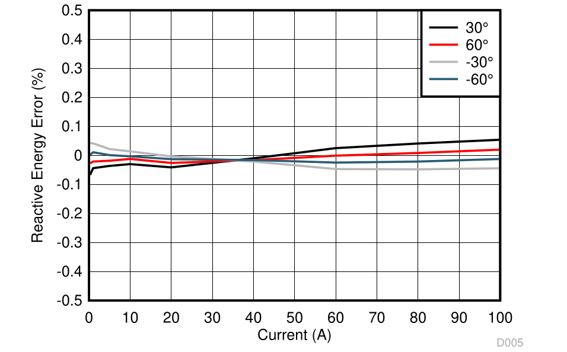

## 10 Power Supply Recommendations

### 10.1 CAP Pin Behavior

The ADS131M08 core digital voltage of 1.8 V is created from an internal LDO from DVDD. The CAP pin outputs the LDO voltage created from the DVDD supply and requires an external bypass capacitor. When operating from DVDD > 2.7 V, place a 220-nF capacitor on the CAP pin to DGND. If DVDD ≤ 2 V, tie the CAP pin directly to the DVDD pin and decouple the star-connected pins using a 100-nF capacitor to DGND.

### 10.2 Power-Supply Sequencing

The power supplies can be sequenced in any order but the analog and digital inputs must never exceed the respective analog or digital power-supply voltage limits.

### 10.3 Power-Supply Decoupling

Good power-supply decoupling is important to achieve optimum performance. AVDD and DVDD must each be decoupled with a 1-µF capacitor. Place the bypass capacitors as close to the power-supply pins of the device as possible  with  low-impedance  connections.  Using  multi-layer  ceramic  chip  capacitors  (MLCCs)  that  offer  low equivalent  series  resistance  (ESR)  and  inductance  (ESL)  characteristics  are  recommended  for  power-supply decoupling purposes. For very sensitive systems, or for systems in harsh noise environments, avoiding the use of vias for connecting the capacitors to the device pins can offer superior noise immunity. The use of multiple vias in parallel lowers the overall inductance and is beneficial for connections to ground planes. The analog and digital ground are recommended to be connected together as close to the device as possible.

## 11 Layout

### 11.1 Layout Guidelines

For best performance, dedicate an entire PCB layer to a ground plane and do not route any other signal traces on this layer. However, depending on restrictions imposed by specific end equipment, a dedicated ground plane may not be practical. If ground plane separation is necessary, make a direct connection of the planes at the ADC. Do not connect individual ground planes at multiple locations because this configuration creates ground loops.

Route digital traces away from all analog inputs and associated components in order to minimize interference.

Use  C0G  capacitors  on  the  analog  inputs.  Use  ceramic  capacitors  (for  example,  X7R  grade)  for  the  powersupply decoupling capacitors. High-K capacitors (Y5V) are not recommended. Place the required capacitors as close as possible to the device pins using short, direct traces. For optimum performance, use low-impedance connections on the ground-side connections of the bypass capacitors.

When  applying  an  external  clock,  be  sure  the  clock  is  free  of  overshoot  and  glitches.  A  source-termination resistor placed at the clock buffer often helps reduce overshoot. Glitches present on the clock input can lead to noise within the conversion data.

### 11.2 Layout Example

Figure 11-1 shows an example layout of the ADS131M08 requiring a minimum of two PCB layers. In general, analog signals and planes are partitioned to the left and digital signals and planes to the right.

**Figure 11-1. Layout Example**

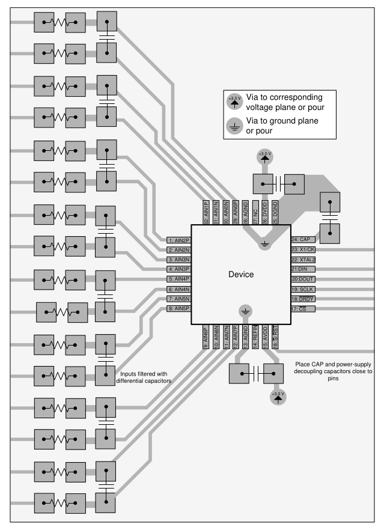