# ADS131M08 Evaluation Module

This user's guide describes the characteristics, operation, and use of the ADS131M08 evaluation module (EVM). This kit is an evaluation platform for the ADS131M08, which is an 8-channel, simultaneouslysampling, 24-bit, delta-sigma ( ΔΣ ) analog-to-digital converter (ADC). The ADS131M08 offers wide dynamic range and internal calibration features, making the device excellent for energy metering, power quality, protection relay, and circuit breaker applications.

The ADS131M08EVM eases the evaluation of the device with hardware, software, and computer connectivity through the universal serial bus (USB) interface. This user's guide includes complete circuit descriptions, schematic diagrams, and a bill of materials. Throughout this document, the abbreviation EVM and the term evaluation module are synonymous with the ADS131M08EVM. The following related documents are available through the Texas Instruments web site at www.ti.com.

**Table 1. Related Documentation**

| Device    | Literature Number   |
|-----------|---------------------|
| ADS131M08 | SBAS950             |

**Contents**

1 EVM Overview
2 EVM Analog Interface
3 Digital Interface
4 Power Supplies
5 ADS131M08EVM Initial Setup
6 ADS131M08EVM Operation
7 ADS131M08EVM Bill of Materials, PCB Layout, and Schematic

**List of Figures** 

1 System Connection for Evaluation
2 Input Terminal Blocks and Headers (Schematic)
3 Input Terminal Blocks and Headers (PCB)
4 CLKIN External Clock (PCB)
5 ADS131M08EVM Jumper Default Settings
6 ADS131M08 Software Installation Prompts
7 Device Driver Installation Wizard Prompts
8 LabVIEW Run-Time Engine Installation
9 ADS131M08EVM GUI Folder Post-Installation
10 ADS131M08EVM Hardware Setup and LED Indicators
11 Launch the EVM GUI Software
12 EVM GUI Global Input Parameters
13 Register Map Configuration
14 Time Domain Display Tool Options
15 Spectral Analysis Tool
16 Histogram Analysis Tool
17 Top Silkscreen
18 Top Layer
19 Ground Layer 1
20 Ground Layer 2
21 Bottom Layer
22 Bottom Silkscreen
23 ADS131M08EVM Hardware Schematic
24 ADS131M08EVM Main Schematic

**List of Tables**

1 Related Documentation
2 Analog Input Terminal Blocks, J1–J8
3 Analog Input Jumper Connection, JP1–JP8
4 CLKIN External Clock Options
5 PHI Connector Pin Functions
6 Digital Header Pins
7 LaunchPad™ Pin Functions
8 Default Settings
9 ADS131M08EVM Bill of Materials

## 1 EVM Overview

The ADS131M08EVM is a platform for evaluating the performance of the ADS131M08, which is a 8channel, simultaneously-sampling, 24-bit, ΔΣ ADC. The evaluation kit includes the ADS131M08EVM board and the precision host interface (PHI) controller board that enables the accompanying computer software to communicate with the ADC over the USB for data capture and analysis.

The ADS131M08EVM board includes the ADS131M08 ADC and all the peripheral analog circuits and components required to extract optimum performance from the ADC.

The PHI board primarily serves three functions:

- Provides a communication interface from the EVM to the computer through a USB port
- Provides the digital input and output signals necessary to communicate with the ADS131M08
- Supplies power to all active circuitry on the ADS131M08EVM board

### 1.1 ADS131M08EVM Kit

The ADS131M08 evaluation module kit includes the following features:

- Hardware and software required for diagnostic testing as well as accurate performance evaluation of the ADS131M08 ADC
- USB powered-no external power supply is required
- The PHI controller that provides a convenient communication interface to the ADS131M08 ADC over USB 2.0 (or higher) for power delivery as well as digital input and output
- Easy-to-use evaluation software for 64-bit Microsoft Windows ® 7, Windows 8, and Windows 10 operating systems
- The software suite includes graphical tools for data capture, histogram analysis, and spectral analysis. This suite also has a provision for exporting data to a text file for post-processing.

Figure 1 illustrates an example system setup for evaluation.

**Figure 1. System Connection for Evaluation**

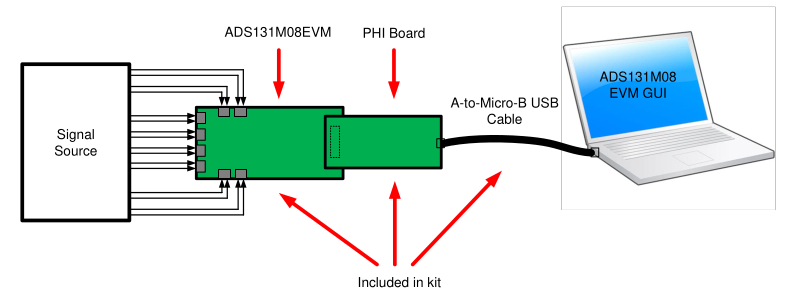

### 1.2 ADS131M08EVM Board

The ADS131M08EVM board includes the following features:

- External signal source from differential pair headers
- Options to use external analog and digital power supplies
- Serial interface header for easy connection to the PHI controller
- Pin connections to monitor digital signals with a logic analyzer
- Onboard ultra-low noise low-dropout (LDO) regulator for excellent 3.3-V, single-supply regulation of all analog circuits

## 2 EVM Analog Interface

The ADS131M08EVM is designed for easy interfacing with analog sources. This section covers the details of the front-end circuit including jumper configuration for different input test signals and board connectors for signal sources.

### 2.1 ADC Analog Input Signal Path

Analog inputs to the EVM can be connected to either the terminal blocks or to the header pins associated with each ADC channel. The 3x2 100-mil headers for each channel allow the user to configure the inputs differentially depending on the signal to be measured. The screw terminal blocks can interface directly with the leads of an external sensor input. Figure 2 shows the signal chain used for all eight input channels on the EVM and is used to describe the supported input options in Figure 3, Table 2, and Table 3.

**Figure 2. Input Terminal Blocks and Headers (Schematic)**

[Input Terminal Schematic](schematicmod/sectionModuloTi.kicad_sch)

External voltage inputs can be applied to J1 pins 1 and 3. For single-ended inputs, install a jumper on either JP1[1-2] or JP1[5-6] to connect an input to the EVM ground. If the external voltage is applied through a series resistor, R1 or R2 can be used to form a resistor divider by installing JP1[3-4] to support higher voltage measurements. Input jumper connections are described in Table 2. Similarly, R33 and R34 can be installed to form a resistor divider with the series 49.9Ω resistors on each input. An input must not be applied such that the voltage on the input pins of the ADS131M08 exceeds the absolute maximum ratings. See the ADS131M08 data sheet for details.

R1 and R2 also present a 2-k Ω differential load when all jumpers on JP1 are uninstalled. This load acts as a burden resistor for a current transformer (CT) input. For single-ended measurements, the unused end of the transformer secondary side can be tied to ground by installing the appropriate jumper on JP1.

R17, R18, and C17 form a differential low-pass filter with a -3-dB cutoff frequency of 1.594 MHz. The series impedance is kept relatively low in order to maintain adequate total harmonic distortion (THD) performance.

**Figure 3. Input Terminal Blocks and Headers (PCB)**

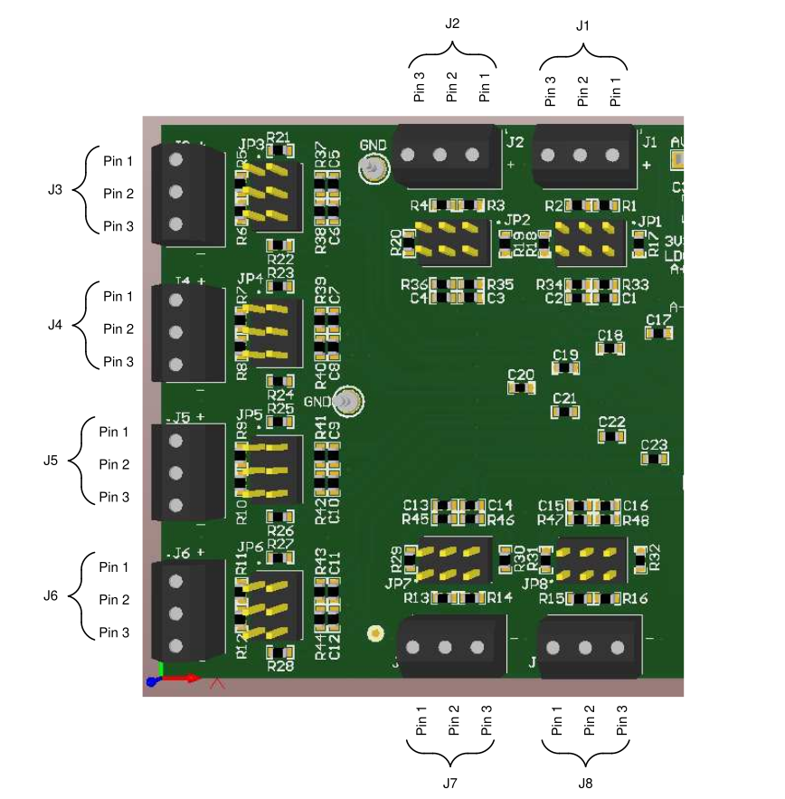

**Table 2. Analog Input Terminal Blocks, J1-J8**

| Terminal Block   |   Pin | Function                 | ADS131M08 Input Pin   |
|------------------|-------|--------------------------|-----------------------|
| J1               |     1 | Channel 0 positive input | AIN0P                 |
| J1               |     2 | EVM ground               | AGND and DGND         |
| J1               |     3 | Channel 0 negative input | AIN0N                 |
| J2               |     1 | Channel 1 positive input | AIN1P                 |
| J2               |     2 | EVM ground               | AGND and DGND         |
| J2               |     3 | Channel 1 negative input | AIN1N                 |
| J3               |     1 | Channel 2 positive input | AIN2P                 |
| J3               |     2 | EVM ground               | AGND and DGND         |
| J3               |     3 | Channel 2 negative input | AIN2N                 |
| J4               |     1 | Channel 3 positive input | AIN3P                 |
| J4               |     2 | EVM ground               | AGND and DGND         |
| J4               |     3 | Channel 3 negative input | AIN3N                 |
| J5               |     1 | Channel 4 positive input | AIN4P                 |
| J5               |     2 | EVM ground               | AGND and DGND         |
| J5               |     3 | Channel 4 negative input | AIN4N                 |
| J6               |     1 | Channel 5 positive input | AIN5P                 |
| J6               |     2 | EVM ground               | AGND and DGND         |
| J6               |     3 | Channel 5 negative input | AIN5N                 |
| J7               |     1 | Channel 6 positive input | AIN6P                 |
| J7               |     2 | EVM ground               | AGND and DGND         |
| J7               |     3 | Channel 6 negative input | AIN6N                 |
| J8               |     1 | Channel 7 positive input | AIN7P                 |
| J8               |     2 | EVM ground               | AGND and DGND         |
| J8               |     3 | Channel 7 negative input | AIN7N                 |

**Table 3. Analog Input Jumper Connection, JP1-JP8**

| Jumper   | Position                               | Description                                                 |
|----------|----------------------------------------|-------------------------------------------------------------|
| JP1      | Connection for channel 0 analog inputs |                                                             |
| JP1      | [1-2]                                  | Short positive input to ground                              |
| JP1      | [3-4]                                  | Connect both inputs to ground via 1-k Ω resistors (default) |
| JP1      | [5-6]                                  | Short negative input to ground                              |
| JP2      | Connection for channel 1 analog inputs |                                                             |
| JP2      | [1-2]                                  | Short positive input to ground                              |
| JP2      | [3-4]                                  | Connect both inputs to ground via 1-k Ω resistors (default) |
| JP2      | [5-6]                                  | Short negative input to ground                              |
| JP3      | Connection for channel 2 analog inputs |                                                             |
| JP3      | [1-2]                                  | Short positive input to ground                              |
| JP3      | [3-4]                                  | Connect both inputs to ground via 1-k Ω resistors (default) |
| JP3      | [5-6]                                  | Short negative input to ground                              |
| JP4      | Connection for channel 3 analog inputs |                                                             |
| JP4      | [1-2]                                  | Short positive input to ground                              |
| JP4      | [3-4]                                  | Connect both inputs to ground via 1-k Ω resistors (default) |
| JP4      | [5-6]                                  | Short negative input to ground                              |
| JP5      | Connection for channel 4 analog inputs |                                                             |
| JP5      | [1-2]                                  | Short positive input to ground                              |
| JP5      | [3-4]                                  | Connect both inputs to ground via 1-k Ω resistors (default) |
| JP5      | [5-6]                                  | Short negative input to ground                              |
| JP6      | Connection for channel 5 analog inputs |                                                             |
| JP6      | [1-2]                                  | Short positive input to ground                              |
| JP6      | [3-4]                                  | Connect both inputs to ground via 1-k Ω resistors (default) |
| JP6      | [5-6]                                  | Short negative input to ground                              |
| JP7      | Connection for channel 6 analog inputs |                                                             |
| JP7      | [1-2]                                  | Short positive input to ground                              |
| JP7      | [3-4]                                  | Connect both inputs to ground via 1-k Ω resistors (default) |
| JP7      | [5-6]                                  | Short negative input to ground                              |
| JP8      | Connection for channel 7 analog inputs |                                                             |
| JP8      | [1-2]                                  | Short positive input to ground                              |
| JP8      | [3-4]                                  | Connect both inputs to ground via 1-k Ω resistors (default) |
| JP8      | [5-6]                                  | Short negative input to ground                              |

### 2.2 ADC External Clock (CLKIN) Options

The ADS131M08 requires a continuous, free-running external master clock at the CLKIN pin for normal operation. The onboard complementary metal oxide semiconductor (CMOS) crystal oscillator (Y1) provides the nominal 8.192-MHz clock frequency used in the high-resolution (HR) mode of the device. Two D flip-flops (U3) divide the Y1 clock output to produce clock frequencies of 4.096 MHz and 2.048 MHz to support the low-power (LP) mode and very-low-power (VLP) mode, respectively.

Is very importan consider 

Install a jumper in the appropriate position on the JP10 header shown in Figure 4 (include image and kicad schematic) to provide selectable clock frequency options. An external clock frequency can also be provided to any even-numbered pin on JP10 when the jumper is uninstalled. TI also recommends powering down Y1 by installing JP9 when providing an external clock. When using an external clock, ground must be shared between the external clock source and the EVM ground. The external clock must adhere to the frequency and amplitude limits outlined in the ADS131M08 data sheet. Table 4 lists the JP6 jumper settings for the clock input selections.

In addition to jumper settings, each of the power modes requires configuration register settings outlined in Section 6.1.

Note:
    It is important to note that, although this manual refers to two D flip-flops in component U3, the schematic representation shown in Figure 4 uses a component with only a single flip-flop. In other words, the original component is the 74AUP2G80, which contains two flip-flops, whereas the schematic representation in Figure 4 uses the 74AUP1G80, which contains only one flip-flop. This change does not affect the functionality of the overall system.

**Figure 4. CLKIN External Clock (PCB)**

[CLKIN External Clock (SCH)](schematicmod/clockModuloTi.kicad_sch)

**Table 4. CLKIN External Clock Options**

| JP10 Jumper Setting   | Clock Frequency   | Description                                      |
|-----------------------|-------------------|--------------------------------------------------|
| [1-2]                 | 8.192 MHz         | Nominal clock for high-resolution mode (default) |
| [3-4]                 | 4.096 MHz         | Nominal clock for low-power mode                 |
| [5-6]                 | 2.048 MHz         | Nominal clock for very-low-power mode            |

## 3 Digital Interface

As noted in Section 1, the EVM interfaces with the PHI and communicates with the computer over the USB. There are two devices on the EVM with which the PHI communicates: the ADS131M08 ADC (over SPI) and the EEPROM (over I 2 C). The EEPROM comes pre-programmed with the information required to configure and initialize the ADS131M08EVM platform. When the hardware is initialized, the EEPROM is no longer used.

### 3.1 SPI Communication

The ADS131M08EVM supports limited interface modes as detailed in the ADS131M08 data sheet. The ADS131M08 uses an SPI-compatible interface to configure the device and retrieve conversion data. SPI communication on the ADS131M08 is performed in frames. Each SPI communication frame consists of several words. The word size is configurable as either 16 bits, 24 bits (default), or 32 bits by programming the WLENGTH[1:0] bits in the MODE register.

Additionally, the DRDY pin indicates when conversion data are available to be read by the master. The DRDY\_SEL[1:0] bits, DRDY\_HIZ bit, and the DRDY\_FMT bit in the MODE register control the behavior of the DRDY pin.

For this EVM not all modes and functions for this SPI communication are supported. Functions not supported are disabled in the EVM GUI software. For more information about the SPI communication, see the ADS131M08 data sheet.

### 3.2 Connection to the PHI

The ADS131M08EVM board communicates with the PHI through a shrouded, 60-pin connector, J9. There are two round standoffs next to J9 with Phillips-head screws. To connect the PHI to the EVM, remove the screws, attach the PHI to the EVM, and replace the screws into the standoffs. The screws secure the EVM to the PHI and ensures the connection between the boards.

Table 5 lists the different PHI connection and their functions.

**Table 5. PHI Connector Pin Functions**

| PHI Connector Pin Name   | PHI Connector Pin   | Function                                                                 |
|--------------------------|---------------------|--------------------------------------------------------------------------|
| EVM_RAW_5V               | J9[2]               | Power-supply source for the analog section of the EVM                    |
| GND                      | J9[3]               | Ground                                                                   |
| SYNC/RESET               | J9[10]              | Conversion synchronization or system reset for the ADS131M08; active low |
| DIN                      | J9[18]              | Serial data input for the ADS131M08                                      |
| CLK                      | J9[20]              | Master clock input for the ADS131M08                                     |
| CS                       | J9[22]              | Chip select for the ADS131M08; active low                                |
| SCLK                     | J9[24]              | Serial data clock for the ADS131M08                                      |
| SCLK                     | J9[28]              | Serial data clock for the ADS131M08                                      |
| DRDY                     | J9[30]              | Data ready for the ADS131M08; active low                                 |
| DOUT                     | J9[36]              | Serial data output for the ADS131M08                                     |
| EVM_DVDD                 | J9[50]              | Power-supply source for the digital section of the EVM                   |
| SDA                      | J9[56]              | I 2 C serial data for the EEPROM used to identify the EVM                |
| SCL                      | J9[58]              | I 2 C serial clock for the EEPROM used to identify the EVM               |
| EVM_ID_PWR               | J9[59]              | Power-supply source for the EEPROM used to identify the EVM              |
| GND                      | J9[60]              | Ground                                                                   |

### 3.3 Digital Header

In addition to the PHI, the EVM has a header connected to the digital lines that can be used to connect a logic analyzer or oscilloscope. This placement allows for easy access to the digital communications. Header J10 is connected to the digital lines between the ADS131M08 and the PHI connector. Table 6 describes the digital header pins.

**Table 6. Digital Header Pins**

| ADS131M08 Pin Name   | Digital Header Pin   |
|----------------------|----------------------|
| SYNC/RESET           | J10[1]               |
| DIN                  | J10[2]               |
| CLK                  | J10[3]               |
| CS                   | J10[4]               |
| SCLK                 | J10[5]               |
| DRDY                 | J10[6]               |
| DOUT                 | J10[7]               |
| GND                  | J10[8]               |

### 3.4 LaunchPad™ Connectors

On the bottom side of the ADS131M08EVM board is a set of unpopulated surface-mount connectors (J11 and J12). When populated, these devices can be used to connect to a TI LaunchPad™ directly as a typical BoosterPack™ plug-in module.

Connectors J11 and J12 are a set of 10x2, 100 mil connectors. As shown in Table 7, the pin numbers for J11 and J12 map to the pin numbers for a standard 40-pin LaunchPad™ connector.

**Table 7. LaunchPad™ Pin Functions**

| ADS131M08EVM Connection   | ADS131M08EVM (J11, J12)   | LaunchPad™ Connection   |
|---------------------------|---------------------------|-------------------------|
| +3.3V                     | J12[1]                    | Pin 1                   |
| SCLK                      | J12[13]                   | Pin 7                   |
| DOUT                      | J11[14]                   | Pin 14                  |
| DIN                       | J11[12]                   | Pin 15                  |
| GND                       | J11[2]                    | Pin 20                  |
| +5V                       | J12[2]                    | Pin 21                  |
| GND                       | J12[4]                    | Pin 22                  |
| DRDY                      | J11[7]                    | Pin 37                  |
| CS                        | J11[5]                    | Pin 38                  |
| SYNC/RESET                | J11[3]                    | Pin 39                  |
| CLK                       | J11[1]                    | Pin 40                  |

## 4 Power Supplies

The PHI provides multiple power-supply options for the EVM, derived from the USB supply of the computer.

The EEPROM on the ADS131M08EVM uses a 3.3-V power supply generated directly by the PHI. The analog supply of the ADC is powered by the LP5907 onboard the EVM, which is a low-noise linear regulator that uses the 5-V supply on the PHI to generate a cleaner 3.3-V output. The 3.3-V supply to the digital section of the ADC is provided directly by an LDO on the PHI.

The power supply for each active component on the EVM is bypassed with a ceramic capacitor placed close to that component. Additionally, the EVM layout uses thick traces or large copper fill areas, where possible, between bypass capacitors and their loads to minimize inductance along the load current path.

As mentioned previously in Section 1, power to the EVM is supplied by the PHI through connector J5. For information about PHI pins and the power connections, see Table 5.

With modifications, the user can use external supplies for either AVDD or DVDD. AVDD can be driven externally by moving the jumper on JP12 to the left. This placement disconnects 3V3\_LDO from AVDD. Power can then be applied through the AVDD test point at TP2 or through 3V3\_LP if connector J12 is installed. DVDD can be driven externally from the DVDD test point at TP1 if R67 is removed from the EVM.

## 5 ADS131M08EVM Initial Setup

This section explains the initial hardware and software setup procedure that must be completed for properly operating the ADS131M08EVM.

### 5.1 Default Jumper Settings

After unpacking, the EVM is already configured with the default jumper settings. Figure 5 shows the locations for the default jumpers.

**Figure 5. ADS131M08EVM Jumper Default Settings**

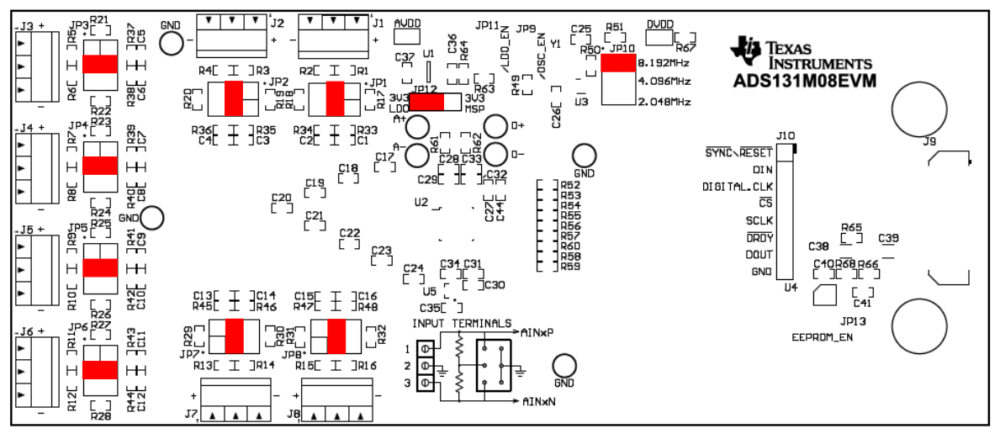

The default position of the JP10 jumper is across [1-2] at the top. JP10 sets the onboard oscillator frequency to 8.192 MHz, used for the ADS131M08 in high-resolution mode. The default connection for JP12 is to the left, so that the linear regulator is powering the system using 5 V from the PHI controller.

The default settings, as listed in Table 8, includes no jumpers installed at JP9, JP11, and JP13. When installed, JP9 disables the onboard oscillator, JP13 enables the EEPROM for write, and JP11 disables the linear regulator.

**Table 8. Default Settings**

| Jumper                                 | Position      | Function                                     |
|----------------------------------------|---------------|----------------------------------------------|
| JP1, JP2, JP3, JP4, JP5, JP6, JP7, JP8 | [3-4]         | Sets common-mode to ground for device inputs |
| JP9                                    | Not installed | Disables on-board oscillator                 |
| JP10                                   | [1-2]         | Oscillator frequency select, 8.192MHz        |
| JP11                                   | Not installed | Disables linear regulator power              |
| JP12                                   | [1-2]         | Selects device power from linear regulator   |
| JP13                                   | Open          | Disables write for EEPROM                    |

### 5.2 EVM Graphical User Interface (GUI) Software Installation

Download the latest version of the EVM GUI installer from the Tools and Software folder of the ADS131M08EVM and run the GUI installer to install the EVM GUI software on your computer.

**CAUTION**

Manually disable any antivirus software running on the computer before downloading the EVM GUI installer onto the local hard disk. Depending on the antivirus settings, an error message may appear or the installer. The exe file can be deleted.

- Accept the license agreements and follow the on-screen instructions shown in Figure 6 to complete the installation.

**Figure 6. ADS131M08 Software Installation Prompts**

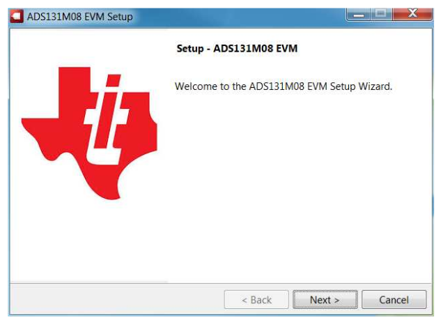

As a part of the ADS131M08EVM GUI installation, a prompt with a Device Driver Installation (as shown in Figure 7) appears on the screen. Click Next to proceed.

Figure 7. Device Driver Installation Wizard Prompts

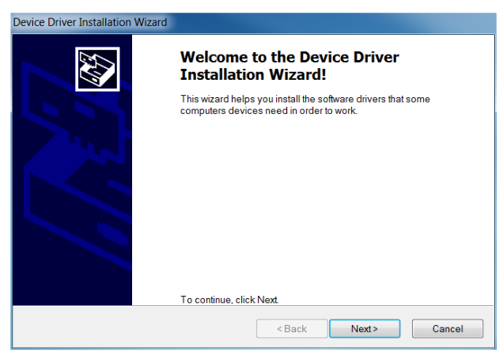

**NOTE:**

    A notice may appear on the screen stating that Windows cannot verify the publisher of this driver software. Select Install this driver software anyway .

The ADS131M08EVM requires the LabVIEW™ run-time engine and may prompt for the installation of this software, as shown in Figure 8, if not already installed.

**Figure 8. LabVIEW Run-Time Engine Installation**

Verify that C:\Program Files (x86)\Texas Instruments\ADS131M08EVM is as shown in Figure 9 after these installations.

**Figure 9. ADS131M08EVM GUI Folder Post-Installation**

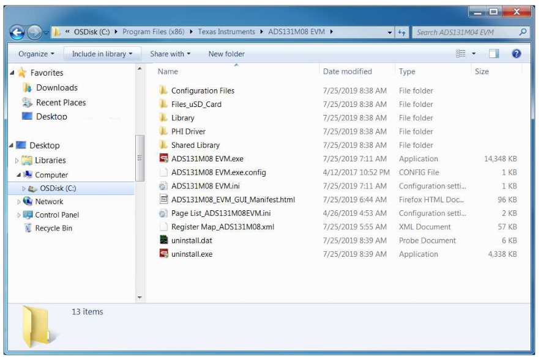

## 6 ADS131M08EVM Operation

The following instructions are a step-by-step guide to connecting the ADS131M08EVM to the computer and evaluating the performance of the ADS131M08:

1. Connect the ADS131M08EVM to the PHI. Install the two screws as indicated in Figure 10.
2. Use the provided USB cable to connect the PHI to the computer.
- LED D5 on the PHI lights up, indicating that the PHI is powered up
- LEDs D1 and D2 on the PHI start blinking to indicate that the PHI is booted up and communicating with the PC; Figure 10 shows the resulting LED indicators
3. Figure 11 shows how to launch the ADS131M08EVM GUI software.

Figure 10. ADS131M08EVM Hardware Setup and LED Indicators

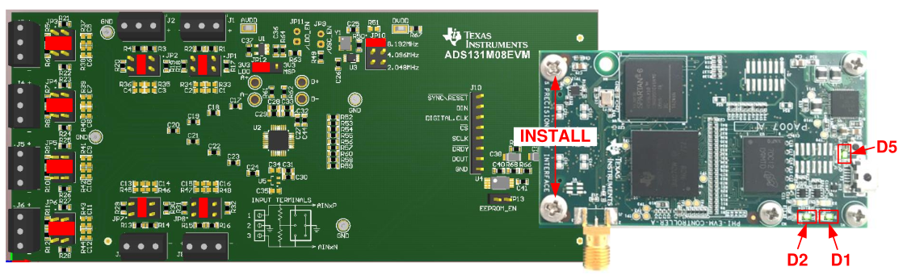

Figure 11. Launch the EVM GUI Software

<!-- image no available-->

### 6.1 EVM GUI Global Settings for ADC Control

Although the EVM GUI does not allow direct access to the levels and timing configuration of the ADC digital interface, the EVM GUI does give users high-level control over virtually all functions of the ADS131M08 including interface modes, sampling rate, and number of samples to be captured. Figure 12 identifies the input parameters of the GUI (as well as their default values) through which the various functions of the ADS131M08 can be exercised.

**Figure 12. EVM GUI Global Input Parameters**

<!-- image no available-->

There are four pages available in the ADS131M08EVM GUI. The information area displays the results of each of the pages. Each of these pages display a different control or measurement of the device. The Register Map Config page is used to read and write to the registers of the device. The Time Domain Display page is used to collect a set of data from the device and display the result. The Spectral Analysis page can determine the FFT of the collected data, and the Histogram Analysis page shows a histogram of the collected data and displays basic statistics of the result.

The Single Commands section allows for direct control of the device for three basic functions. First the Reset button sends a signal to the SYNC/RESET pin to reset the device. The Standby button puts the device into a low-power state in which all channels are disabled, and the reference and other nonessential circuitry are powered down. The Wakeup button exits the standby mode.

The Interface Configuration options in this pane allows the user to choose from different frame word sizes available on the ADS131M08. This section also sets the data rate by setting the oversampling ratio (OSR) in the ADC. Finally, this section can used to set the power modes in the registers. The ADS131M08 can be set to high-resolution, low-power, and very-low-power modes in conjunction with the jumper settings of JP6 for the CLKIN pin, as outlined in Table 4. This information is also discussed in Section 2.2.

The Clock and Sampling Rate section allows the user to specify a target SCLK frequency (in Hz) and the GUI tries to match this frequency as closely as possible by changing the PHI PLL settings, but the achievable frequency may differ from the target value entered. This section also displays the sampling rate of the ADC as controlled by the OCR.

The GUI is switched between hardware mode and simulation mode by checking and unchecking the Connected to Hardware box in the top right area of the screen at any time.

### 6.2 Register Map Configuration Tool

The register map configuration tool allows the user to view and modify the registers of the ADS131M08. This tool can be selected, as indicated in Figure 13, by clicking on the Register Map Config radio button at the Pages section of the left pane. On power-up, the values on this page correspond to the Host Configuration Settings that enable ADC sampling at the maximum sampling rate specified for the ADC. The register values can be edited by double-clicking the corresponding value field. If interface mode settings are affected by the change in register values, this change reflects on the left pane immediately. The changes in the register value reflect on the ADS131M08 device on the ADS131M08EVM based on the Update Mode selection, as described in Section 6.1.

**Figure 13. Register Map Configuration**

<!-- image no available-->

Section 6.3 through Section 6.5 describe the data collection and analysis features of the ADS131M08EVM GUI.

### 6.3 Time Domain Display Tool

The time domain display tool allows visualization of the ADC response to a given input signal. This tool is useful for both studying the behavior and debugging any gross problems with the ADC or drive circuits.

The user can trigger a capture of the data of the selected number of samples from the ADS131M08EVM, as per the current interface mode settings indicated in Figure 14 by using the Capture button. The sample indices are on the x-axis and there are two y-axes showing the corresponding output codes as well as the equivalent analog voltages based on the specified reference voltage. Switching pages to any of the Analysis tools described in the subsequent sections causes calculations to be performed on the same set of data.

**Figure 14. Time Domain Display Tool Options**

<!-- image no available-->

### 6.4 Spectral Analysis Tool

The spectral analysis tool, shown in Figure 15, is intended to evaluate the dynamic performance (SNR, THD, SFDR, SINAD, and ENOB) of the ADS131M08 ADC through single-tone sinusoidal signal FFT analysis using the 7-term Blackman-Harris window setting.

**Figure 15. Spectral Analysis Tool**

<!-- image no available-->

The FFT tool includes windowing options that are required to mitigate the effects of non-coherent sampling (this discussion is beyond the scope of this document). The 7-Term Blackman Harris window is the default option and has sufficient dynamic range to resolve the frequency components of up to a 24-bit ADC. The None option corresponds to not using a window (or using a rectangular window) and is not recommended.

### 6.5 Histogram Tool

Noise degrades ADC resolution and the histogram tool can be used to estimate effective resolution, which is an indicator of the number of bits of ADC resolution losses resulting from noise generated by the various sources connected to the ADC when measuring a DC signal. The cumulative effect of noise coupling to the ADC output from sources such as the input drive circuits, the reference drive circuit, the ADC power supply, and the ADC itself is reflected in the standard deviation of the ADC output code histogram that is obtained by performing multiple conversions of a DC input applied to a given channel.

As shown in Figure 16, the histogram corresponding to a DC input is displayed on clicking the Capture button.

**Figure 16. Histogram Analysis Tool**

<!-- image no available-->

## 7 ADS131M08EVM Bill of Materials, PCB Layout, and Schematic

### 7.1 Bill of Materials

Table 9 lists the ADS131M08EVM bill of materials.

**Table 9. ADS131M08EVM Bill of Materials**

| Designator |   Quantity | Value   | Description | Package Reference | Part Number | Manufacturer |
|------------|------------|---------|-------------|-------------------|-------------|--------------|
| C17, C18, C19, C20, C21, C22, C23, C24 | 8 | 1000pF | CAP, CERM, 1000 pF, 25 V, +/- 10%, C0G/NP0, 0603 | 0603 | C0603C102K3GACTU   | Kemet |
| C25, C26, C31, C32, C40, C41 | 6 | 0.1uF   | CAP, CERM, 0.1 uF, 25 V, +/- 5%, X7R, 0603 | 0603 | C0603C104J3RAC | Kemet |
| C27 | 1 | 0.22uF  | CAP, CERM, 0.22 uF, 25 V, +/- 5%, X7R, 0603      | 0603 | C0603C224J3RAC7867 | Kemet |
| C30, C33, C36, C37 | 4 | 1uF | CAP, CERM, 1 uF, 25 V, +/- 10%, X7R, 0603 | 0603 | C0603C105K3RACTU   | Kemet |
| C38, C39 | 2 | 10uF    | CAP, CERM, 10 uF, 25 V, +/- 10%, X7R, 1206_190   | 1206_190 | C1206C106K3RACTU   | Kemet |
| C44 | 1 | 10pF    | CAP, CERM, 10 pF, 50 V, +/- 5%, C0G/NP0, 0603 | 0603 | C0603C100J5GACTU   | Kemet |
| H1, H2 | 2 | | Machine Screw Pan PHILLIPS M3 | | RM3X4MM 2701 | APM HEXSEAL | 
| H3, H4 | 2 | | ROUND STANDOFF M3 STEEL 5MM | | 9774050360R | Wurth Elektronik    |
| H5, H6, H7, H8 |          4 |         | Bumpon, Hemisphere, 0.44 X 0.20, Clear           | Transparent Bumpon                    | SJ-5303 (CLEAR)    | 3M                  |
| H9 | 1 |         | Cable, USB-A to micro USB-B, 1 m - Kitting item  | | 102-1092-BL-00100  | CnC Tech |
| H10 | 1 | | PHI-EVM Controller Kitting item Edge# 6591636    | | PA007              | Texas Instruments   |
| J1, J2, J3, J4, J5, J6, J7, J8 | 8 | | Terminal Block, 3.5mm Pitch, 3x1, TH | 10.5x8.2x6.5mm | ED555/3DS | On-Shore Technology |
| J9 | 1 | | Header(Shrouded), 19.7mil, 30x2, Gold, SMT | Header (Shrouded), 19.7mil, 30x2, SMT | QTH-030-01-L-D-A   | Samtec |
| J10 | 1 | | Header, 100mil, 8x1, Gold, TH | 8x1 Header | TSW-108-07-G-S | Samtec |
| JP1, JP2, JP3, JP4, JP5, JP6, JP7, JP8, JP10 | 9 | | Header, 100mil, 3x2, Gold, TH | 3x2 Header | TSW-103-07-G-D | Samtec |
| JP12 | 1 | | Header, 100mil, 3x1, Gold, TH | 3x1 Header | TSW-103-07-G-S | Samtec |
| JP13 | 1 | | Header, 100mil, 2x1, Gold, TH | 2x1 Header | TSW-102-07-G-S | Samtec |
| R1, R2, R3, R4, R5, R6, R7, R8, R9, R10, R11, R12, R13, R14, R15, R16 | 16 | 1.00k   | RES, 1.00 k, 1%, 0.1 W, AEC-Q200 Grade 0, 0603 | 0603 | CRCW06031K00FKEA | Vishay-Dale |
| R17, R18, R19, R20, R21, R22, R23, R24, R25, R26, R27, R28, R29, R30, R31, R32 | 16 | 49.9 | RES, 49.9, 1%, 0.1 W, AEC-Q200 Grade 0, 0603 | 0603 | CRCW060349R9FKEA | Vishay-Dale |
| R49, R59, R60, R64 | 4 | 100k | RES, 100 k, 1%, 0.1 W, AEC-Q200 Grade 0, 0603 | 0603 | CRCW0603100KFKEA   | Vishay-Dale |
| R50, R53, R54, R55, R56, R57, R58, R63, R65, R66, R67 | 11 | 0 | RES, 0, 5%, 0.1 W, 0603 | 0603 | RC0603JR-070RL | Yageo |
| R52 | 1 | 10.0 | RES, 10.0, 1%, 0.25 W, AEC-Q200 Grade 0, 0603 | 0603 | CRCW060310R0FKEAHP | Vishay-Dale |
| R61, R62 | 2 | 0.1 | RES, 0.1, 1%, 0.1 W, AEC-Q200 Grade 1, 0603 | 0603 | ERJ-L03KF10CV | Panasonic |
| R68 | 1 | 10k | RES, 10 k, 5%, 0.1 W, 0603 | 0603 | RC1608J103CS | Samsung Electro-Mechanics |
| SH-J1, SH-J2, SH-J3, SH-J4, SH-J5, SH-J6, SH-J7, SH-J8, SH-J9, SH-J10 | 10 | 1x2 | Shunt, 100mil, Flash Gold, Black | Closed Top 100mil Shunt | SPC02SYAN | Sullins Connector Solutions |
| TP1, TP2 | 2 | | Test Point, Miniature, SMT | Testpoint Keystone Miniature | 5015 | Keystone |
| TP3, TP4, TP5, TP6 | 4 | | Terminal, Turret, TH, Double | Keystone1573-2 | 1573-2 | Keystone |
| U1 | 1 | | 250-mA Ultra-Low-Noise, Low-IQ LDO, DBV0005A (SOT-23-5) | DBV0005A | LP5907MFX-3.3/NOPB | Texas Instruments |
| U2 | 1 | | 8-Channel, 24-Bit, Simultaneously-Sampling, Delta-Sigma ADC, PBS0032A (TQFP-32) | PBS0032A | ADS131M08IPBSR | Texas Instruments |
| U3 | 1 | | Low-Power Dual Positive-Edge-Triggered D-Type Flip-Flop, DCU0008A (VSSOP-8) | DCU0008A | SN74AUP2G80DCUR | Texas Instruments |
| U4 | 1 | | I2C BUS EEPROM (2-Wire), TSSOP-B8 | TSSOP-8 | BR24G32FVT-3AGE2 | Rohm |
| Y1 | 1 | | Oscillator, 8.192 MHz, 15 pF, AEC-Q200 Grade 1, SMD | 3.2x2.5mm | SIT8924BA-22-33E-8.192000G | SiTime |
| C1, C2, C3, C4, C5, C6, C7, C8, C9, C10, C11, C12, C13, C14, C15, C16 | 0 | 0.01uF  | CAP, CERM, 0.01 uF, 25 V, +/- 5%, C0G/NP0, 0603 | 0603 | C0603H103J3GACTU | Kemet |
| C28, C34, C35 | 0 | 1uF | CAP, CERM, 1 uF, 25 V, +/- 10%, X7R, 0603 | 0603 | C0603C105K3RACTU | Kemet |
| C29 | 0 | 0.1uF   | CAP, CERM, 0.1 uF, 25 V, +/- 5%, X7R, 0603 | 0603 | C0603C104J3RAC | Kemet |
| C42, C43 | 0 | 10uF | CAP, CERM, 10 uF, 25 V, +/- 10%, X7R, 1206_190 | 1206_190 | C1206C106K3RACTU | Kemet |
| FID1, FID2, FID3 | 0 | | Fiducial mark. There is nothing to buy or mount. | N/A | N/A | N/A |
| J11, J12 | 0 | | Connector, Receptacle, 100mil, 10x2, Gold plated, SMD | 10x2 Receptacle | SSW-110-22-F-D-VS-K | Samtec |
| JP9, JP11 | 0 | | Header, 100mil, 2x1, Gold, TH | 2x1 Header | TSW-102-07-G-S | Samtec |
| R33, R34, R35, R36, R37, R38, R39, R40, R41, R42, R43, R44, R45, R46, R47, R48 | 0 | 1.00k | RES, 1.00 k, 1%, 0.1 W, AEC-Q200 Grade 0, 0603 | 0603 | CRCW06031K00FKEA | Vishay-Dale |
| R51, R69, R70 | 0 | 0 | RES, 0, 5%, 0.1 W, 0603 | 0603 | RC0603JR-070RL | Yageo |
| TP7, TP8, TP9, TP10 | 0 | | Terminal, Turret, TH, Double | Keystone1573-2 | 1573-2 | Keystone |
| U5 | 0 | | 30 ppm / degC Drift, 3.9 uA, Voltage Reference, -40 to 125 degC, 3-pin SC70 (DCK), Green (RoHS & no Sb/Br) | DCK0003A | REF3312AIDCKT | Texas Instruments |

**Notes about bill of materials**

    1. It is important to note that, although this manual refers to two D flip-flops in component U3, the schematic representation shown in Figure 24 uses a component with only a single flip-flop. In other words, the original component is the 74AUP2G80, which contains two flip-flops, whereas the schematic representation in Figure 24 uses the 74AUP1G80, which contains only one flip-flop. This change does not affect the functionality of the overall system.

    2. Although the manual mentions eight Analog Input Terminal Blocks, J1 through J8, the schematic representation in Figure 24 shows only three Terminal Blocks for simplification purposes. This simplification does not affect the functionality of the circuit.

### 7.2 PCB Layout

Figure 17 through Figure 22 illustrate the ADS131M08EVM PCB layout.

**Figure 17. Top Silkscreen**

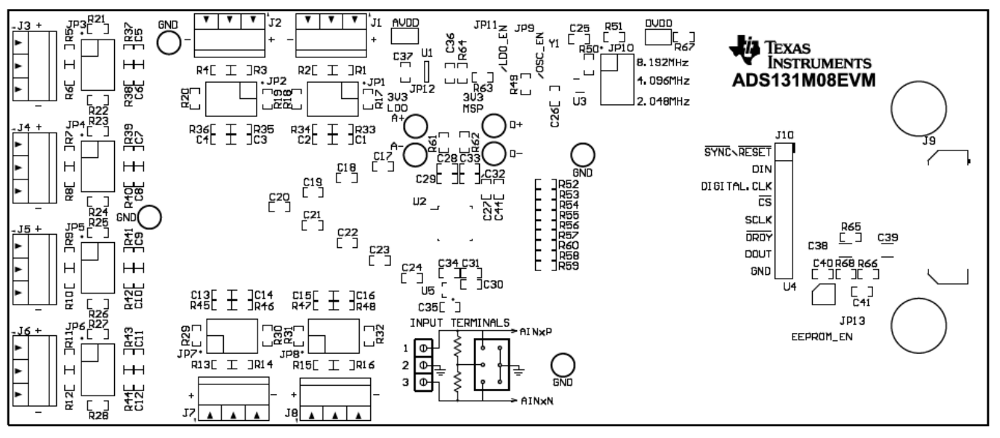

**Figure 18. Top Layer**

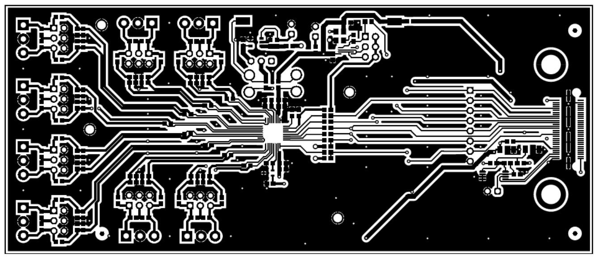

**Figure 19. Ground Layer 1**

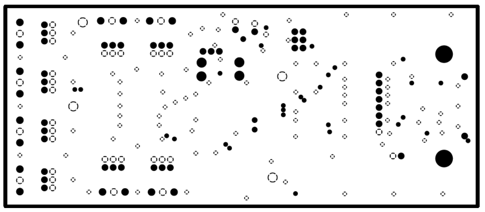

**Figure 20. Ground Layer 2**

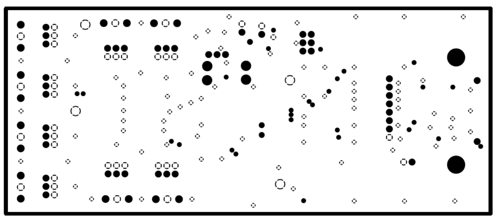

**Figure 21. Bottom Layer**

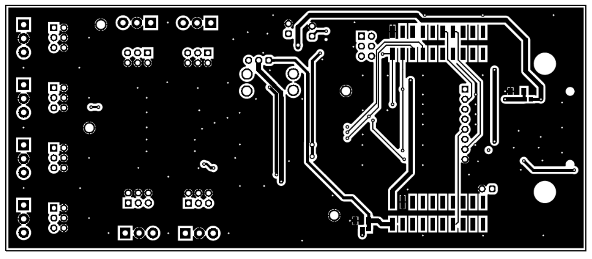

**Figure 22. Bottom Silkscreen**

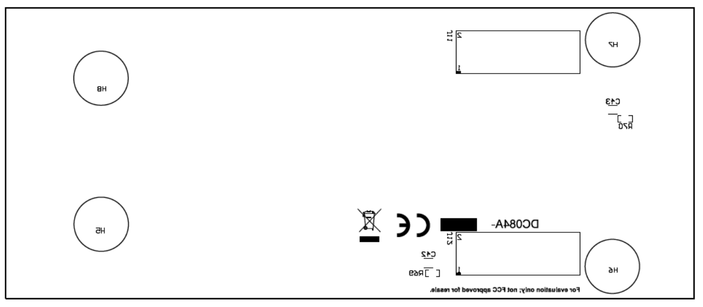

### 7.3 Schematic

Figure 23 and Figure 24 illustrate the ADS131M08EVM schematics.

**Figure 23. ADS131M08EVM Hardware Schematic**

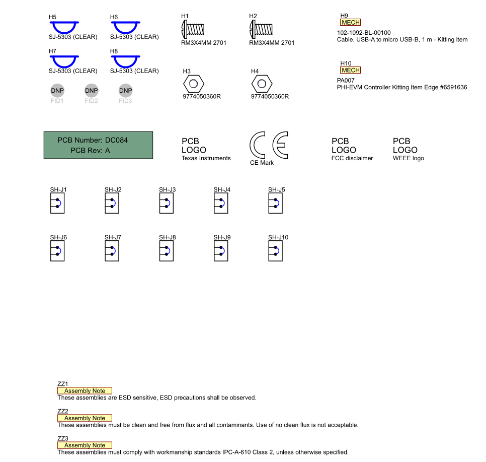

**Notes**

    1. It is important to note that, although this manual refers to two D flip-flops in component U3, the schematic representation shown in Figure 24 uses a component with only a single flip-flop. In other words, the original component is the 74AUP2G80, which contains two flip-flops, whereas the schematic representation in Figure 24 uses the 74AUP1G80, which contains only one flip-flop. This change does not affect the functionality of the overall system.

    2. Although the manual mentions eight Analog Input Terminal Blocks, J1 through J8, the schematic representation in Figure 24 shows only three Terminal Blocks for simplification purposes. This simplification does not affect the functionality of the circuit.

**Figure 24. ADS131M08EVM Main Schematic**

[ADS131M08EVM Main Schematic](schematicmod/moduloTi.kicad_sch)

**IMPORTANT NOTICE AND DISCLAIMER*

TI PROVIDES TECHNICAL AND RELIABILITY DATA (INCLUDING DATA SHEETS), DESIGN RESOURCES (INCLUDING REFERENCE DESIGNS), APPLICATION OR OTHER DESIGN ADVICE, WEB TOOLS, SAFETY INFORMATION, AND OTHER RESOURCES “AS IS” AND WITH ALL FAULTS, AND DISCLAIMS ALL WARRANTIES, EXPRESS AND IMPLIED, INCLUDING WITHOUT LIMITATION ANY IMPLIED WARRANTIES OF MERCHANTABILITY, FITNESS FOR A PARTICULAR PURPOSE OR NON-INFRINGEMENT OF THIRD PARTY INTELLECTUAL PROPERTY RIGHTS.
These resources are intended for skilled developers designing with TI products. You are solely responsible for (1) selecting the appropriate TI products for your application, (2) designing, validating and testing your application, and (3) ensuring your application meets applicable standards, and any other safety, security, regulatory or other requirements.
These resources are subject to change without notice. TI grants you permission to use these resources only for development of an application that uses the TI products described in the resource. Other reproduction and display of these resources is prohibited. No license is granted to any other TI intellectual property right or to any third party intellectual property right. TI disclaims responsibility for, and you will fully indemnify TI and its representatives against, any claims, damages, costs, losses, and liabilities arising out of your use of these resources.
TI’s products are provided subject to TI’s Terms of Sale or other applicable terms available either on ti.com or provided in conjunction with such TI products. TI’s provision of these resources does not expand or otherwise alter TI’s applicable warranties or warranty disclaimers for TI products.
TI objects to and rejects any additional or different terms you may have proposed. IMPORTANT NOTICE
Mailing Address: Texas Instruments, Post Office Box 655303, Dallas, Texas 75265
Copyright © 2022, Texas Instruments Incorporated

